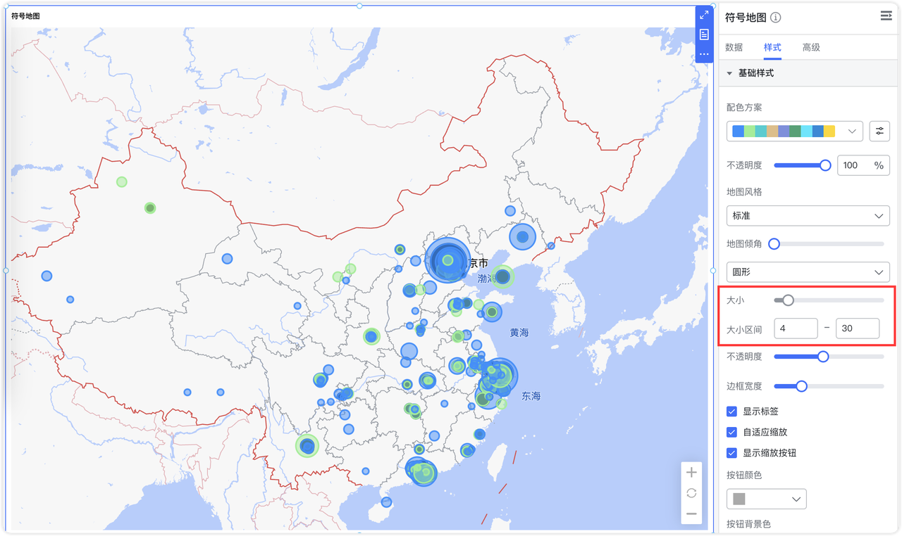
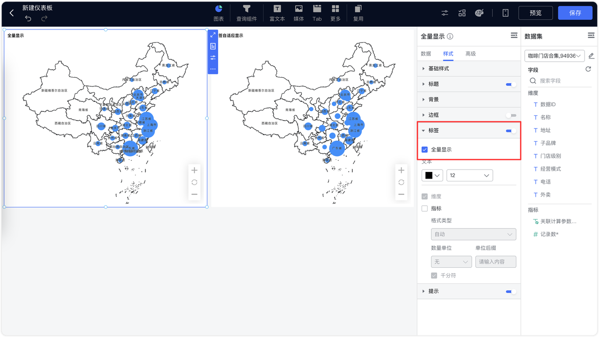
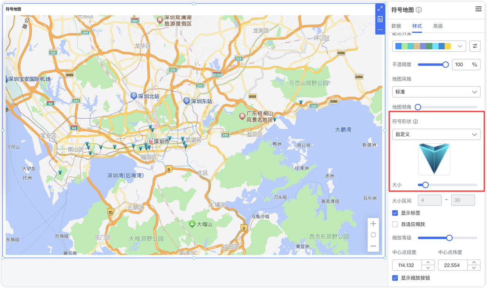

!!! Abstract ""
    点击【样式】，切换至样式设计界面，该界面主要针对【背景】、【基础样式】、【标签】、【提示】、【标题】等进行调整，**不同的图表类型可支持的样式会有所差异。**

{ width="900px" }

## 1 背景
!!! Abstract ""

    - 支持进行图表的内边距、圆角设置；
    - 图表背景颜色设置；
    - 背景图片和边框设置。
{ width="900px" }

{ width="900px" }

## 2 基础样式

!!! Abstract ""
    支持修改图形的颜色，支持配置系统方案（默认、复古、淡雅、未来、渐变、简洁、商务、柔和、科技、明亮、经典、清新、活力、火红、轻快、灵动）；  
    如下图所示，点击，也可以自定义配色。

{ width="900px" }

!!! Abstract ""
    应用配色方案后，仍然可以进一步调整颜色，如下图所示，整个图表应用到的颜色都会在下方列出来，修改时不需要再在配色方案中选中，自行修改颜色后，配色方案中所展示的颜色将不会跟着改变。如下图所示。

{ width="900px" }

{ width="900px" }

!!! Abstract ""
    地图颜色支持设置渐变色及自定义渐变色
{ width="900px" }

!!! Abstract ""
    在自定义渐变色时，可以通过设置起始和结束颜色，DataEase 会自动计算中间渐变色。
{ width="900px" }

!!! Abstract ""
    如下图所示，支持开启渐变色和透明度调整 。

{ width="900px" }

!!! Abstract ""
    饼图和环形图均支持 TopN 设置，即显示 TopN，其余的可以合并为其他。
{ width="900px" }

!!! Abstract ""
    柱状图均支持圆角设置（不包括瀑布图、K 线图）。

{ width="900px" }

!!! Abstract ""
    明细表与汇总表自适应、固定列宽、自定义。自定义列宽支持手动拖拉和针对各个字段进行宽度调整。   
    **注意:在预览界面与编辑界面均支持手动拖拉表格宽度，但只有编辑界面下拖拉完成保存后生效，在预览界面拖拉仅用于临时使用，刷新页面后将还原。**

{ width="900px" }
{ width="900px" }

!!! Abstract ""
    透视表支持在样式中设置【平铺展示】或【树形展示】，树形展示支持手动点击将下级字段聚合或展开。
    树形展示示例：

{ width="900px" }

## 3 大小

!!! Abstract ""
    如下图所示，以配置"水波图"的图形属性大小为例。
    水波图支持设置目标值和动态值，应用示例如下：    
    指标放置了 ”记录数“ 并且计算方式为 “求和”，目标值使用了设定值，则水波图自动计算出了统计总数占目标值的多少，即占比比例。。

{ width="900px" }

!!! Abstract ""
    仪表盘支持在组件样式设置最小值、最大值、支持用图表指标来动态设置最大值和最小值，支持起始角度和结束角度设置。

{ width="900px" }

!!! Abstract ""
    词云图支持配置字号大小区间和文字间距。
{ width="900px" }

!!! Abstract ""
    符号地图现支持自定义气泡大小范围：
    
    - 【数据】中拖入字段到【气泡大小】栏后，【样式】中的【大小】会自动禁用，同时启用【大小区间】设置。通过调整【大小区间】的最小值和最大值，可灵活控制气泡的尺寸范围。
    - 【气泡大小】中未拖入字段时，【样式】中的【大小】滑块将保持启用，允许手动统一调整气泡大小。

{ width="900px" }

## 4 标签

!!! Abstract ""
    支持修改标签的颜色、大小，根据不同的图表所支持的配置项有所不同，以地图为例，支持通过勾选的方式选择展示的维度、指标，同时支持指标的格式类型和单位设置。

{ width="900px" }

!!! Abstract ""
    漏斗图支持展示转化率

{ width="900px" }

!!! Abstract ""
    标签显示支持全量和自适应两种模式：

    - 全量显示：所有标签全部展示，无论重叠与否均展示。
    - 自适应显示：标签根据布局自动调整显示，避免重叠，确保清晰度。

{ width="900px" }

!!! Abstract ""
    堆叠柱状图的总计标签与主标签支持单独控制。

{ width="900px" }

{ width="900px" }

## 5 提示

!!! Abstract ""
    支持调整图表的”提示“字体大小、字体颜色，显示格式设置。

{ width="900px" }、

## 6 标题

!!! Abstract ""
    支持修改组件的标题（标题名称、字体大小、字体颜色、字体间隔、字体样式、对齐方式）。

{ width="900px" }

## 7 图例

!!! Abstract ""
    支持修改组件的图例，包括图例的图标、方向、字体大小、字体颜色、水平位置、垂直位置等。

{ width="900px" }

!!! Abstract ""
    地图图例提供【自动】和【自定义】两种模式，用户通过【自定义】选择【等分区间】或【自定义区间】。

    - 等分区间：系统自动将最小值和最大值之间的区间等分成指定数量的图例。
    - 自定义区间：用户可以手动设置每个图例的区间值，实现更灵活的展示效果。

{ width="900px" }

{ width="900px" }

## 8 坐标轴

!!! Abstract ""
    有坐标轴的图表（柱状图、折线图等），轴值支持数值格式化设置，如下图所示，在样式的横轴设置中，可以设置横轴位置、轴名、轴线、标签。

{ width="900px" }

!!! Abstract ""
    在纵轴设置中，除了坐标轴横轴的设置内容，还可对纵轴指标的显示进行格式和单位设置。

{ width="900px" }

## 9 表格

!!! Abstract ""
    支持对表头、单元格分别进行设置背景（支持单独设置透明度）、字体等。

{ width="900px" }
!!! Abstract ""
    透视表汇总支持自定义聚合公式。

{ width="900px" }

!!! Abstract ""
    支持自己编写聚合公式。

{ width="900px" }

!!! Abstract ""
    明细表和汇总表支持行列冻结。

{ width="900px" }

{ width="900px" }

!!! Abstract ""
    明细表支持单元格合并。

{ width="900px" }

## 10 提示

!!! Abstract ""
    地图、气泡地图、符号地图支持提示轮播展示。地图和气泡地图按照地图映射顺序轮播，符号地图按照数据顺序轮播。

{ width="900px" }

{ width="900px" }

## 11 边框

!!! Abstract ""
    支持设置组件边框，设置边框的颜色、圆角，同时可以选择线条对样式以及设置线宽。

{ width="900px" }

## 12 地图

!!! Abstract ""

    - 地名标签控制：支持在线地图的地名标签显示设置，用户可自由开启或关闭地名标签。
    - 缩放级别：新增默认缩放级别配置（取消自适应缩放后生效），用户可指定地图加载时的初始缩放比例。
    - 中心点：支持设置地图的默认中心点经纬度（取消自适应缩放后生效），便于地图聚焦于特定区域。

{ width="900px" }

!!! Abstract ""
    在制作在线地图时，地图风格选择【自定义】，URL 填入高德自定义地图分享的 URL 即可。详细设置可参考[地图自定义风格设置](../../change-v2-10-2.md/#121-支持自定义地图风格)。

{ width="900px" }

!!! Abstract ""
    符号地图支持自定义符号形状。

{ width="900px" }

!!! Abstract ""
    地图和气泡地图支持区域填充功能。

{ width="900px" }
