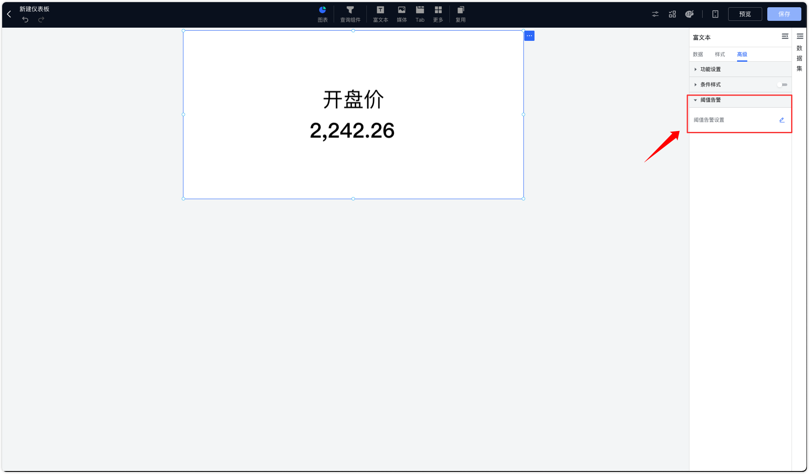
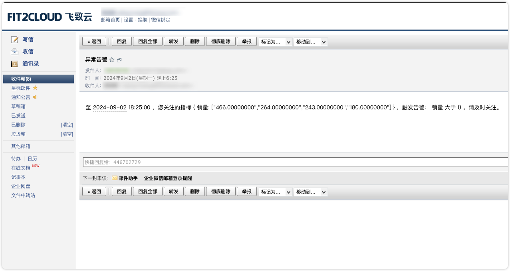
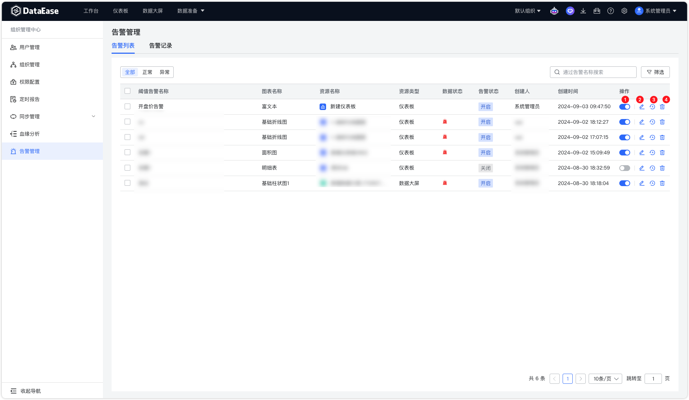
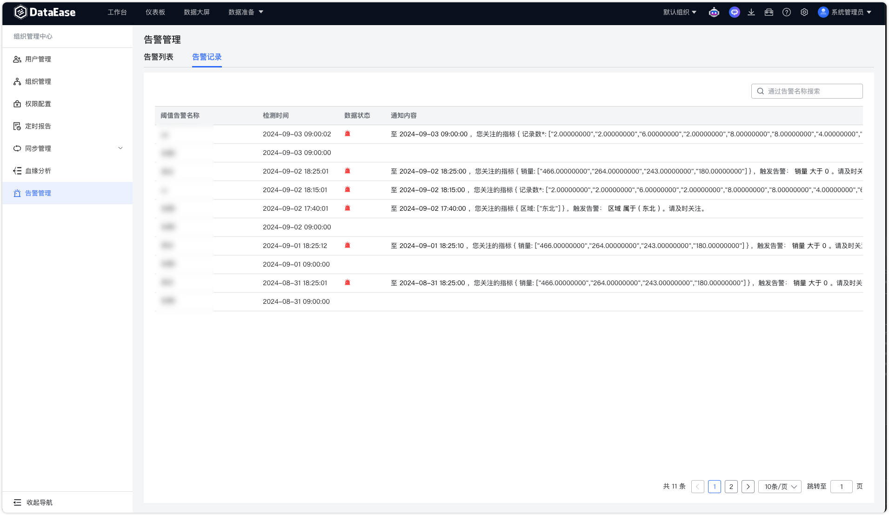
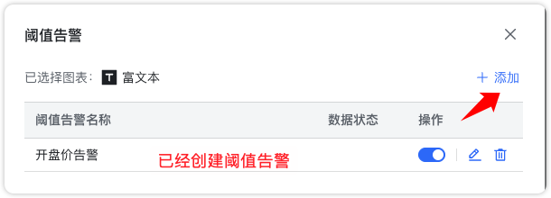
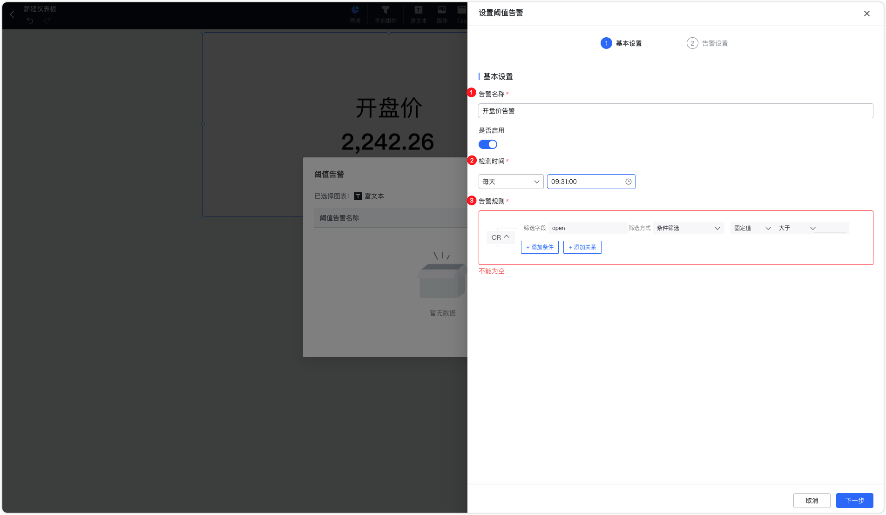
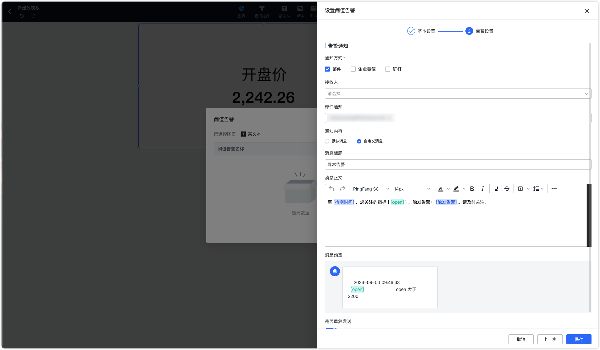

## 1 概述

!!! Abstract ""
    DataEase 的告警管理功能中，用户可以为数据图表设置告警条件，当数据超出预设的阈值时，系统将触发告警旨，并提供多种通知方式进行告知。可在【组织管理中心】下的【告警管理】集中管理告所有告警。

{ width="900px" }

{ width="900px" }

## 2 告警管理
!!! Abstract ""
    告警列表展示该组织下所有已创建的告警，包括告警名称、数据来源、资源类型、告警状态（开启/关闭）、创建人和时间等关键信息。用户可以在这里快速浏览和管理已有的告警。

    - 【序号 1】开启或者关闭告警；
    - 【序号 2】编辑和设置阈值告警；
    - 【序号 3】查看告警记录；
    - 【序号 4】删除任务。

{ width="900px" }

!!! Abstract ""
    告警记录可以查看所有触发过的告警事件，详细说明触发的时间、数据的状态、通知的发送情况。用户可以在此查看历史告警的执行情况，便于追溯和分析。

{ width="900px" }

## 3 阈值告警设置

!!! Abstract ""
    用户可以从富文本、图表、表格等可视化组件中选择需要监控的资源，在【高级】中设置阈值告警。

{ width="900px" }

{ width="600px" }

!!! Abstract ""
    为选定的资源设置具体的阈值条件，包括告警的类型、名称、资源名称、告警状态（开启/关闭）以及创建时间等。例如，每日检测仪某个数据低于预期值或库存量达到某个上限时触发告警。

{ width="900px" }

!!! Abstract ""
    配置通知机制，确保告警能通过合适的渠道及时传达给相关人员：

    - 通知方式：可以选择通过邮件、短信、企业微信等不同的通知渠道。
    - 通知对象：可以选择通知的接收人，包括指定的个人或团队成员。
    - 通知内容：用户可以自定义通知的内容，以确保接收者能快速理解告警的具体情况。

{ width="900px" }

