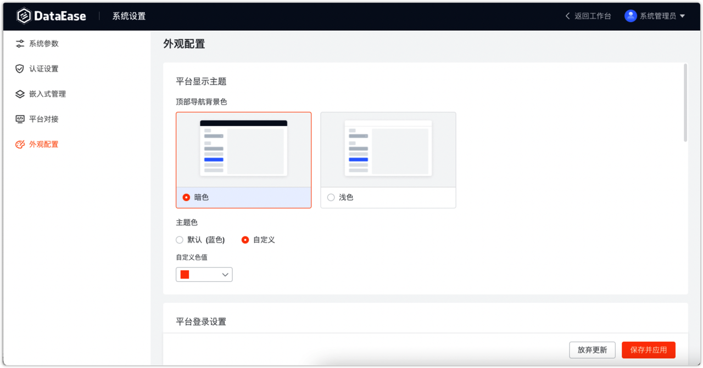
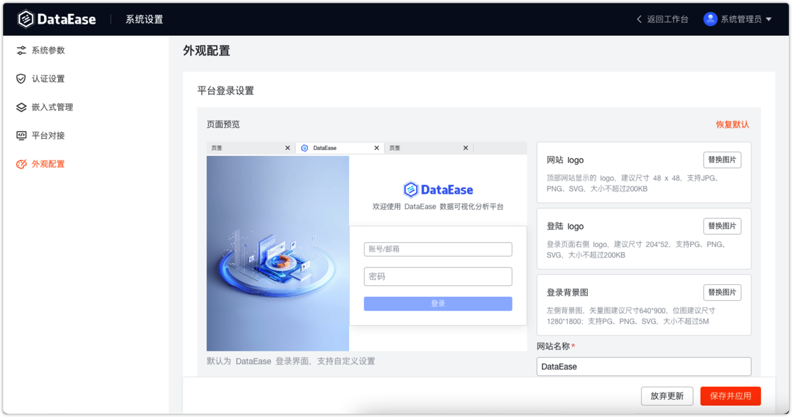
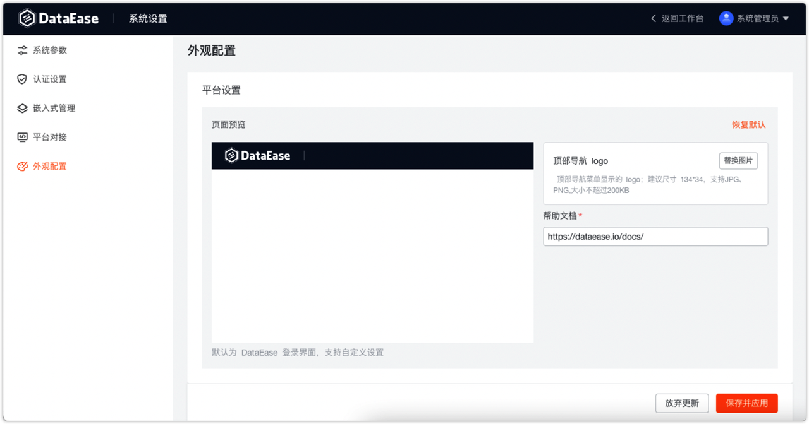

## 1 平台显示主题

!!! Abstract ""
    该主题应用于系统顶部导航背景色，系统默认蓝色主题，用户可自定义色值为自定义主题。

{ width="900px" }

## 2 平台登录设置

!!! Abstract ""
    可设置系统的网站 logo、登录 logo、登录背景图、网站名称、sloga 和自定义页脚。  
    为了显示效果，建议上传的图片大小符合系统中的提示，如：头部系统 logo，建议大小为 135px\*35px。

{ width="900px" }

## 3 平台设置
!!! Abstract ""
    置配顶部导航 logo 和帮助文档连接。

{ width="900px" }

