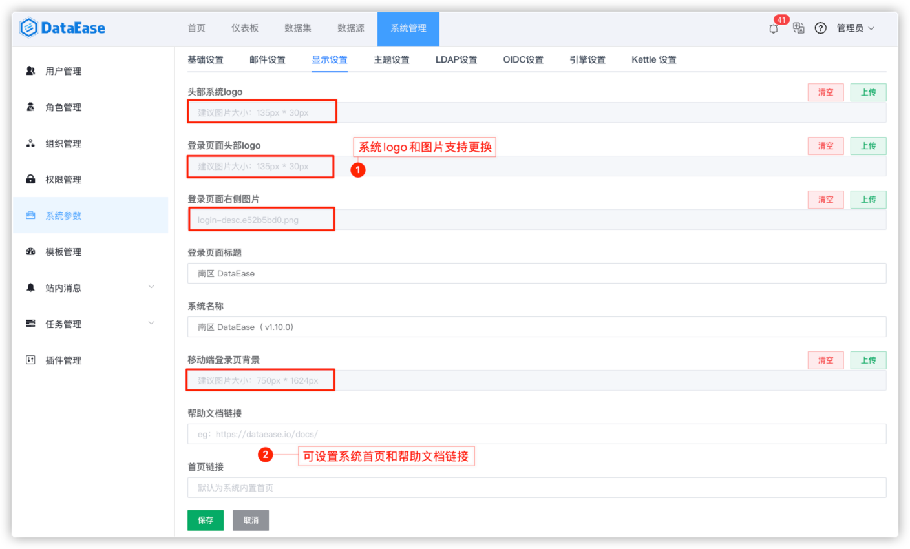
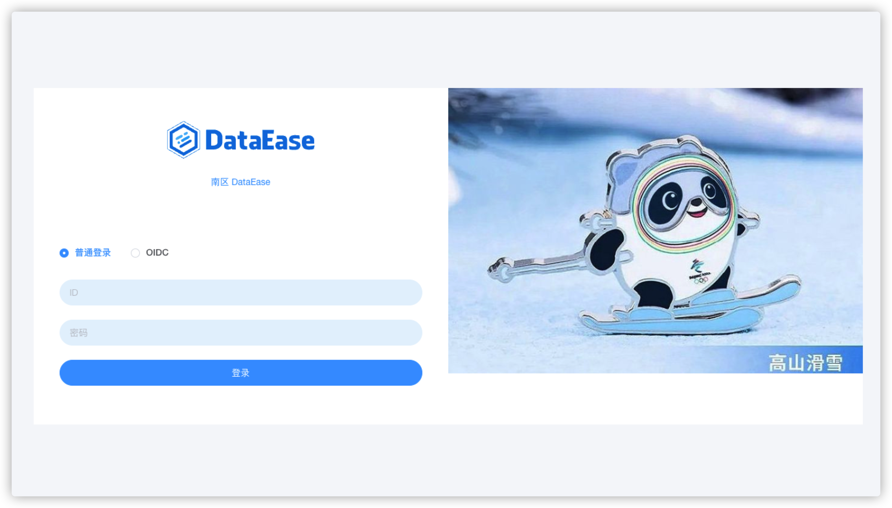

## 1 显示设置

!!! Abstract ""
可在此界面设置系统的显示 logo、登录页面头部
logo、登录页面右侧图片、系统图标、登录页面标题、系统名称，移动端登录页背景、帮助文档链接、登录页脚，图片类信息可以有"清空"和"
上传"操作；  
如下图所示，为了显示效果，建议上传的图片大小符合系统中的提示，如：头部系统 logo，建议大小为 135px\*35px。

{ width="900px" }

!!! Abstract ""
显示设置配置完成后的图示如下。

{ width="900px" }

!!! Abstract ""
登录页页脚设置可配置启用/禁用，提供在富文本编辑器里编写，限制在页脚与登录页底部的间距，配置完成后的图示如下。

{ width="900px" }

{ width="900px" }

## 2 主题设置

!!! Abstract ""
该主题应用于系统外观，包括"基础配色"、"字体颜色"、"边框颜色"、"背景颜色"，系统初始化时有两种内置主题，分别为"默认主题"与"
深色主题"，除此外，用户可自定义各类参数保存为自定义主题；  
切换主题：在系统内置主题与自定义主题中选择需要切换的主题保存即可。

{ width="900px" }

{ width="900px" }

!!! Abstract ""
删除主题：点击主题右下方的删除标记，可删除该主题。  
**注意：** 系统主题不可编辑、不支持删除。

{ width="900px" }
