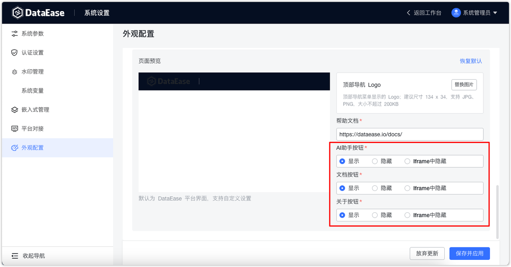

## 1 平台显示主题

!!! Abstract ""
    该主题应用于系统顶部导航背景色，系统默认蓝色主题，用户可自定义色值为自定义主题。

{ width="900px" }

## 2 平台登录设置

!!! Abstract ""
    可设置系统的网站 logo、登录 logo、登录背景图、网站名称、sloga 和自定义页脚。  
    为了显示效果，建议上传的图片大小符合系统中的提示，如：头部系统 logo，建议大小为 135px\*35px。

{ width="900px" }

## 3 平台设置
!!! Abstract ""
    置配顶部导航 logo 和帮助文档连接。

{ width="900px" }

## 4 移动端设置

!!! Abstract ""
    外观配置支持设置移动端登录 Logo 及背景图。

{ width="900px" }

## 5 其他设置
!!! Abstract ""
    支持设置 AI 助手按钮、文档按钮、关于按钮的【显示】、【隐藏】或【Iframe中隐藏】。

    - 显示 - 在各种模式下均显示
    - 隐藏 - 在各种模式下均隐藏
    - Iframe 中隐藏 - 主要用在嵌入式场景中，平台访问均显示，Iframe 嵌入的场景中会不显示
{ width="900px" }
{ width="900px" }

