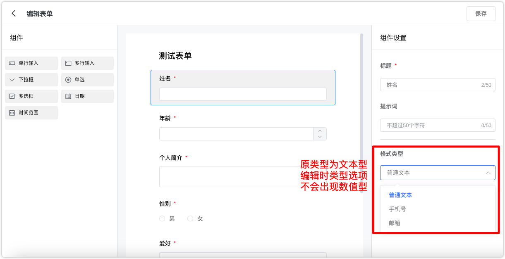
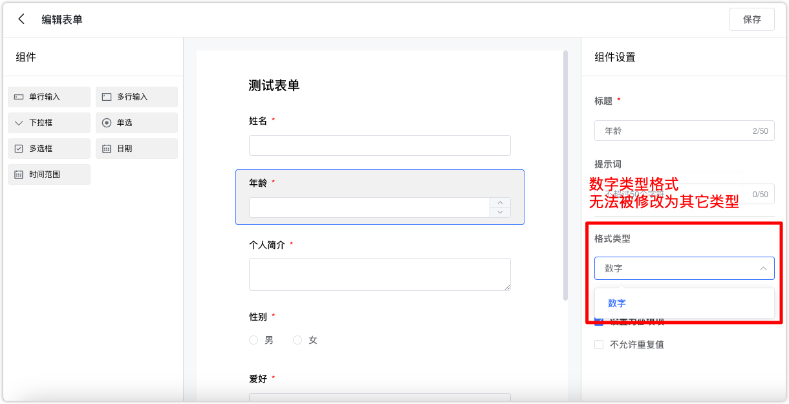
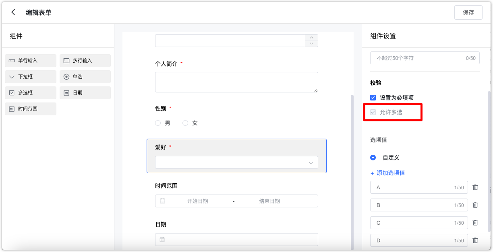
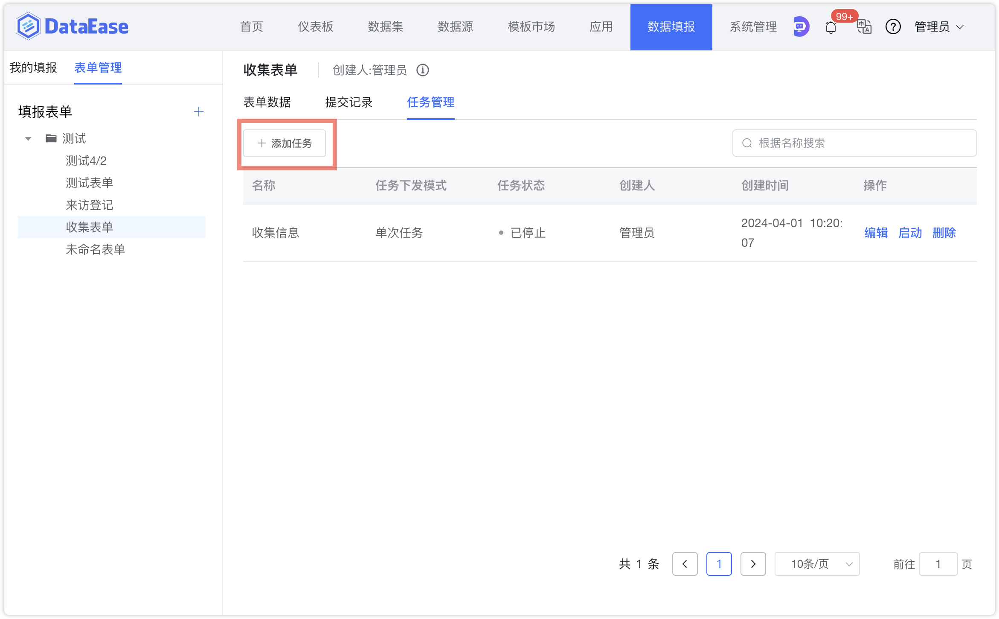
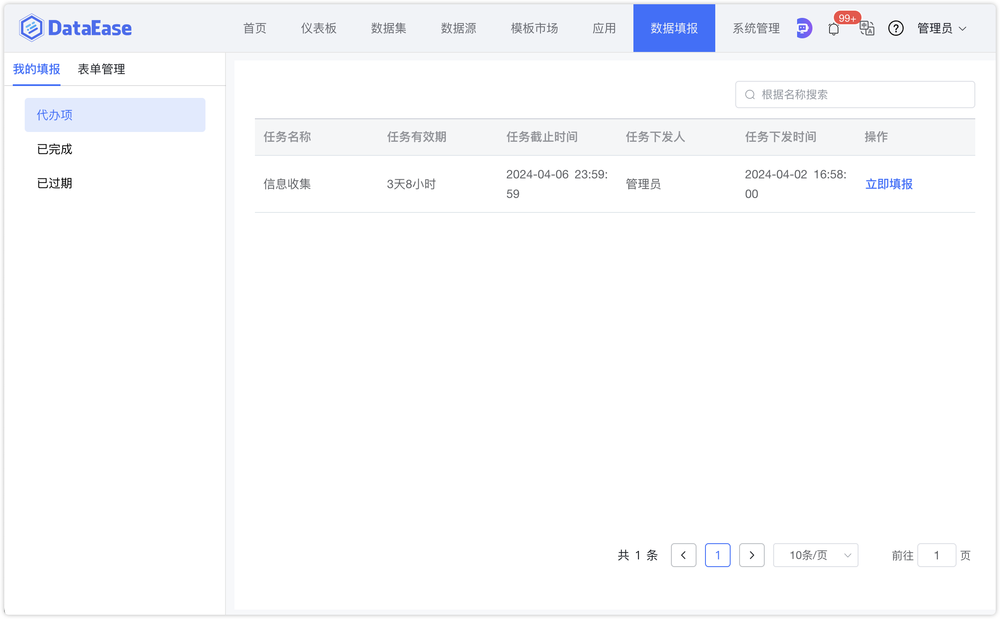

## 1 概述

!!! Abstract ""
    【数据填报】模块可以管理填报表单并下发填报任务。可在【权限管理】中【菜单和操作】，给对应的用户开通对应权限。
{ width="900px" }
## 2 表单管理

### 2.1 创建表单

!!! Abstract ""
    点击【新建表单】，根据下图所示操作，在目录下自定义表单；

{ width="900px" }

!!! Abstract ""
    表单配置：配置表单各个字段。
{ width="900px" }
!!! Abstract ""
    保存表单：选择一个具体的数据源，并设置对应表名及表单各个字段对应的数据库表字段名称。后续所填写的表单数据将会被保存至该数据源的库表下。
{ width="900px" }
!!! Abstract ""
    支持复制表单。
{ width="900px" }

### 2.2 表单数据
!!! Abstract ""
    选择对应对表单，可以查看表单的填报数据以及对应的填报时间、填报人，并且可对表单记录进行修改、查看、删除。  
    支持下载表单模板、通过 Excel 批量上传数据。
{ width="900px" }
!!! Abstract ""
    切换至【提交记录】，可查看对应提交人的操作动作。
{ width="900px" }

### 2.3 表单修改

!!! Abstract ""
    支持【编辑】对历史表单修改。但需要注意:        
    数字不能切换为其他类型，其他格式类型也不允许切换为数字。

{ width="900px" }

{ width="900px" }
!!! Abstract ""
    原组件若允许多选，在编辑时无法修改为非允许多选，该选项为置灰状态。
{ width="900px" }

!!! Abstract ""
    下拉框、单选、多选框组件的选项值允许编辑，表单的历史数据不做处理，如果历史数据该字段内容不在选项值范围内，那么可以对该数据编辑时，按照最新的选项值选择后，点击「确定」，完成对该条数据的修改。
{ width="900px" }

!!! Abstract ""
    将组件从当前表单中删除后，后台数据表中的物理字段会保留。表单预览数据时，均按照表单中的组件展示，被删除的组件不做展示。
{ width="900px" }

### 2.4 任务管理
!!! Abstract ""
    切换至任务管理页面，可设置表单任务。支持对历史对表单任务进行编辑、启动和删除。
{ width="900px" }
!!! Abstract ""
    表单任务的接收对象支持按照用户、角色与组织选择。任务可设置为单次任务与重复任务，任务下发和结束时间内进行执行。
{ width="900px" }

## 3 我的填报

!!! Abstract ""
    在填报页面可查看所在用户对代办项、已完成、已过期各状态的表单。
!!! Abstract ""
    代办项的表单，可查看对应的表单下发人以及表单失效。
{ width="900px" }
!!! Abstract ""
    已完成的表单，可对表单数据进行再次编辑以及可查看表单数据。
{ width="900px" }
!!! Abstract ""
    已过期表单，可查看过期对表单明细。
{ width="900px" }
