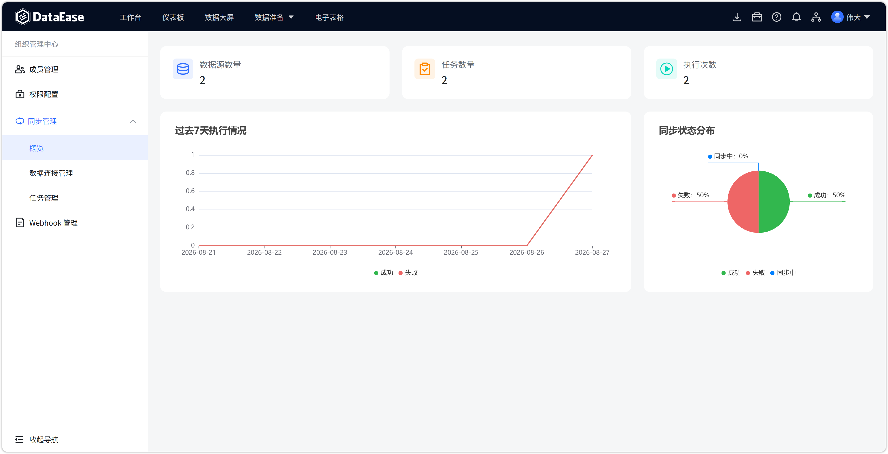
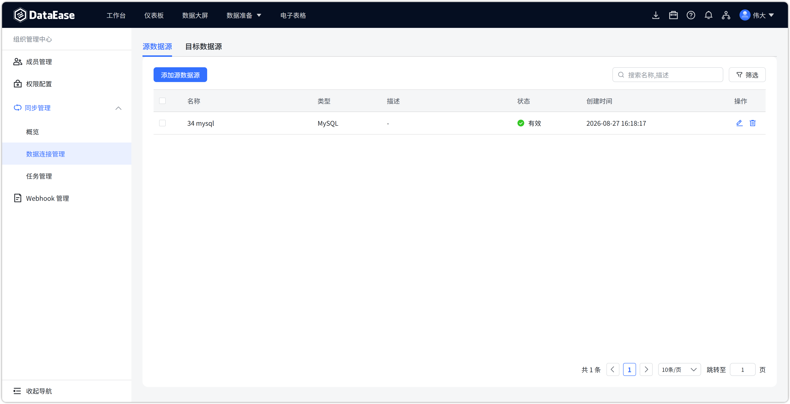
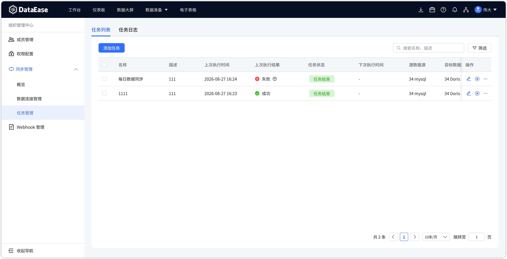
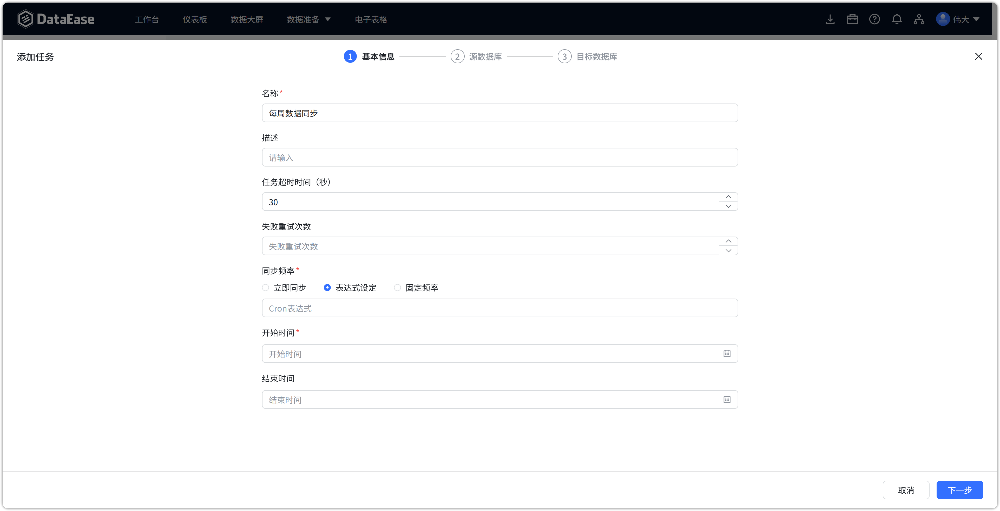
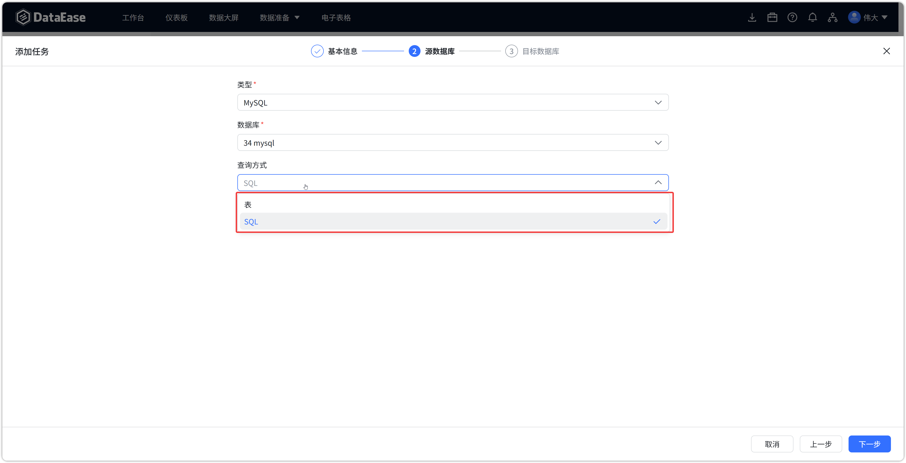
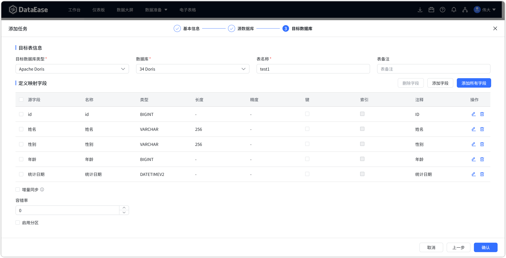
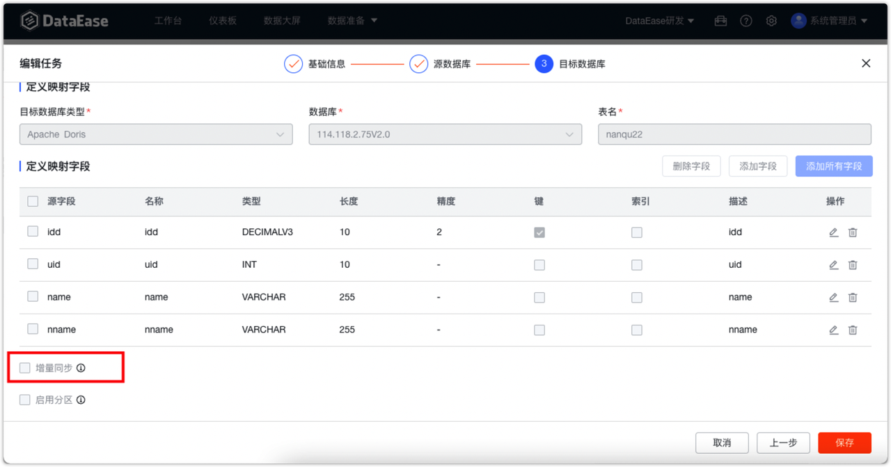
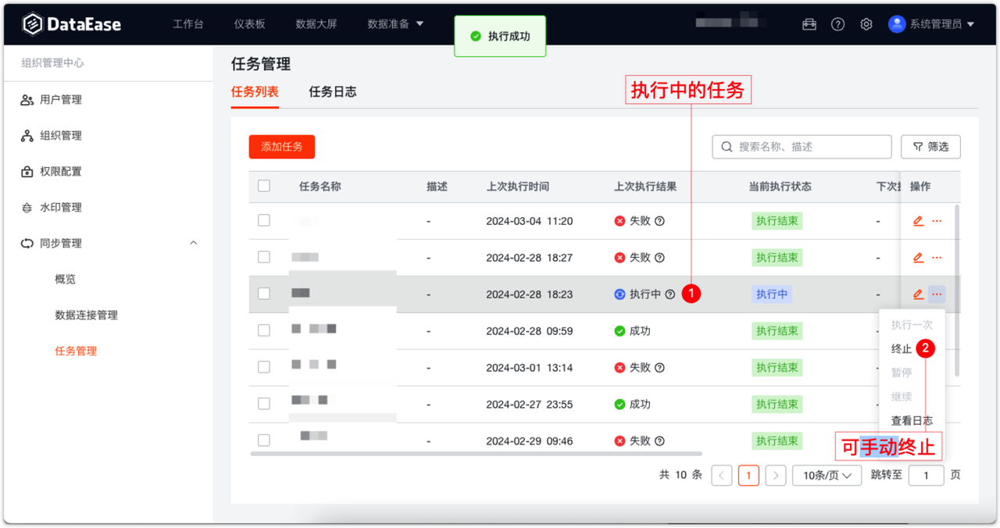

## 1 概述

!!! Abstract ""
    同步管理位于【组织管理中心】下，支持将用户自己数据库里的数据同步到如 Apache Doris 等高性能实时的分析型数据库中。

    - 当前支持同步的源数据库：Db2、MySQL、Oracle、SQL Server、Elasticsearch
    - 当前支持的目标数据库：Apache Doris（v1.2 及以上版本）
{ width="900px" }

## 2 页面介绍
!!! Abstract ""
    数据连接管理页面：源数据源管理与目标数据源管理。 
{ width="900px" }

!!! Abstract ""
    Doris 类型的目标数据源的 BE 节点设置为可选非必选项，并允许配置副本数，但 BE 副本数必须小于等于 BE 节点数。

{ width="900px" }

{ width="900px" }

!!! Abstract ""
    任务管理页面：任务列表管理、任务日志管理 。
{ width="900px" }

## 3 添加任务

!!! Abstract ""
    创建任务流程：填写基本信息-选择源数据库-选择目标数据库。先填写和选择同步管理的相关内容。
{ width="900px" }

!!! Abstract ""
    选择源目标数据库和查询方式。
{ width="900px" }

!!! Abstract ""
    选择目标数据库，进行字段映射。

{ width="900px" }

!!! Abstract ""
    同步任务支持设置增量同步与容错率的配置：
    同步模式

    - 全量：全量覆盖同步。
    - 增量：根据增量字段增量同步，增量字段必须是整型或时间类型。
    - 增量字段：以选择的字段为基准进行增量同步。

    偏移量：用于调整增量判定基准，负数为前向偏移，正数为后向偏移。
    容错率：数据同步过程中，允许的数据错误占比阈值。

{ width="900px" }

!!! Abstract ""
    支持手动终止执行中的任务。
{ width="900px" }

