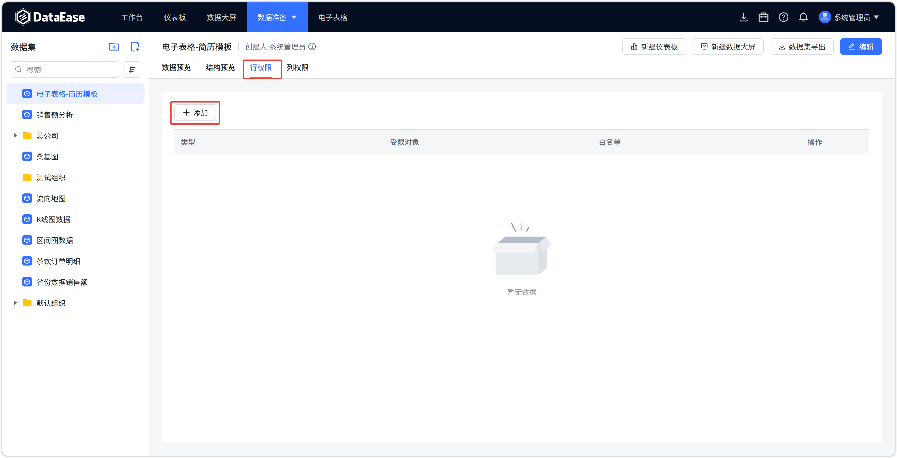
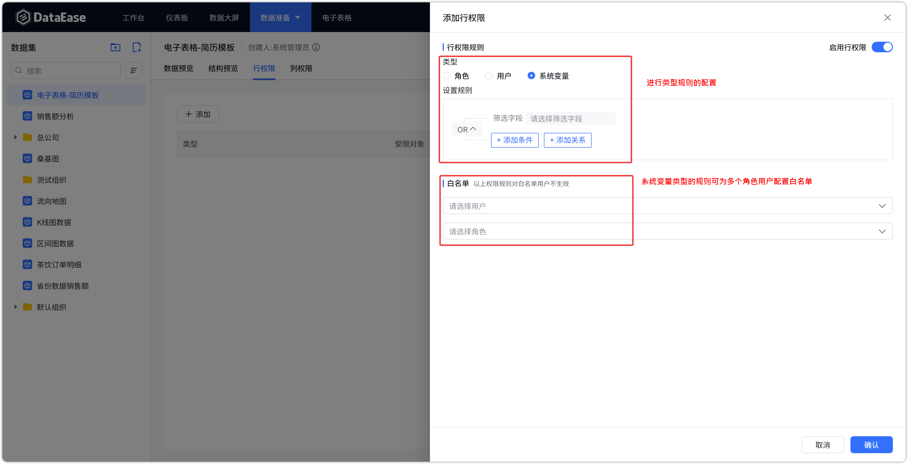
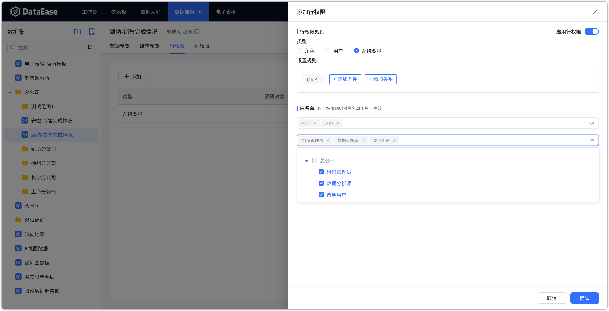
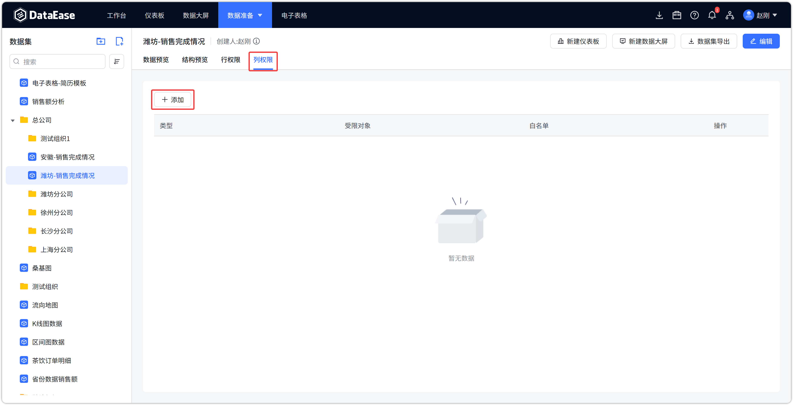
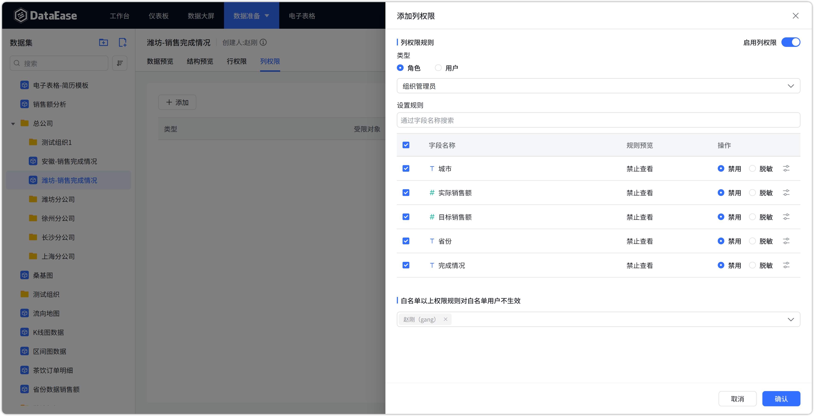
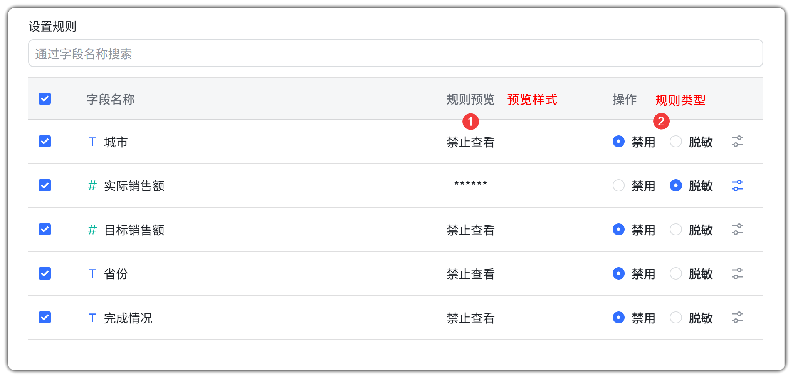
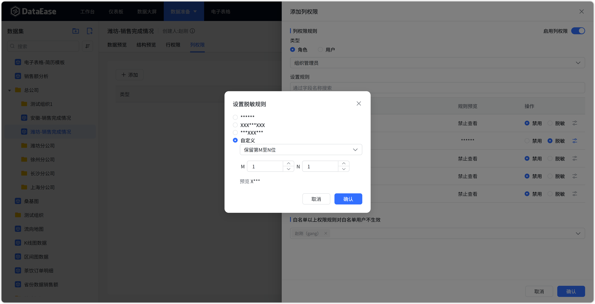

# 数据集

## 1 功能概述

!!! Abstract ""
    「行列权限」是数据集的权限类型之一（企业版 X-Pack 功能），在数据集中进行配置。

    对行列权限的设置可以达到针对同一个数据集数据，不同的维度能查看对应权限的数据资源的目的。

    「行权限」是对行数据的权限进行不同维度的重新分配，例如，可以通过行权限的配置，使「运维部门」员工仅能查看运维相关的数据。

    「列权限」是对列数据的过滤，包括对列数据的「禁用」和「脱敏」操作。配置「禁用」后的整列，字段名和数据都不会被看见；「脱敏」后的列数据，能看见字段名，数据会被以 "\*\*\*\*\*\*" 展示。

    「白名单」中的用户或角色不受该规则限制，以系统变量为类型时白名单可添加多个用户、多个角色。

## 2 行权限

!!! Abstract ""
    按照数据内容过滤，常用场景比如不同部门只能看到自己部门的数据，不同产品线只能看到自己产品线的数据，不同门店只能看到自己门店的数据等。

    系统支持从 3 种不同的维度配置行权限（维度包括「角色」、「用户」、「系统变量」）。

    其中系统变量是除了系统内置的「账号」、「姓名」、「邮箱」系统变量，系统管理员可在系统设置中增加自定义变量，组织管理员可以为组织内成员配置这些系统变量。使数据集数据与系统内置数据建立联系，可以轻松快捷地实现不同的用户访问各自所属的数据资源。自定义变量的配置见 [系统变量](system_variables.md)。
{ width="900px" }
{ width="900px" }
!!! Abstract ""
    白名单：在每条行权限的配置中，可以将 **用户** 或 **角色** 加入白名单，权限规则对白名单中的用户及所属角色成员不生效。
{ width="900px" }

## 3 列权限

!!! Abstract ""
    列权限按照字段过滤，常用场景比如一些敏感字段数据不适合某些角色人查看及使用，像是销售金额、客户身份证号等。
{ width="900px" }
{ width="900px" }

!!! Abstract ""
    支持两种配置类型：

    - **禁用：** 用户完全看不到该字段，甚至不知道该字段的存在；
    - **脱敏：** 用户可以看见该字段，知道这个字段的存在，但是看不到真实的信息，会有 \* 替代真实信息做脱敏处理。
{ width="900px" }

!!! Abstract ""
    脱敏规则支持选择系统内置规则或用户自定义，比如设置从第 M 位至第 N 位显示为 \*。
{ width="900px" }
