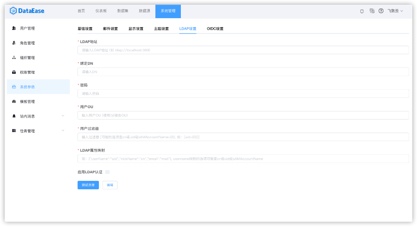
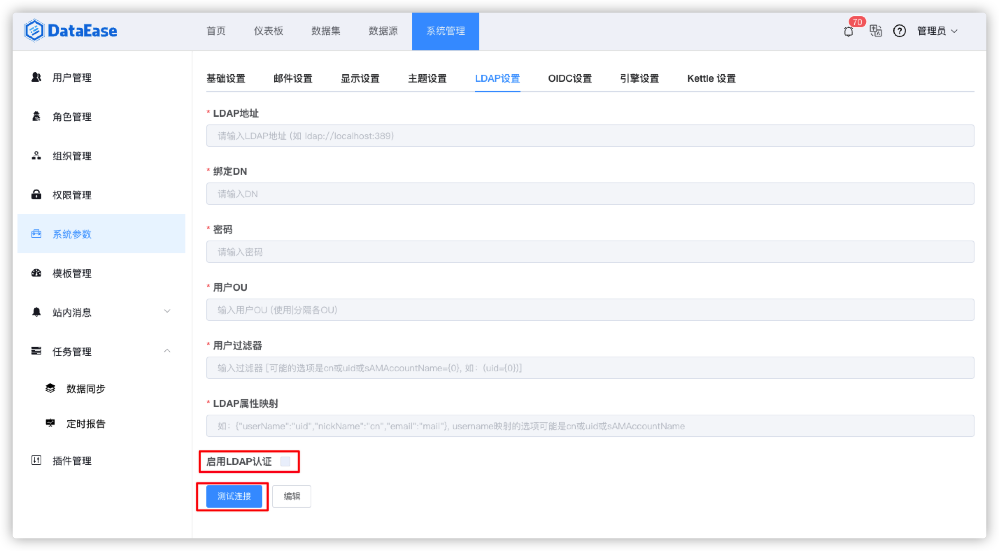
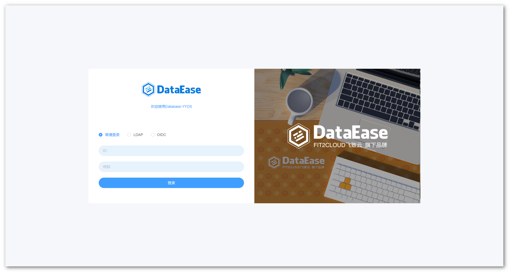
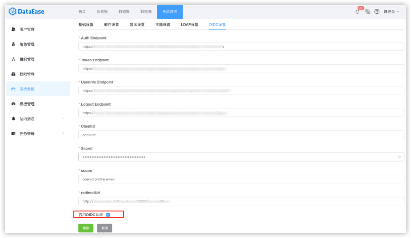
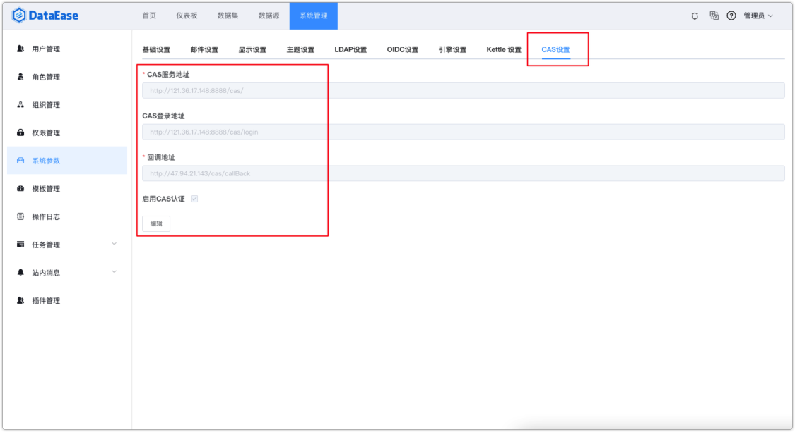
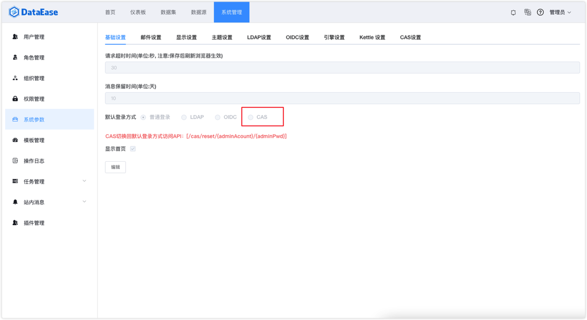

## 1 LDAP 设置

!!! Abstract ""
将相应 LDAP 信息配置在该界面后即可。

{ width="900px" }

!!! Abstract ""
配置 LDAP 的过程可参考下图，注意勾选下方"启用 LDAP 认证"后开启此功能。

    **提示：** 配置完成可点击上方【测试连接】即时测试配置信息是否正确，网络是否连通。

{ width="900px" }

!!! Abstract ""
配置完成后，随即跳转到登录页面即可使用 LDAP 方式登录。

{ width="900px" }

## 2 OIDC 设置

!!! Abstract ""
可以编辑和启用 OIDC 的认证信息作为认证授权。

{ width="900px" }

## 3 CAS 设置

!!! Abstract ""
系统支持 CAS 单点登录设置，须开启默认登录方式，在【基础设置】配置默认登录方式为 CAS，开启后不可选择其他登录方式。  
**注意：** 如果需要还原其他登录方式，可以通过页面访问指定 URL（/cas/reset/{adminAcount}/{adminPwd}）来重置登录方式。

{ width="900" }

{ width="900" }