## 1 功能概述

!!! Abstract ""
    系统支持「资源预览」、「仪表板编辑」、「大屏编辑」、「视图预览」等界面嵌入第三方系统。

    - 资源预览：可以将仪表板的预览页面嵌入第三方平台，直接显示整个仪表板；
    - 仪表板编辑：可以将仪表板的编辑页面嵌入第三方平台，此界面可以直接进行仪表板的编辑操作；
    - 大屏编辑：可以将大屏的编辑页面嵌入第三方平台，此界面可以直接进行大屏的编辑操作；
    - 视图预览：可以将视图的预览页面嵌入第三方平台，直接显示单个视图。

## 2 效果预览

!!! Abstract ""
    资源预览  
    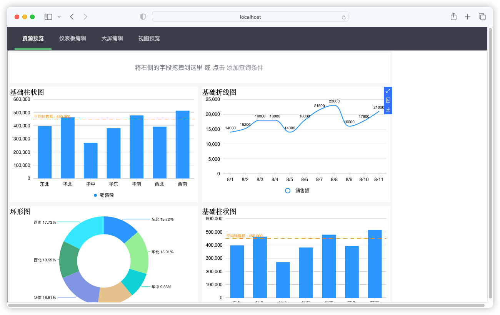{ width="900px" }

!!! Abstract ""
    仪表板编辑  
    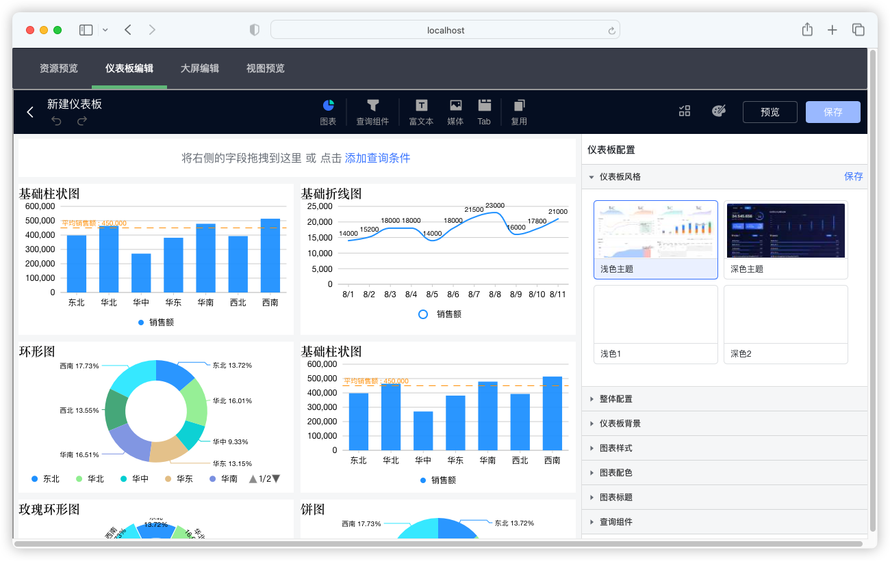{ width="900px" }

!!! Abstract ""
    大屏编辑  
    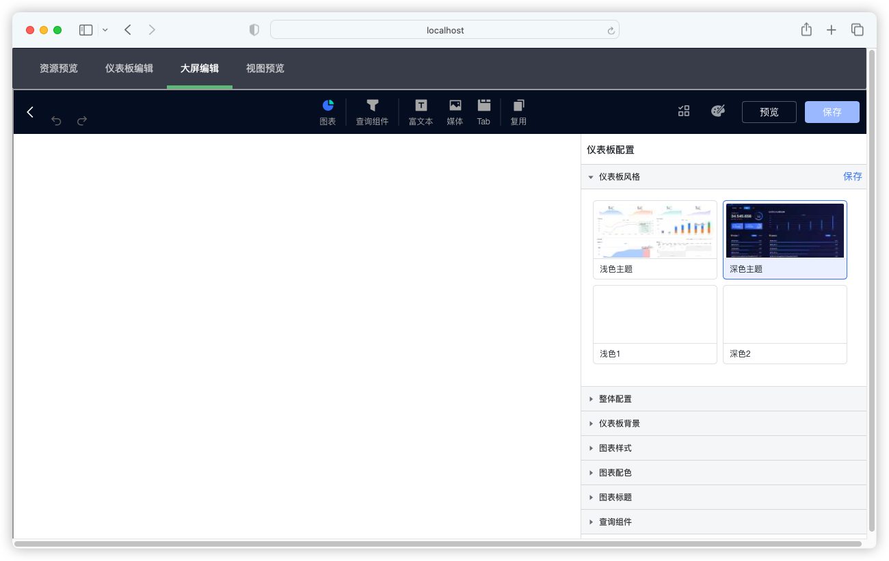{ width="900px" }

!!! Abstract ""
    视图预览  
    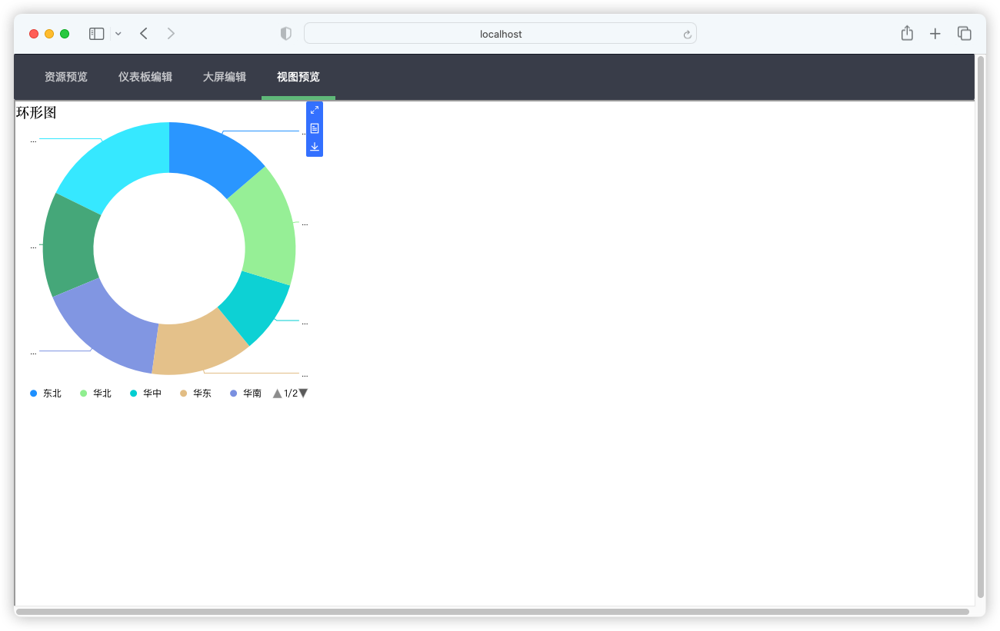{ width="900px" }

## 3 实践示例

### 3.1 获取代码

!!! Abstract ""
    进入 GitHub 下载源码：（敬请期待）

### 3.2 代码解析

!!! Abstract ""
    代码目录结构如下:  
    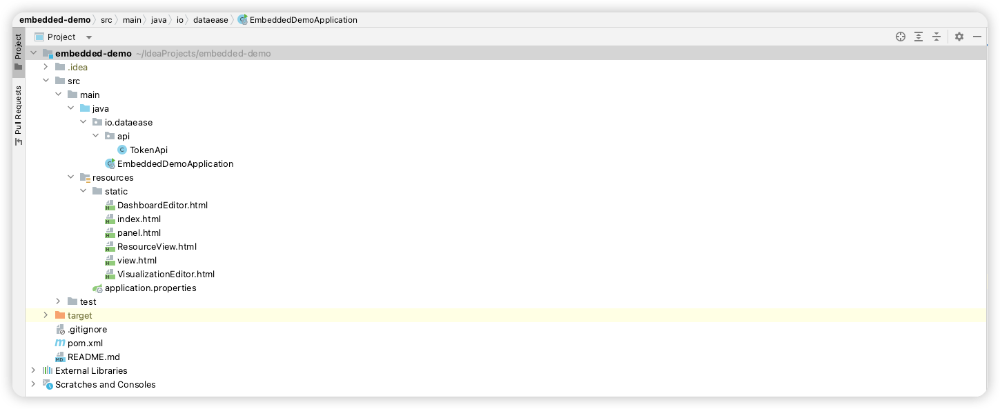{ width="900px" }

!!! Abstract ""
    DataEase API 接口调用类:  
    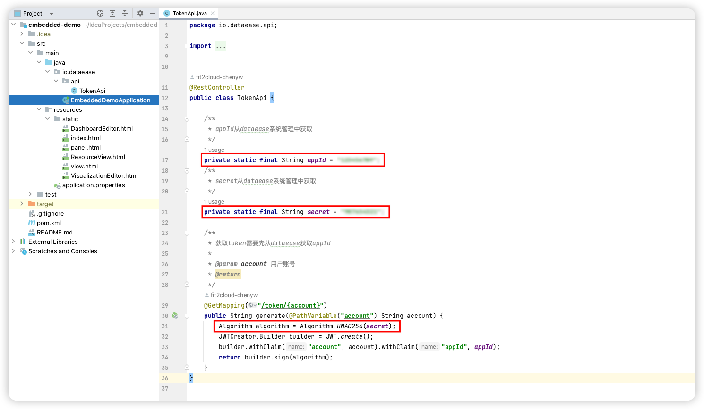{ width="900px" }  
    需要从 DataEase 系统管理中获取 appId 和 secret 两个参数的值传入该接口，需要注意的是 secret 需要进行 HMAC256 加密。  
    获取界面如下图所示:   
    { width="900px" }（敬请期待）  
    **临时处理** —— 往该表插入以下数据：  
    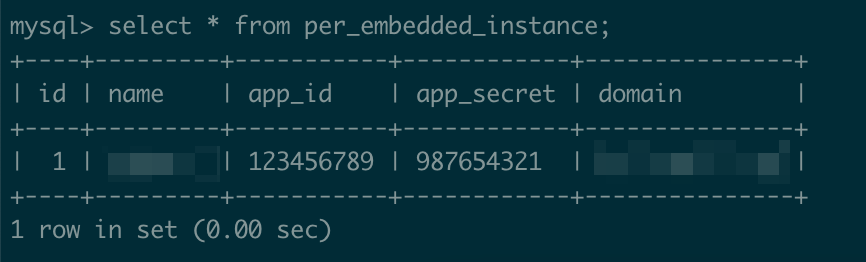{ width="900px" }

!!! Abstract ""
    第三方界面模拟静态文件:   
    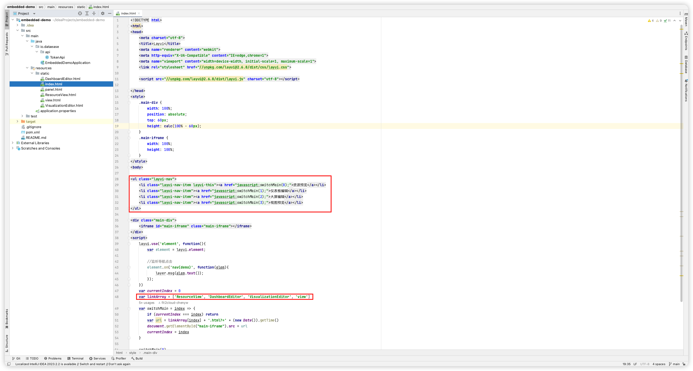{ width="900px" }

!!! Abstract ""
    资源预览界面调用静态文件:

    - 【序号 1】src 属性填入 DataEase 服务提供的脚本文件的 URL，如：https://**DataEase 服务 IP(域名)**/js/div_import_0.0.0-dataease.js；  
    - 【序号 2】接口调用录入对应的 **用户 account**，此处示例为 admin 用户；  
    - 【序号 3】dvId 录入对应的 dvId；   
    - 【序号 4】DataEaseBi.create 方法第一个参数录入 **Dashboard**；   
    - 【序号 5】baseUrl 录入 **DataEase 服务 IP(域名)**；  
    - 【序号 6】DataEaseBi.initialize 方法 container 属性录入 **#app**。

    { width="900px" }  
    
    **注意：** dvId 的获取方式如下：  
    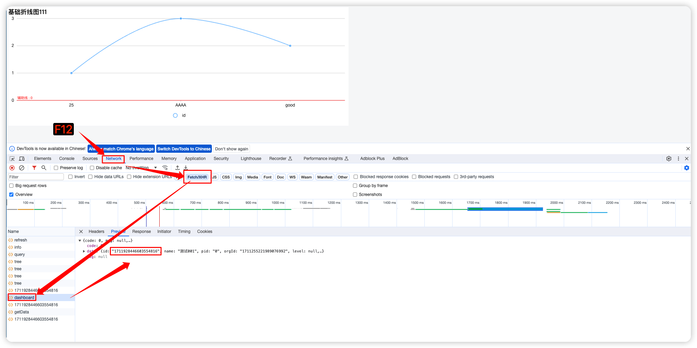{ width="900px" }

!!! Abstract ""
    仪表板编辑界面调用静态文件:

    - 【序号 1】src 属性填入 DataEase 服务提供的脚本文件的 URL，如：https://**DataEase 服务 IP(域名)**/js/div_import_0.0.0-dataease.js；  
    - 【序号 2】接口调用录入对应的 **用户 account**，此处示例为 admin 用户；  
    - 【序号 3】resourceId 录入对应的 resourceId；   
    - 【序号 4】opt 录入 **create**；  
    - 【序号 5】DataEaseBi.create 方法第一个参数录入 **DashboardEditor**；   
    - 【序号 6】baseUrl 录入 **DataEase 服务 IP(域名)**；  
    - 【序号 7】DataEaseBi.initialize 方法 container 属性录入 **#dataease-container**。

    { width="900px" }  
    
    **注意：** resourceId 的获取方式如下：  
    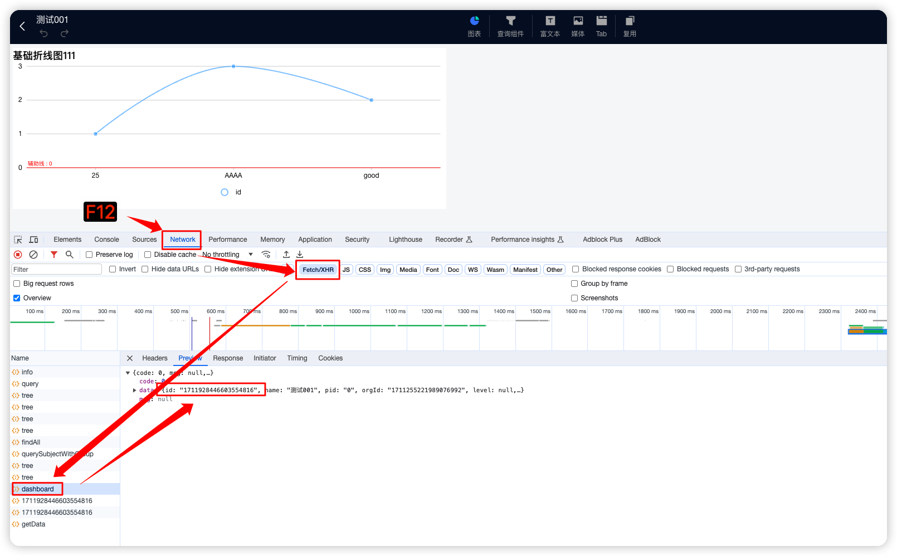{ width="900px" }

!!! Abstract ""
    大屏编辑界面调用静态文件:

    - 【序号 1】src 属性填入 DataEase 服务提供的脚本文件的 URL，如：https://**DataEase 服务 IP(域名)**/js/div_import_0.0.0-dataease.js；  
    - 【序号 2】接口调用录入对应的 **用户 account**，此处示例为 admin 用户；  
    - 【序号 3】dvId 录入对应的 dvId；   
    - 【序号 4】opt 录入 **create**；  
    - 【序号 5】DataEaseBi.create 方法第一个参数录入 **DashboardEditor**；   
    - 【序号 6】baseUrl 录入 **DataEase 服务 IP(域名)**；  
    - 【序号 7】DataEaseBi.initialize 方法 container 属性录入 **#dataease-container**。

    { width="900px" }
    
    **注意：** dvId 的获取方式如下：  
    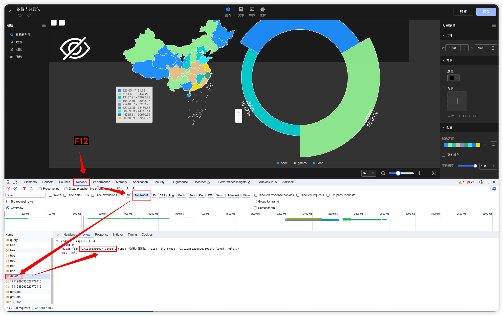{ width="900px" }

!!! Abstract ""
    视图预览界面调用静态文件:

    - 【序号 1】src 属性填入 DataEase 服务提供的脚本文件的 URL，如：https://**DataEase 服务 IP(域名)**/js/div_import_0.0.0-dataease.js；  
    - 【序号 2】接口调用录入对应的 **用户 account**，此处示例为 admin 用户；  
    - 【序号 3】dvId 录入对应的 dvId；   
    - 【序号 4】chartId 录入对应的 chartId；  
    - 【序号 5】DataEaseBi.create 方法第一个参数录入 **ViewWrapper**；   
    - 【序号 6】baseUrl 录入 **DataEase 服务 IP(域名)**；  
    - 【序号 7】DataEaseBi.initialize 方法 container 属性录入 **#dataease-view-container**。  

    { width="900px" }
    
    **注意：** dvId 和 chartId 的获取方式如下：  
    dvId：  
    { width="900px" }  
    chartId：  
    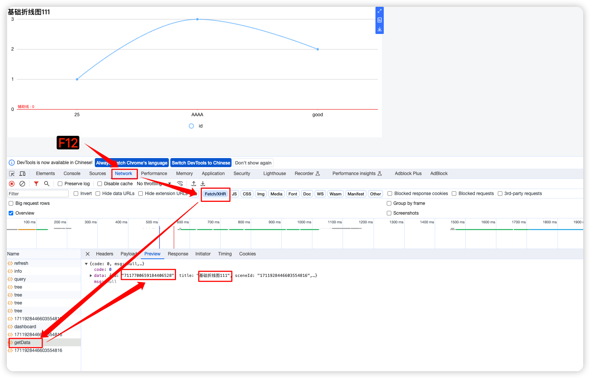{ width="900px" }

!!! Abstract ""
    最后本地运行即可预览效果。  
    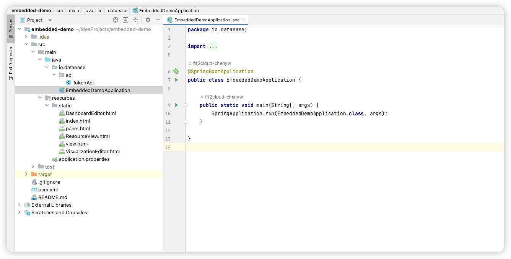{ width="900px" }