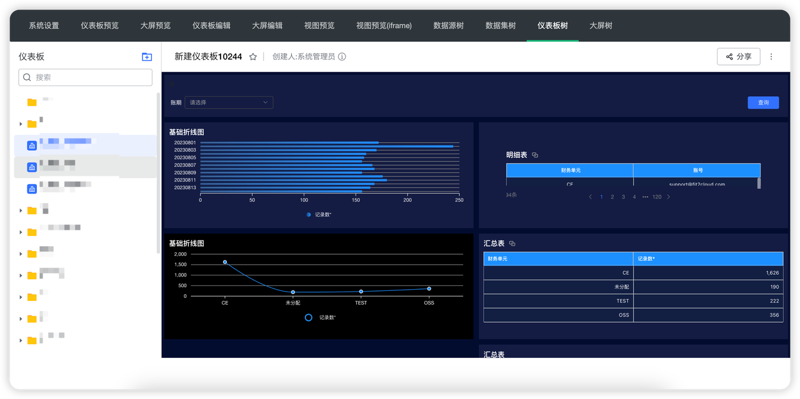
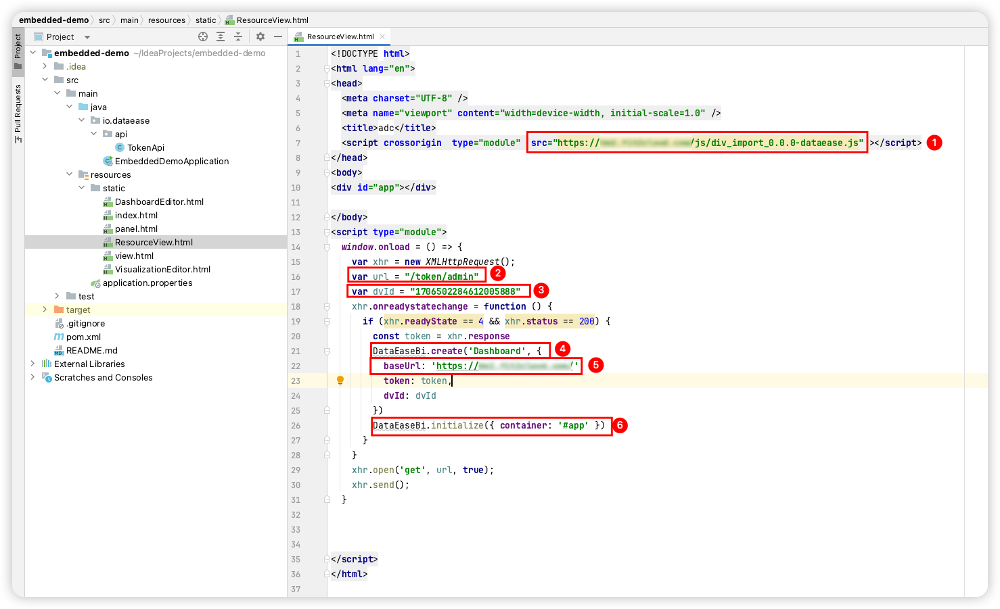
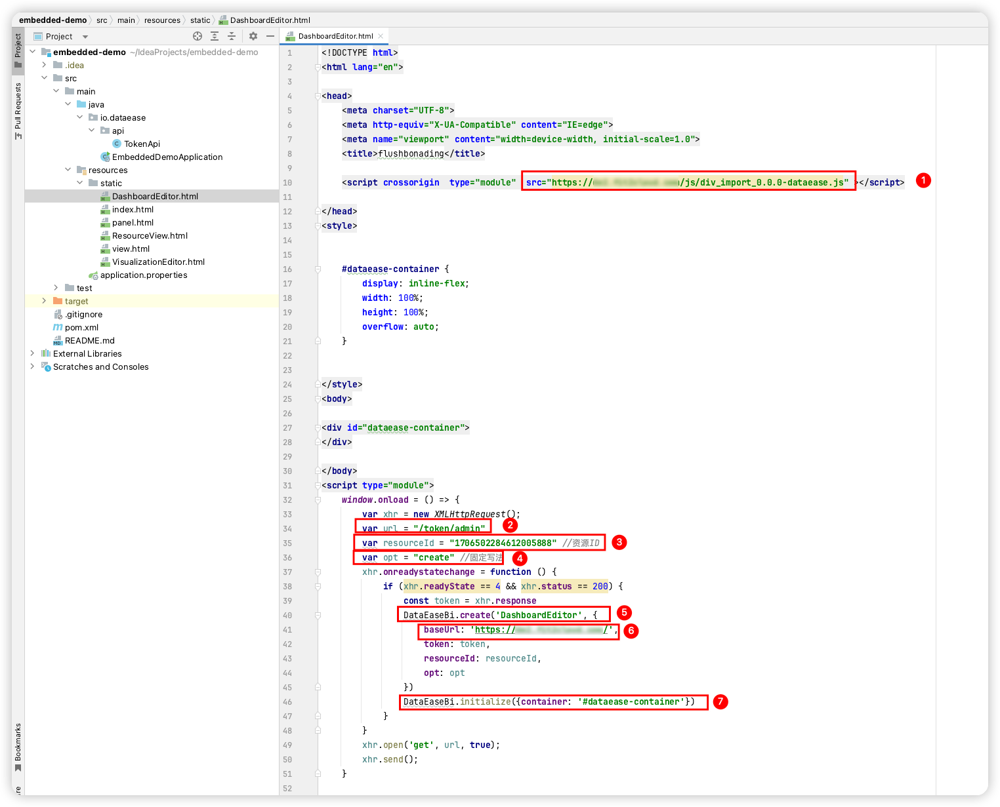
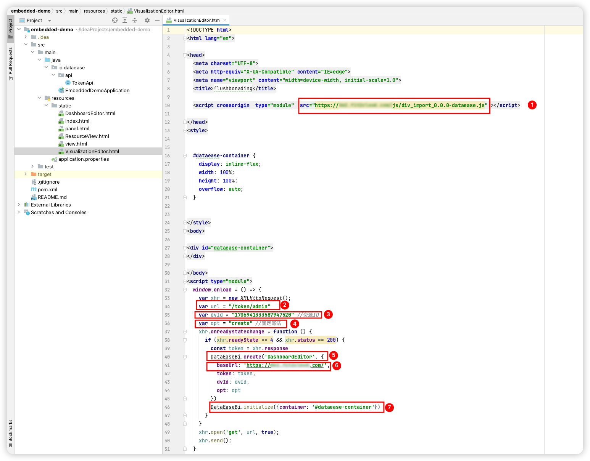
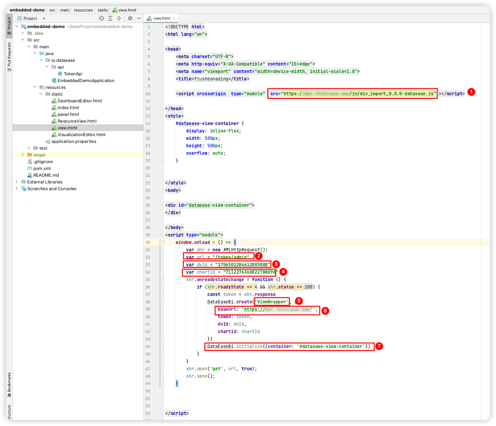
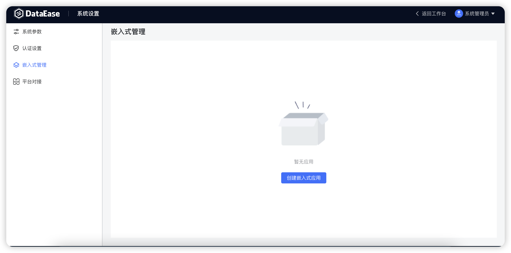
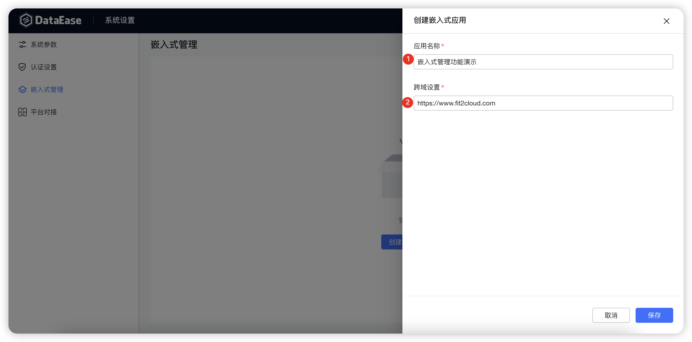
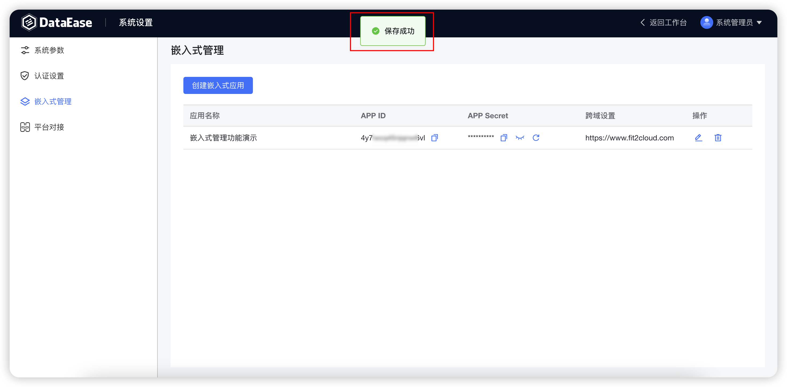

## 1 功能概述

!!! Abstract ""
    嵌入式支持嵌入仪表板、数据大屏、数据源、数据集页面（带左侧的树形菜单）。

    - 仪表板嵌入：可以将仪表板嵌入第三方平台，直接显示整个仪表板；
    - 数据大屏嵌入：可以将数据大屏嵌入第三方平台，直接显示整个数据大屏；
    - 设计器嵌入：可以将仪表板和数据大屏的设计器页面嵌入第三方平台，此界面可以直接进行仪表板和数据大屏的编辑操作；
    - 图表嵌入：可以将图表嵌入第三方平台，直接显示单个图表。
    
    以下是嵌入式示例工程运行后的效果，顶部菜单的右侧 4 个菜单对应的即为仪表板、数据大屏、数据源、数据集页面（带左侧的树形菜单）。

{ width="900px" }

## 2 效果预览

!!! Abstract ""
    仪表板嵌入、数据大屏嵌入示例：    
{ width="900px" }

!!! Abstract ""
    仪表板设计器嵌入示例：  
{ width="900px" }

!!! Abstract ""
    数据大屏设计器嵌入示例：  
{ width="900px" }

!!! Abstract ""
    图表嵌入示例：  
{ width="900px" }

## 3 系统配置
!!! Abstract ""
    嵌入式管理创建嵌入式应用。  
    **注意：** 每个 DataEase 实例默认最多可创建 5 个嵌入式应用。
{ width="900px" }

!!! Abstract ""
    创建嵌入式应用配置项如下：

    - 【序号 1】应用名称：自定义；
    - 【序号 2】跨域设置：在使用嵌入式时遇到跨域问题时，可以通过设置目标系统的域名进行跨域设置。
{ width="900px" }

!!! Abstract ""
    创建完嵌入式应用后，可以获取到该应用对应的 APP ID 和 APP Secret（**嵌入式对接时需要用到**）。
{ width="900px" }