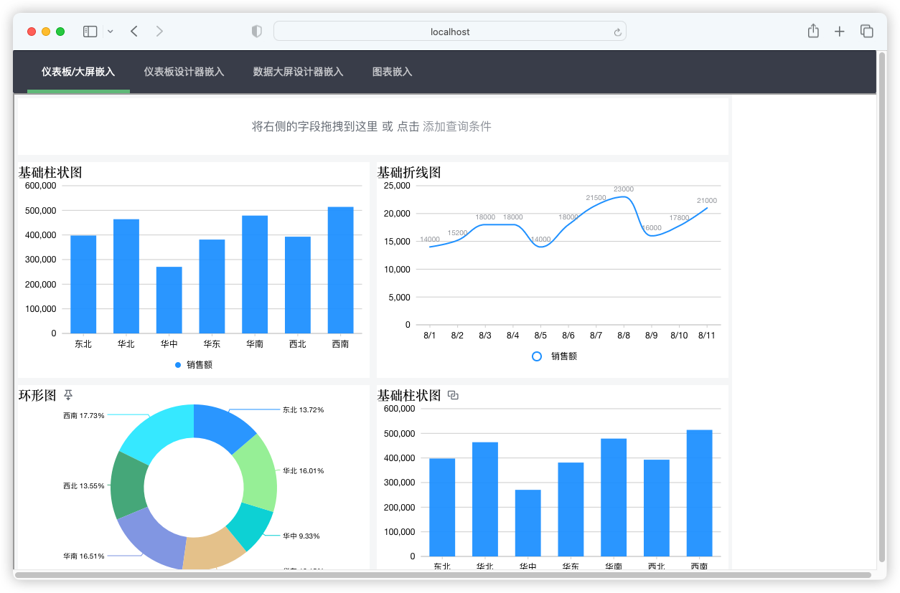
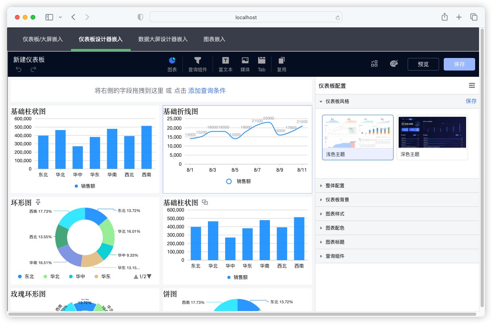

## 1 功能概述

!!! Abstract ""
    嵌入式支持嵌入仪表板、数据大屏、数据源、数据集页面（带左侧的树形菜单）。  
    **在线体验环境** ：https://embedded-bi.dataease.cn/#/home/index

    - 设计器嵌入：将仪表板或数据大屏设计器嵌入到业务系统中，查看仪表板的同时可对其进行修改，增强系统的自助分析能力；
    - 看板嵌入：将制作好的仪表板或数据大屏整体嵌入到业务系统中，支持通过传递参数过滤数据，同时支持联动、跳转、下钻、过滤组件等自助式分析操作。支持与系统之间双向传参。；
    - 模块级嵌入：将 DataEase 的数据源、数据集、仪表板、数据大屏等页面拆开完整嵌入至第三方系统，直接提供数据分析所需要的全部功能；
    - 单个图表嵌入：将单个图表嵌入到系统中，辅助用户进行决策。支持与系统之间双向传参。
    
    以下是嵌入式示例工程运行后的效果，顶部菜单的右侧 4 个菜单对应的即为仪表板、数据大屏、数据源、数据集页面（带左侧的树形菜单）。

{ width="900px" }

## 2 效果预览

!!! Abstract ""
    仪表板嵌入、数据大屏嵌入示例：    
{ width="900px" }

!!! Abstract ""
    仪表板设计器嵌入示例：  
{ width="900px" }

!!! Abstract ""
    数据大屏设计器嵌入示例：  
{ width="900px" }

!!! Abstract ""
    图表嵌入示例：  
{ width="900px" }

## 3 系统配置
!!! Abstract ""
    嵌入式管理创建嵌入式应用。  
    **注意：** 每个 DataEase 实例默认最多可创建 5 个嵌入式应用。
{ width="900px" }

!!! Abstract ""
    创建嵌入式应用配置项如下：

    - 【序号 1】应用名称：自定义；
    - 【序号 2】跨域设置：在使用嵌入式时遇到跨域问题时，可以通过设置目标系统的域名进行跨域设置。
{ width="900px" }

!!! Abstract ""
    创建完嵌入式应用后，可以获取到该应用对应的 APP ID 和 APP Secret（**嵌入式对接时需要用到**）。
{ width="900px" }