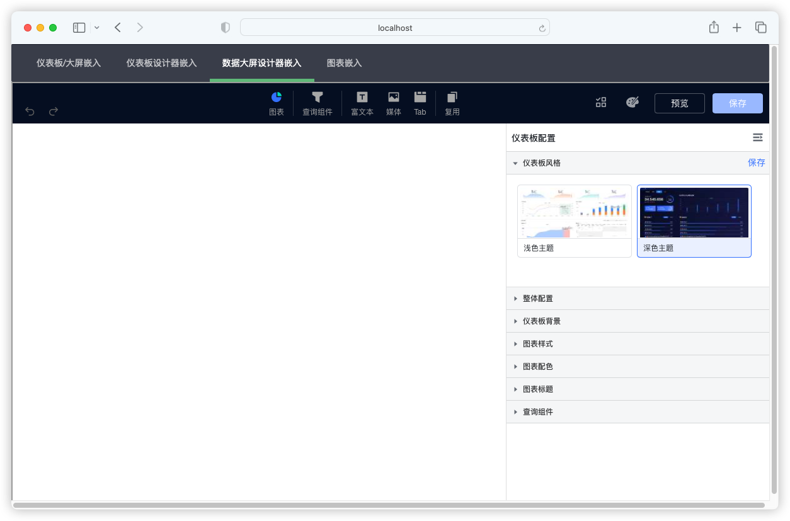
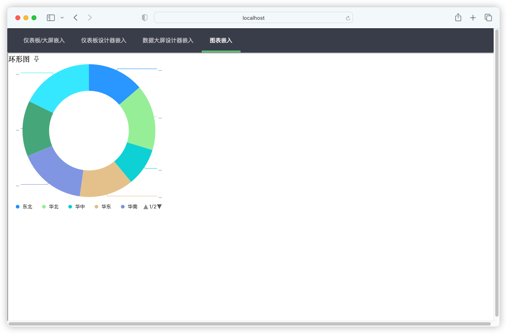

## 1 功能概述

!!! Abstract ""
    系统支持将「仪表板」、「大屏」、「设计器」、「图表」嵌入第三方系统。

    - 仪表板嵌入：可以将仪表板嵌入第三方平台，直接显示整个仪表板；
    - 数据大屏嵌入：可以将数据大屏嵌入第三方平台，直接显示整个数据大屏；
    - 设计器嵌入：可以将仪表板和数据大屏的设计器页面嵌入第三方平台，此界面可以直接进行仪表板和数据大屏的编辑操作；
    - 图表嵌入：可以将图表嵌入第三方平台，直接显示单个图表。

## 2 效果预览

!!! Abstract ""
    仪表板嵌入、数据大屏嵌入示例：    
{ width="900px" }

!!! Abstract ""
    仪表板设计器嵌入示例：  
{ width="900px" }

!!! Abstract ""
    数据大屏设计器嵌入示例：  
{ width="900px" }

!!! Abstract ""
    图表嵌入示例：  
{ width="900px" }