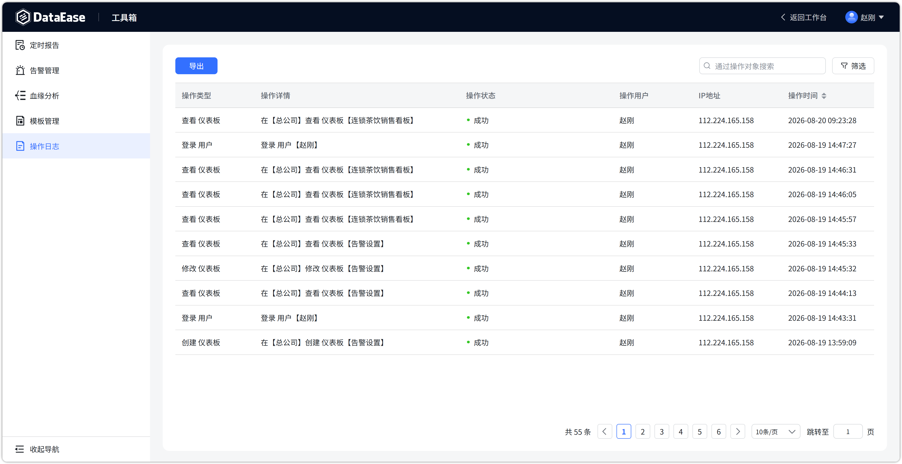
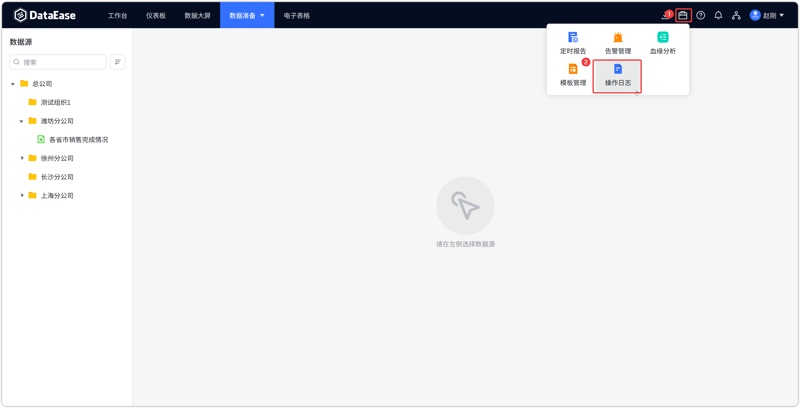
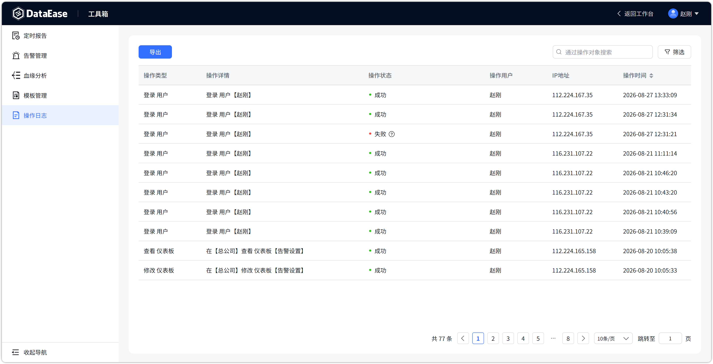
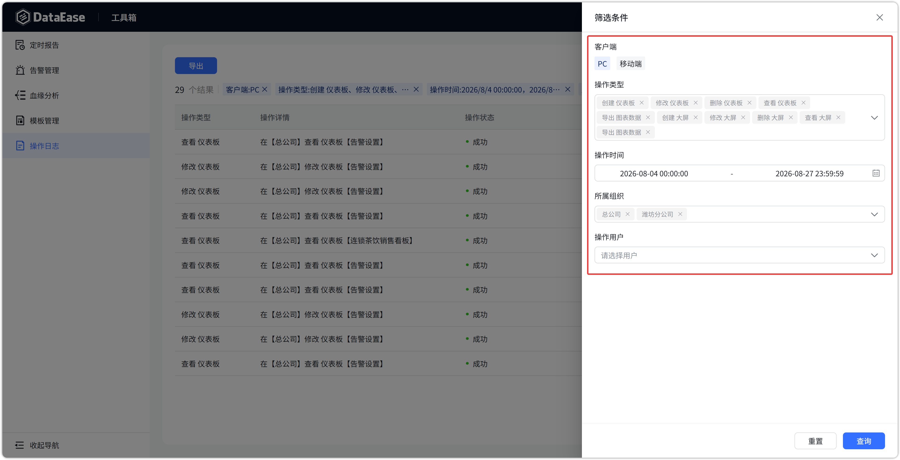
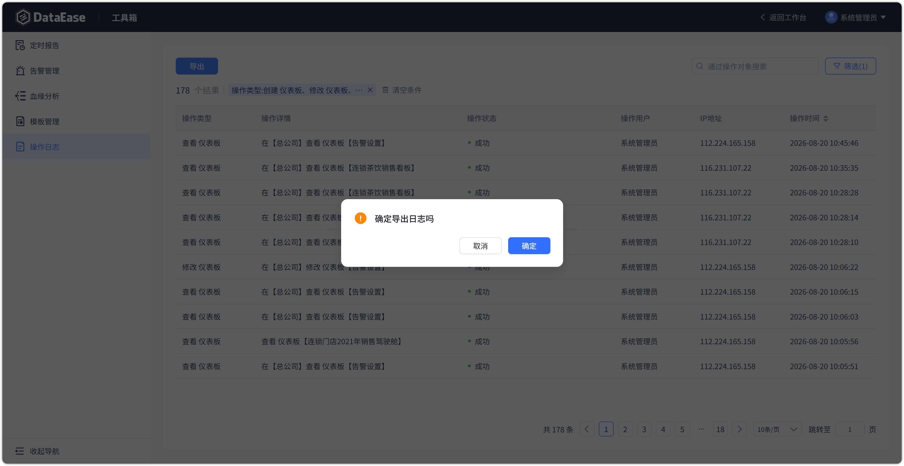

# 操作日志

## 1 概述

!!! Abstract ""
    操作日志位于【工具箱】下，用于记录平台内用户的操作行为，便于审计与追溯。

    - **系统管理员**：可查看所有用户的操作日志；
    - **其他用户**（含组织管理员）：仅可查看自己的操作日志，包括该用户所在各组织下的操作记录。

{ width="900px" }

## 2 查看操作日志

!!! Abstract ""
    进入【工具箱】→【操作日志】，即可查看日志列表。表格列包括：

    | 列名 | 说明 |
    | --- | --- |
    | 操作类型 | 如登录、创建、修改、删除、导出等 |
    | 操作详情 | 具体操作对象与内容描述 |
    | 操作状态 | 成功 / 失败 |
    | 操作用户 | 执行操作的用户 |
    | IP 地址 | 操作来源 IP |
    | 操作时间 | 操作发生时间 |

{ width="900px" }

## 3 筛选日志

!!! Abstract ""
    支持按条件组合筛选日志，常用筛选项包括：
    - 客户端；
    - 操作类型；
    - 操作用户；
    - 所属组织；
    - 操作时间。

    **提示：** 定时任务和消息通知中已有的相关记录，操作日志里不再重复记录。

{ width="900px" }

{ width="900px" }

## 4 导出操作日志

!!! Abstract ""
    点击页面【导出】按钮，可将当前筛选结果导出为 Excel 文件，便于离线留存或二次分析。

{ width="900px" }
