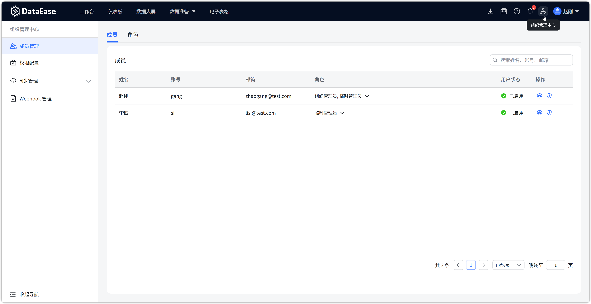
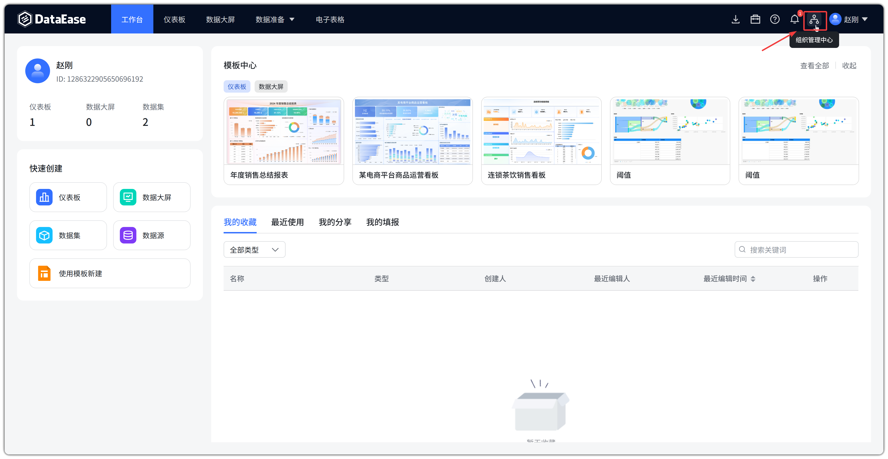
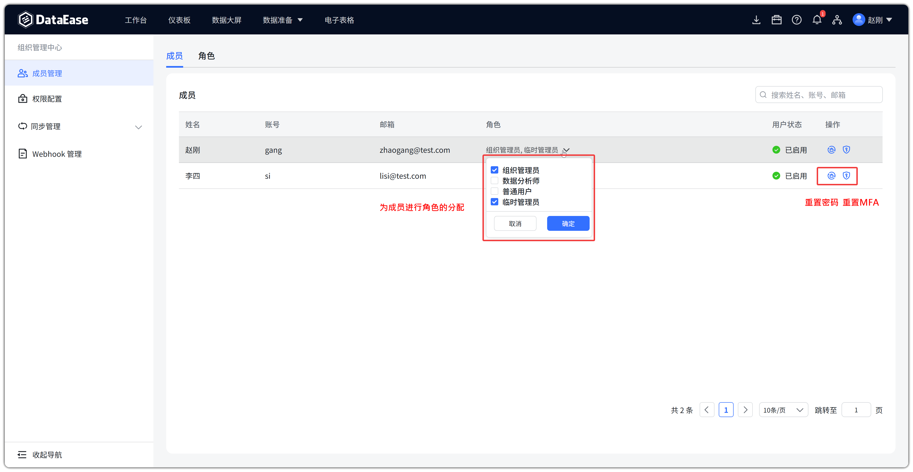
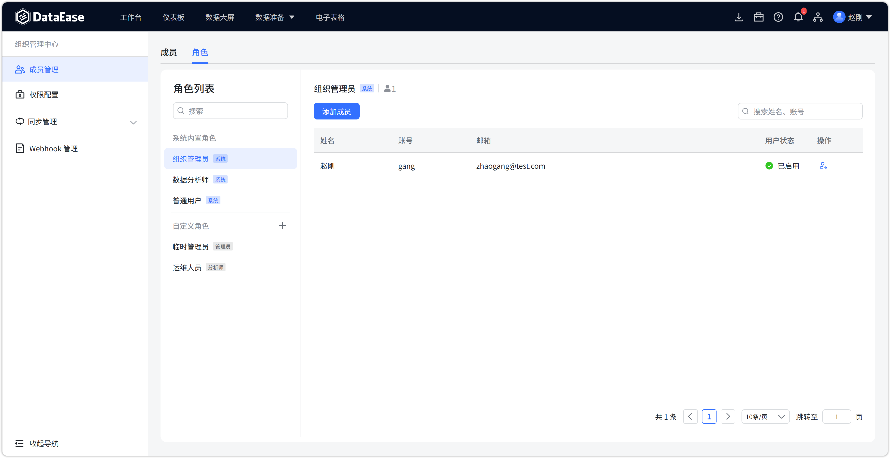
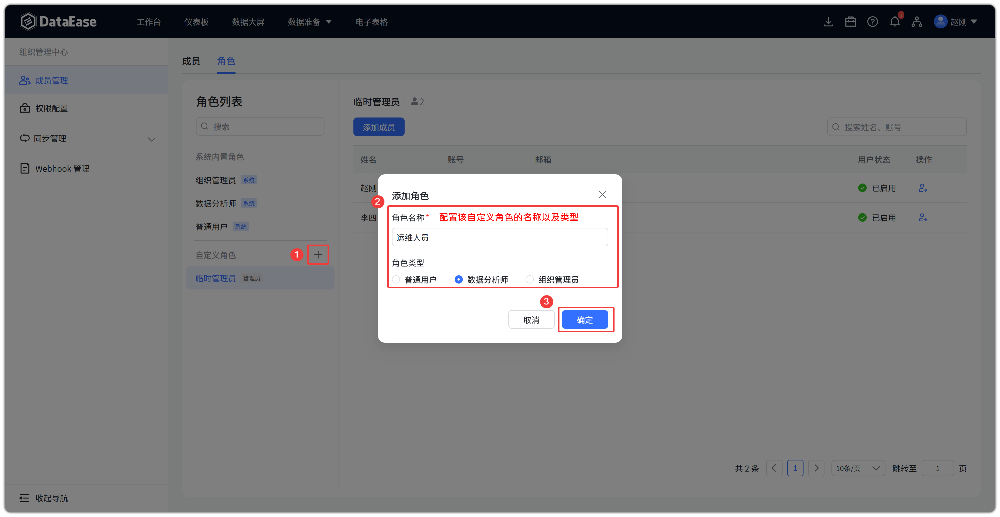
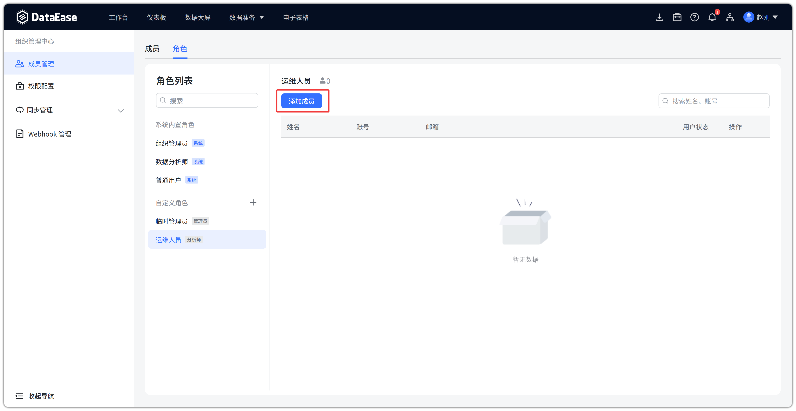
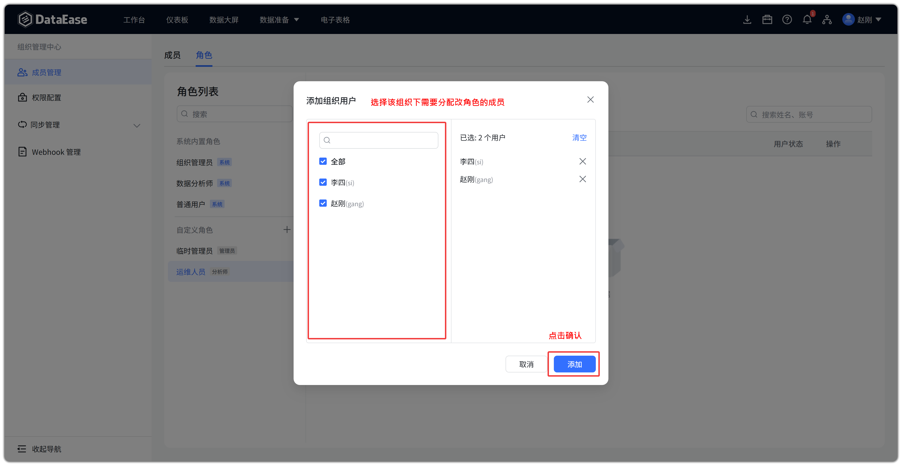
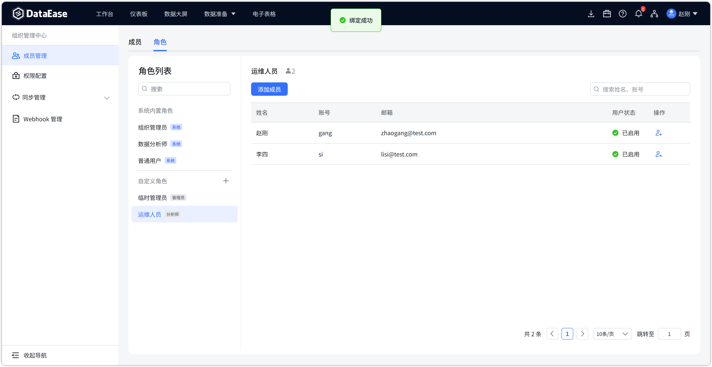
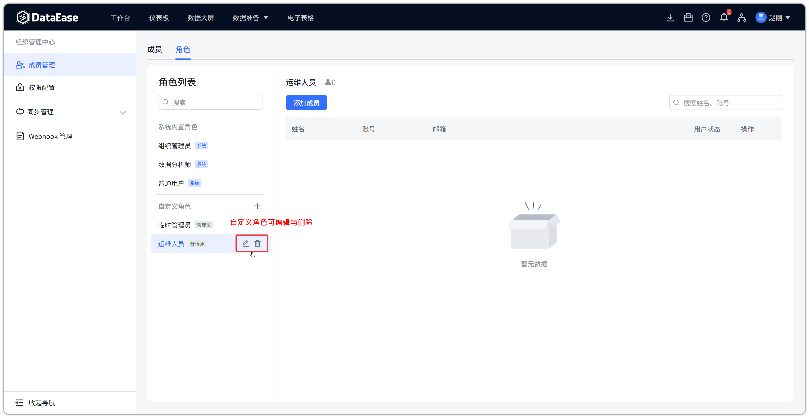

# 成员管理

## 1 功能概述

!!! Abstract ""
    【成员管理】位于顶部菜单【组织管理中心】下，供 **当前组织的组织管理员** 维护本组织成员与角色。

    用 **组织管理员** 登录后，顶部一级菜单会出现【组织管理中心】，其下为：成员管理、权限配置、同步管理、Webhook 管理。
{ width="900px" }
!!! Abstract ""

    **组织管理员可以：**

    - 查看当前组织内的成员列表；
    - 为成员调整其在当前组织下的角色；
    - 在【角色】页签创建自定义角色，并向角色添加 / 移除组织内成员；
    - 重置成员密码、解锁账号、重置 MFA。

    **组织管理员不可以：**

    - 新建、删除平台用户（无【添加用户】【批量导入】【删除】）；
    - 将用户加入组织或从组织中移出（无【添加成员】【移出组织】）；
    - 新建、删除组织节点。

    将用户放进某个组织、从组织中移出，只能由系统管理员在【系统设置-组织管理】中完成。组织管理员进入【组织管理中心】后，只能调整该用户在 **本组织** 内的角色权限。

!!! Abstract ""
    **与【系统设置-用户管理】的区别**

    | 对比项 | 系统设置-用户管理 | 组织管理中心-成员管理 |
    | --- | --- | --- |
    | 入口 | 右上角头像菜单【系统设置】 | 顶部菜单【组织管理中心】 |
    | 适用角色 | 系统管理员（可进入系统设置） | 组织管理员 |
    | 管理范围 | 全平台用户 | 当前组织成员 |
    | 添加用户 / 批量导入 / 删除用户 | 支持 | 不支持 |
    | 将用户加入 / 移出组织 | 在 [组织管理](sys_management_organization.md) 中操作 | 不支持 |
    | 调整组织内角色 | 创建用户时可指定；组织管理页也可改 | 支持 |
    | 自定义角色 | 不支持 | 支持 |

## 2 功能入口

!!! Abstract ""
    登录后，在顶部一级菜单点击【组织管理中心】，左侧进入【成员管理】。

    页面顶部有【成员】【角色】两个页签。
{ width="900px" }
## 3 成员页签

!!! Abstract ""
    【成员】页签展示当前组织下的全部成员，支持按姓名、账号、邮箱搜索。

    列表列：姓名、账号、邮箱、角色、用户状态、操作。

    常见操作：

    - **调整角色**：点击成员行的角色列，勾选该成员在当前组织下的角色后确定。可选角色包括内置角色与自定义角色；
    - **重置密码**：对本地来源（LOCAL）用户重置为系统默认密码；
    - **解锁 / 重置 MFA**：账号被锁定或需重置 MFA 时使用。

    此页 **没有** 添加用户、批量导入、移出组织按钮。成员必须先由系统管理员加入本组织，才会出现在列表中。

{ width="900px" }

## 4 角色页签

!!! Abstract ""
    【角色】页签左侧为角色列表，右侧为该角色下的成员。

    **系统内置角色**（带「系统」标记，不可编辑、不可删除）：

    - **组织管理员**
    - **数据分析师**
    - **普通用户**

    **自定义角色**

    - 在「自定义角色」标题旁点击加号创建；
    - 创建时需指定角色类型（组织管理员 / 数据分析师 / 普通用户），权限不得超出该类型；
    - 自定义角色可编辑、删除。

{ width="900px" }
{ width="900px" }

### 4.1 向角色添加成员

!!! Abstract ""
    选中角色后，右侧点击【添加成员】，可将 **已在本组织内** 且尚未拥有该角色的成员加入该角色。
{ width="900px" }
{ width="900px" }
{ width="900px" }

### 4.2 从角色移除成员

!!! Abstract ""
    将成员从当前角色中移除后，成员仍保留在组织内。若这是其在本组织内的唯一角色，该成员可能暂时没有可用角色，需重新分配。
{ width="900px" }