## 1 企业微信设置

!!! Abstract ""
    系统支持企业微信平台接入，支持扫码登录、接收消息、定时报告以及免登。

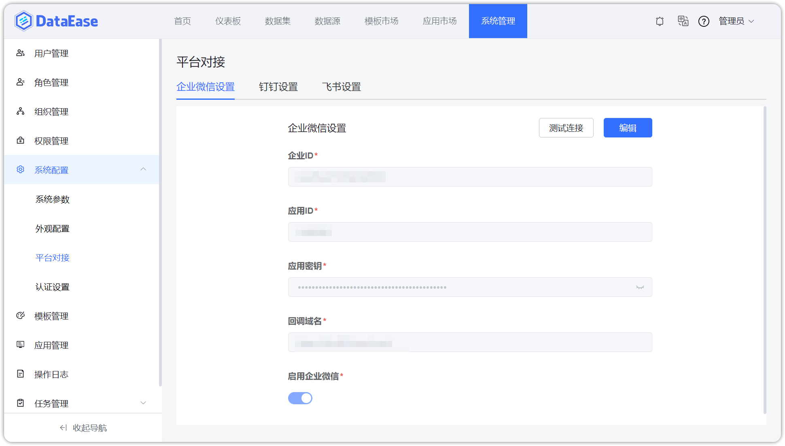{ width="900px" }

### 1.1 配置平台对接信息

!!! Abstract ""
    DataEase 对接企业微信，需要填写以下信息：

    - 企业 ID
    - 应用 ID
    - 应用密钥
    - 回调域名

    对接信息的获取，需要以管理员权限登录企业微信后台，如下图所示。

{ width="900px" }

!!! Abstract ""
    获取企业 ID，获取路径：企业微信后台->我的企业->企业信息，如下图所示。

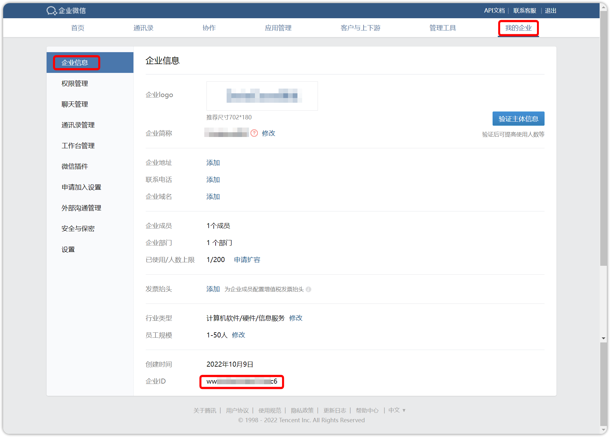{ width="900px" }

!!! Abstract ""
    获取应用 ID 与应用密钥，获取路径：企业微信后台->应用管理；  
    首先需要创建一个对应的应用，在【应用管理】栏的【应用】中，滚动到页面最下方，点击【创建应用】。

{ width="900px" }

!!! Abstract ""
    在弹出的【创建应用】对话框中输入应用的相关信息后确认即可，此处我们创建一个名叫“DataEase 测试”的应用。

{ width="900px" }

!!! Abstract ""
    创建完成后会自动跳转到新建应用的详情界面，按照如下图所示获取应用 ID 与应用密钥即可。

{ width="900px" }

!!! Abstract ""
    回调域名填写 DataEase 的访问域名即可，例如 https://dataease.fit2cloud.com，此处域名请根据实际情况进行修改；  
    **注意：** 此处的回调域名在后续的应用权限设置中需要用到。  
    根据以上信息完成下图界面的信息录入并保存。

{ width="900px" }

### 1.2 应用权限设置

!!! Abstract ""
    DataEase 对接企业微信，让安装 DataEase 的服务器可以访问企业微信的接口，需要设置企业可信域名。可信域名若使用非标准端口需要带上端口号，此处不可使用 IP 地址。
    可参考可信域名验证配置操作步骤可参考[可信域名验证配置操作步骤](https://kb.fit2cloud.com/?p=915e0151-5581-406f-ac2e-22afb9b3b4bf) 。若校验不通过，可按照提示信息做相关操作即可。

{ width="900px" }

{ width="900px" }

!!! Abstract ""
    域名验证完成后，再设置企业可信 IP，将 DataEase 服务器的出口 IP 设置进去。  
    企业可信 IP 为本企业服务器的 IP 地址，仅所配 IP 可通过接口获取企业数据。进入应用，在最下方可以看到“企业可信 IP”，输入 DataEase 服务器 IP 即可，例如上面的回调域名 dataease.fit2cloud.com 的 IP 为 111.111.111.111，则在配置中填写该 IP。

{ width="900px" }

{ width="900px" }

!!! Abstract ""
    要支持扫码登录，需要进行企业微信授权登录的设置。

{ width="900px" }

!!! Abstract ""
    在 Web 网页里授权回调域，注意域名需要和 DataEase 平台里填写的【回调域名】一致。

{ width="900px" }

### 1.3 企业微信免登设置
!!! Abstract ""
    应用主页地址的构造可以参考企业微信的在线文档[《构造网页授权链接——构造企业oauth2链接》](https://developer.work.weixin.qq.com/document/path/91120#%E6%9E%84%E9%80%A0%E4%BC%81%E4%B8%9Aoauth2%E9%93%BE%E6%8E%A5)。  
    应用主页地址主要结构如下面的链接所示，注意下面的红字部分：  
    https://open.weixin.qq.com/connect/oauth2/authorize?appid=CORPID&redirect_uri=REDIRECT_URI&response_type=code&scope=SCOPE&agentid=AGENTID#wechat_redirect  
    详细说明如下：

    - CORPID - 企业 ID
    - REDIRECT_URI - 回调地址，例如 https://dataease.fit2cloud.com/#/de-auto-login?type=wecom，调整域名部分即可
    - SCOPE - 填 snsapi_base 即可
    - AGENTID - 应用 ID

    主页地址示例：
    https://open.weixin.qq.com/connect/oauth2/authorize?appid=ww8c9076cfd8ea1fc1&redirect_uri=https://dataease.fit2cloud.com/#/de-auto-login?type=wecom&response_type=code&scope=snsapi_base&agentid=1000010#wechat_redirect

!!! Abstract ""
    在应用的【应用主页】栏点击【配置】，将上一步获取到的应用主页地址填入电脑端网址即可。

{ width="900px" }

!!! Abstract ""
    在企业微信工作台中找到 DataEase 应用，点击该应用即可免登访问 DataEase。

{ width="900px" }

!!! Abstract ""
    **注意：** 在工作台里访问 DataEase，用户将无法退出，以及无法修改密码。

!!! Abstract ""
    移动端免登，和桌面端类似，就是给每个应用添加上移动端的首页设置就可以了。

{ width="900px" }

## 2 钉钉设置

!!! Abstract ""
    系统支持钉钉平台接入，支持扫码登录、接收消息、定时报告以及免登。

{ width="900px" }

!!! Abstract ""
    在【任务管理】定时报告中新添加任务。

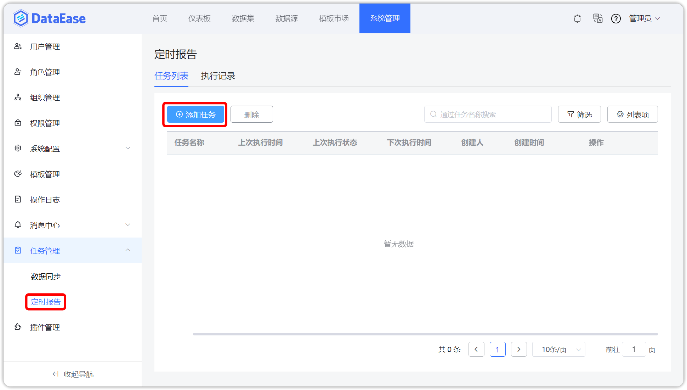{ width="900px" }

!!! Abstract ""
    进入编辑任务页面，在接受设置中勾选钉钉。

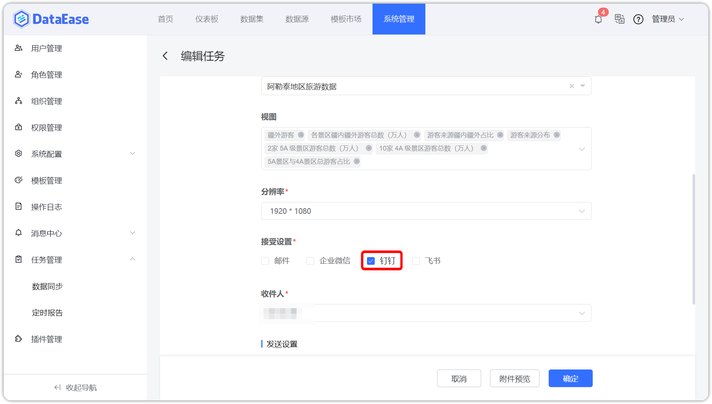{ width="900px" }

!!! Abstract ""
    可在钉钉平台查看仪表板图片及制作仪表板所用的数据集。

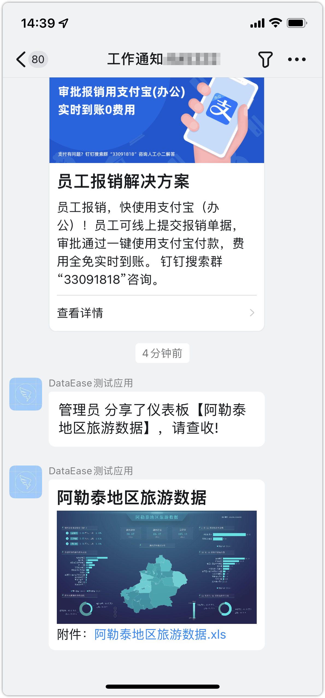{ width="900px" }

{ width="900px" }

### 2.1  配置平台对接信息

!!! Abstract ""
    DataEase 对接钉钉，需要填写以下信息：

    - 企业 ID
    - 应用 ID
    - 应用 Key
    - 应用密钥
    - 回调域名

    获取企业 ID，需要访问钉钉开放平台 https://open-dev.dingtalk.com/#/，以管理员权限登录钉钉后台，登录后即可查到对应的企业 ID，可参考下图：

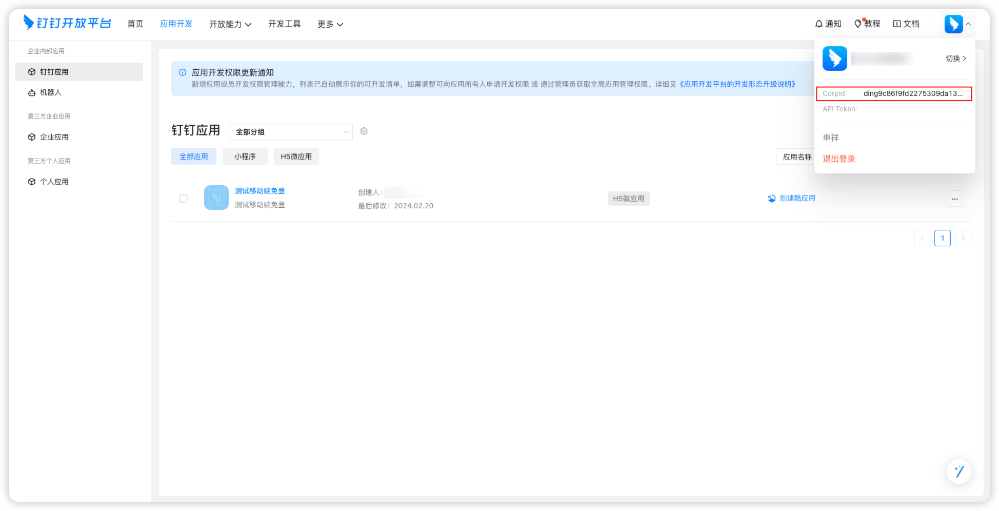{ width="900px" }

!!! Abstract ""
    获取应用 ID 和应用密钥，需要在钉钉工作台的【应用管理】中创建一个对应的应用，可以先登录工作台 https://oa.dingtalk.com/index.htm#/microApp/microAppList；  
    创建应用，需要在【应用管理】中，滚动到页面最下方，点击【自建应用】。

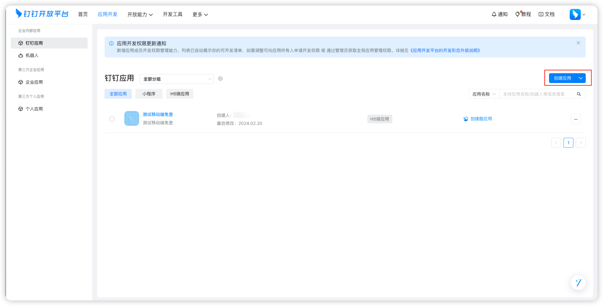{ width="900px" }

!!! Abstract ""
    在弹出的【创建企业内部应用】对话框中输入应用的相关信息后确认即可，此处我们创建一个名叫“DataEase 测试应用”的应用，这里应用类型不影响结果。

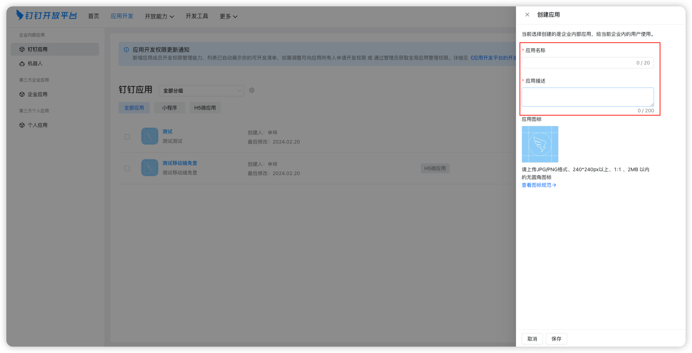{ width="900px" }

!!! Abstract ""
    获取应用信息，在应用创建完成后，可以在刚才创建的“DataEase 测试应用”中的【应用凭证】里找到所需的信息，其中：

    - AgentId - 应用 ID
    - AppKey - 应用 Key
    - AppSecret - 应用密钥

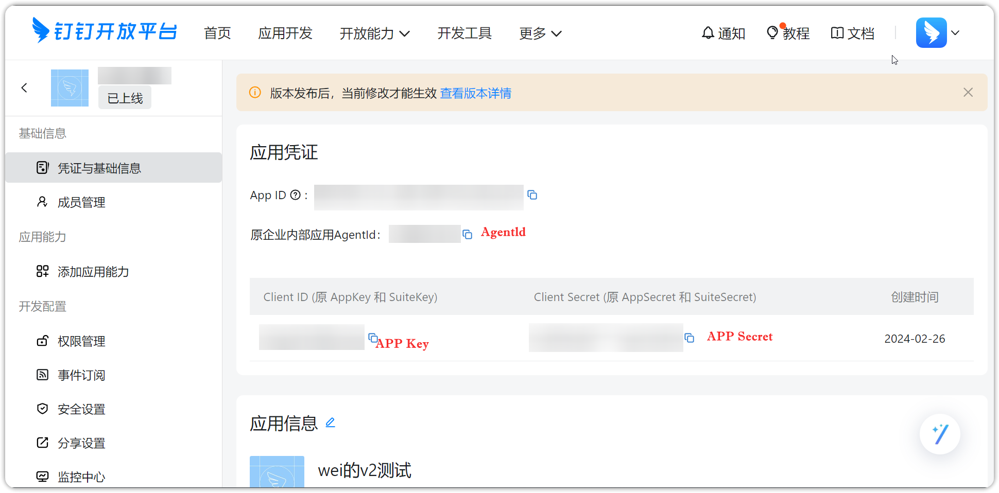{ width="900px" }

!!! Abstract ""
    回调域名填写 DataEase 的访问域名即可，例如 https://dataease.fit2cloud.com，此处域名根据自己的实际情况进行修改；  
    **注意：** 此处的回调域名在后续的应用权限设置中需要用到。  
    按照以上信息完成下图所示的平台对接配置即可。

{ width="900px" }

### 2.2 应用权限设置

!!! Abstract ""
    授权登录，要支持扫码登录，需要进行钉钉授权登录的设置，进入应用“DataEase 测试应用”，在【分享设置】里中添加授权回调域，注意域名需要和 DataEase 平台里填写的【回调域名】一致。

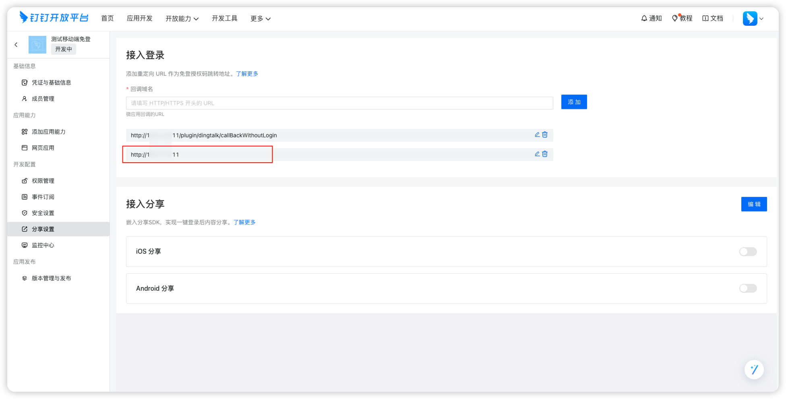{ width="900px" }

!!! Abstract ""
    权限控制，进入到【权限管理】中，添加如下图所示的权限即可。

{ width="900px" }

### 2.3 钉钉免登设置

!!! Abstract ""
    在钉钉开放平台的【应用能力】栏中，进入【网页应用】，设置【应用首页地址】和【PC端首页地址】。首页地址格式为：http(s)://xxx.xxx.xxx/#/de-auto-login?corpId=&dollar;CORPID&dollar;，corpId=&dollar;CORPID&dollar; 无需替换成真正的 corpId，此处仅为变量。

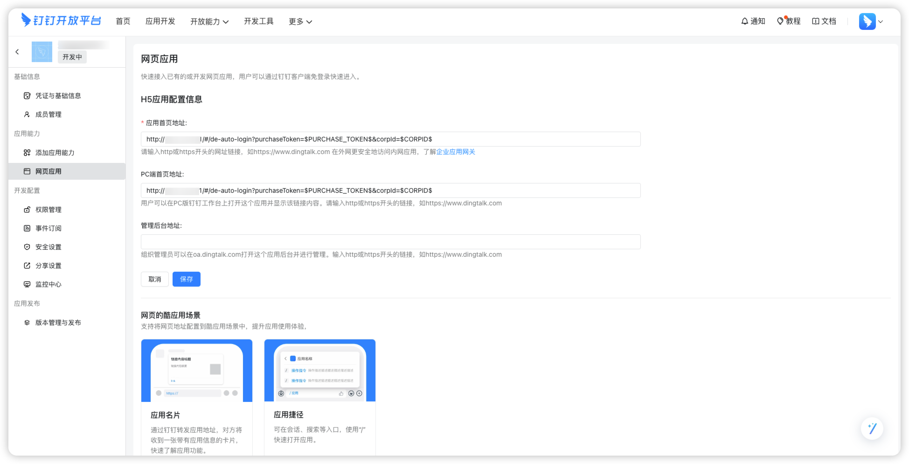{ width="900px" }

!!! Abstract ""
    在【分享设置】页面中添加回调域名，域名格式为：http(s)://xxx.xxx.xxx/plugin/dingtalk/callBackWithoutLogin。

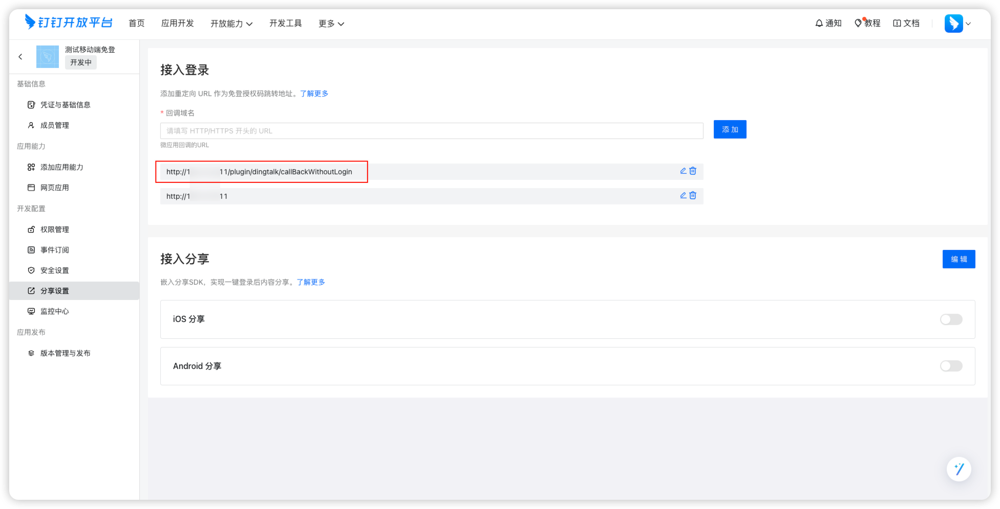{ width="900px" }

!!! Abstract ""
    **注意：** 在工作台里访问 DataEase，用户将无法退出，以及无法修改密码。

!!! Abstract ""
    移动端免登，和桌面端类似，就是给每个应用添加上移动端的首页设置就可以了。

{ width="900px" }

## 3 飞书设置

!!! Abstract ""
    系统支持飞书平台接入，支持扫码登录、接收消息、定时报告以及免登。

{ width="900px" }

!!! Abstract ""
    配置定时报告示例。

{ width="900px" }

{ width="900px" }

!!! Abstract ""
    支持飞书平台查看消息。

{ width="900px" }

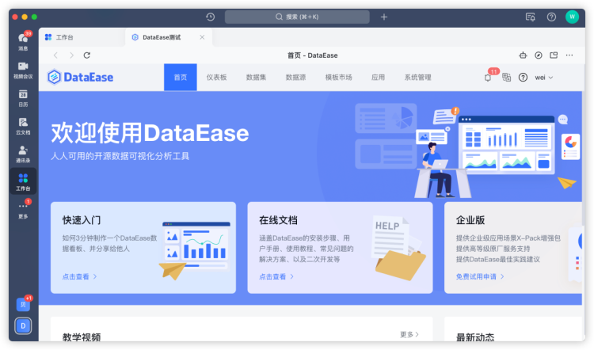{ width="900px" }

### 3.1 配置平台对接信息

!!! Abstract ""
    DataEase 对接飞书，需要填写以下信息：

    - 应用 ID
    - 应用密钥
    - 回调域名

    获取应用 ID 和应用密钥，需要以管理员权限登录飞书管理后台，在【工作台】的【应用管理】中创建一个对应的应用。

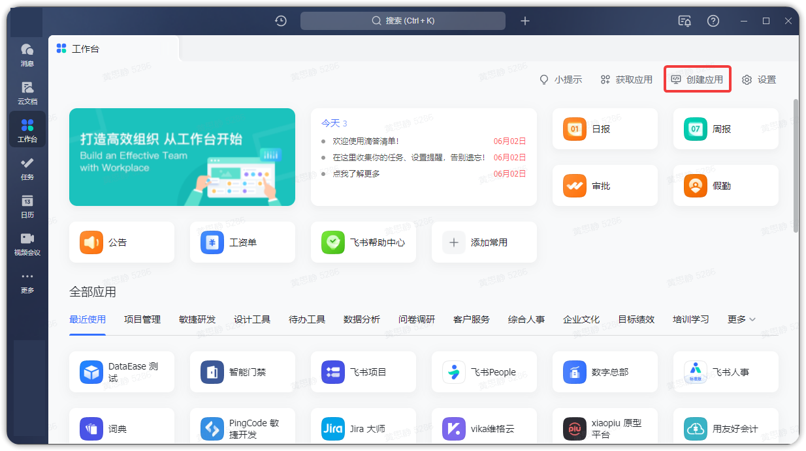{ width="900px" }

{ width="900px" }

{ width="900px" }

!!! Abstract ""
    创建应用，在弹出的【创建应用】对话框中输入应用的相关信息后确认即可，此处创建一个名叫“DataEase 测试”的应用。

{ width="900px" }

!!! Abstract ""
    点击【确定创建】按钮后，完成应用创建并进入应用。提醒进行配置和发布，进行配置后进行发布版本。

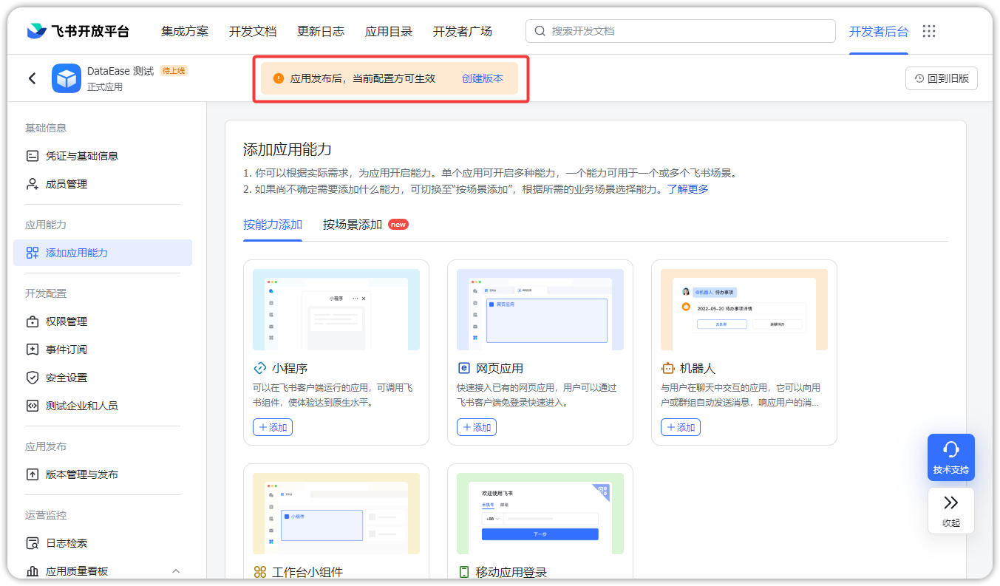{ width="900px" }

!!! Abstract ""
    应用设置，启用机器人，路径：飞书开放平台->新创建的 DataEase 测试应用->应用功能->添加机器人。

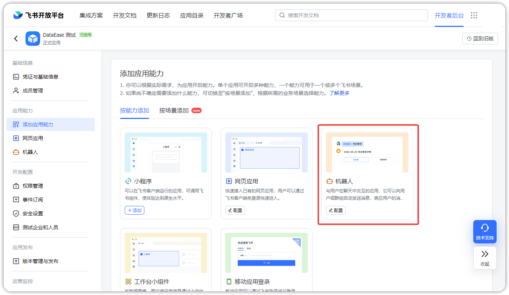{ width="900px" }

{ width="900px" }

!!! Abstract ""
    设置回调 URL 和 IP 白名单，假设 DataEase 服务器的域名为 https://dataease.fit2cloud.com，对应的 IP 为111.222.111.222，则在应用中的【安全设置】里，在【重定向 URL】中添加两条记录：https://dataease.fit2cloud.com/plugin/lark/callBack，即 http(s)://域名/plugin/lark/callBack；https://dataease.fit2cloud.com/plugin/lark/bind， 即 http(s)://域名/plugin/lark/bind；  
    在【IP 白名单】中加 入DataEase 服务器对应的 IP，如 111.222.111.222。

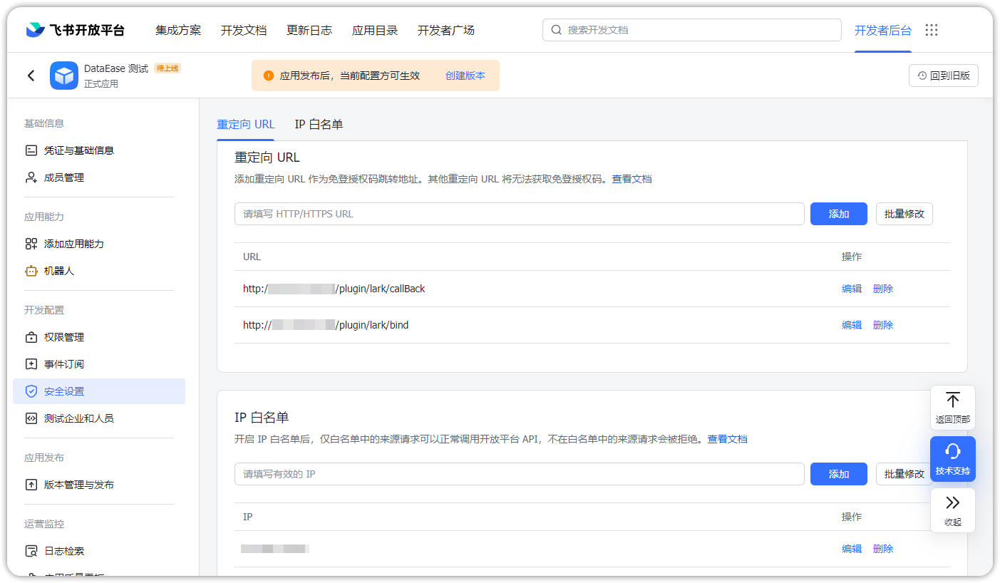{ width="900px" }

!!! Abstract ""
    应用授权，在应用的【权限管理】里进行应用的相关授权，具体权限参考下图：

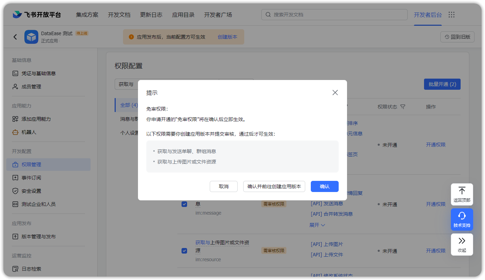{ width="900px" }

{ width="900px" }

!!! Abstract ""
    新建应用版本，在应用的【版本管理与发布】中创建应用版本，如下图所示。

{ width="900px" }

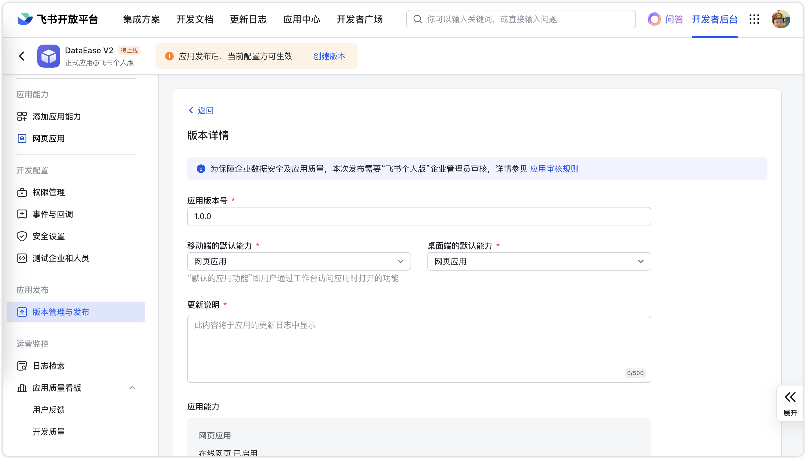{ width="900px" }

!!! Abstract ""
    申请线上发布。

{ width="900px" }

!!! Abstract ""
    进行应用审核。

{ width="900px" }

{ width="900px" }

{ width="900px" }

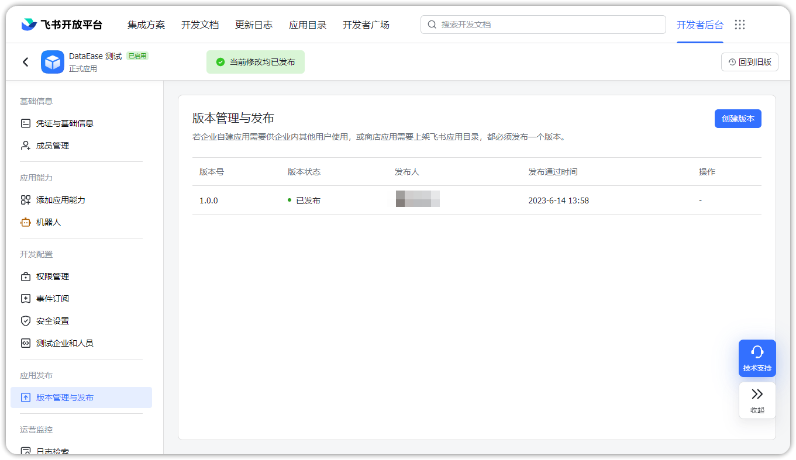{ width="900px" }

!!! Abstract ""
    获取应用 ID 和应用密钥，在应用的【凭证与基础信息】里可以获取到应用 ID 和应用密钥。

{ width="900px" }

!!! Abstract ""
    回调域名填写 DataEase 的访问域名即可，例如 https://dataease.fit2cloud.com，此处域名根据自己的实际情况进行修改；  
    **注意：** 此处的回调域名在后续的应用权限设置中需要用到。  
    按照以上信息完成下图所示的平台对接配置即可。

### 3.2 飞书权限设置

{ width="900px" }
!!! Abstract ""
    定时报告支持发送至飞书群聊，飞书应用中需要在权限里加上以下两个权限。
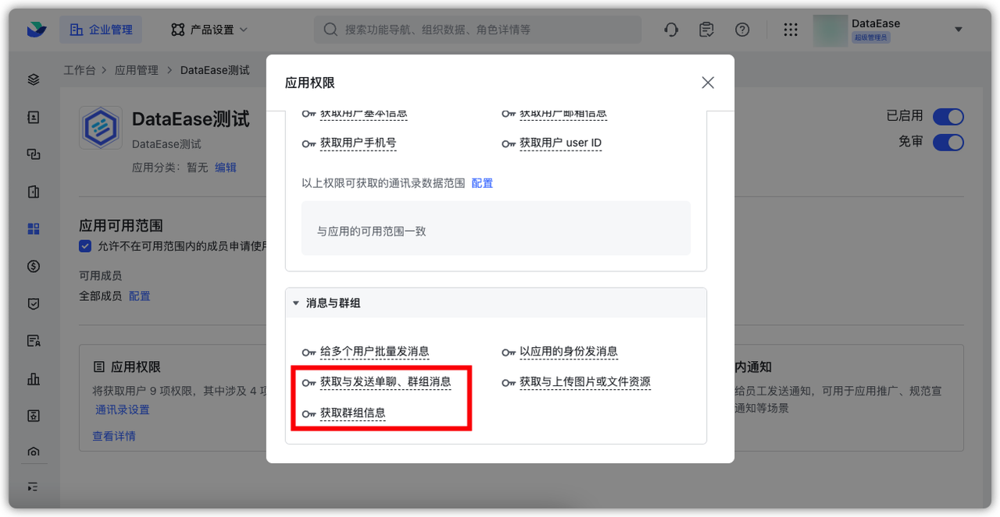{ width="900px" }
!!! Abstract ""
    在飞书群组中加入 DataEase 应用的机器人。
{ width="900px" }
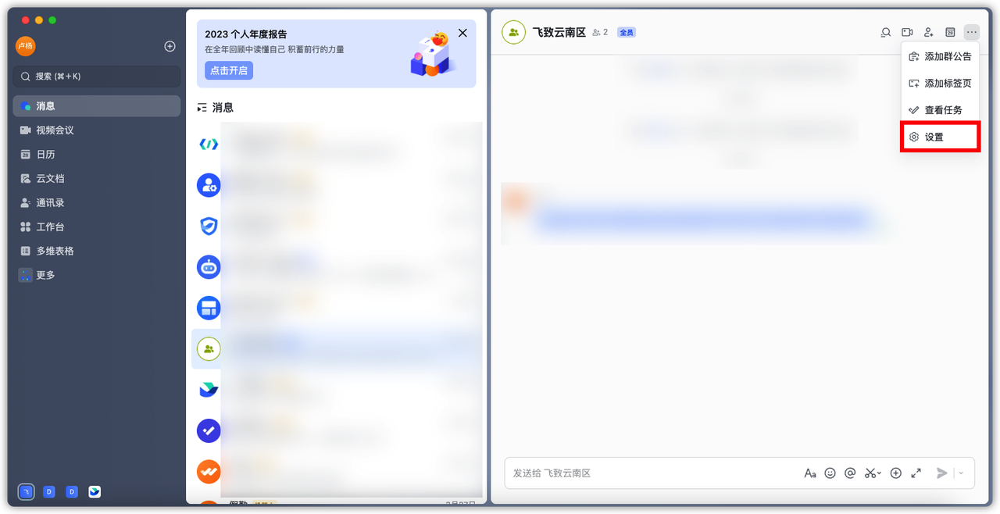{ width="900px" }
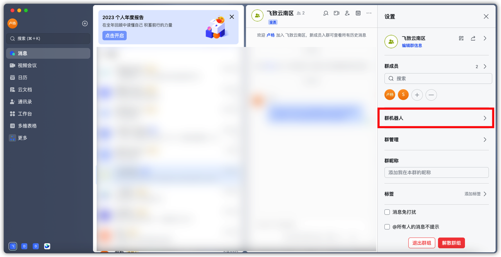{ width="900px" }
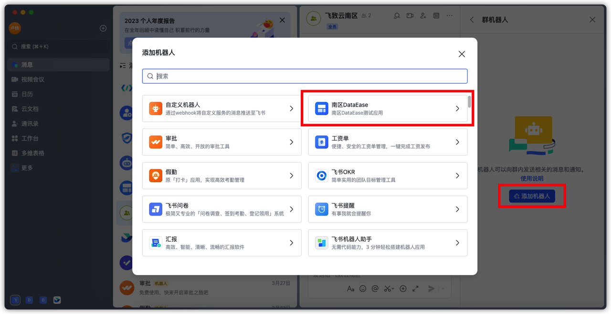{ width="900px" }

### 3.3 飞书免登设置

!!! Abstract ""
    在飞书开放平台中，选择 DataEase 应用。在【应用功能】下的【网页】里，开启网页功能，并配置【桌面端主页】。主页地址格式：http(s)://xxx.xxx.xxx.xxx/#/de-auto-login?type=lark。

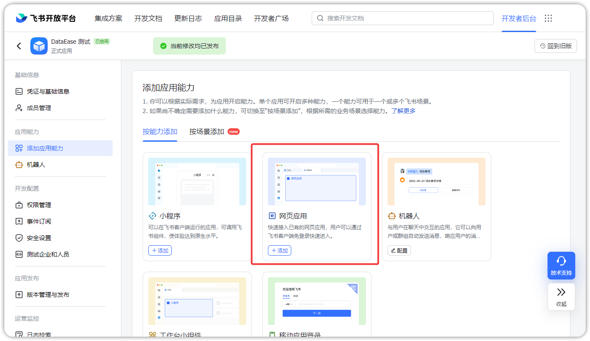{ width="900px" }

!!! Abstract ""
    在【安全设置】里添加【重定向URL】。URL格式为：http(s)://xxx.xxx.xxx.xxx/#/de-auto-login?type=lark。

{ width="900px" }

!!! Abstract ""
    滚动到页面下方，继续添加【可信域名】，将 DataEase 服务器的域名添加到可信域名中。此处支持 http(s)://192.168.1.101:9999 格式的内容。

{ width="900px" }

!!! Abstract ""
    创建一个新的应用版本进行发布即可。

{ width="900px" }

!!! Abstract ""
    **注意：** 在工作台里访问 DataEase，用户将无法退出，以及无法修改密码。

!!! Abstract ""
    移动端免登，和桌面端类似，就是给每个应用添加上移动端的首页设置就可以了。

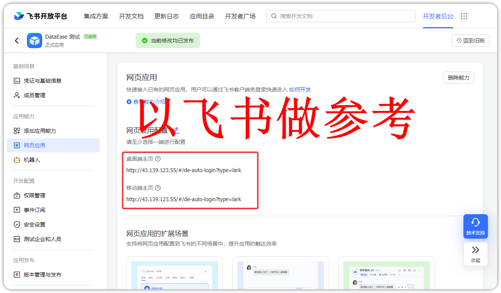{ width="900px" }

## 4 Lark 设置

!!! Abstract ""
    支持飞书国际版平台接入，可扫码登录、接收消息和定时报告。

{ width="900px" }

!!! Abstract ""
    配置定时报告示例。

{ width="900px" }

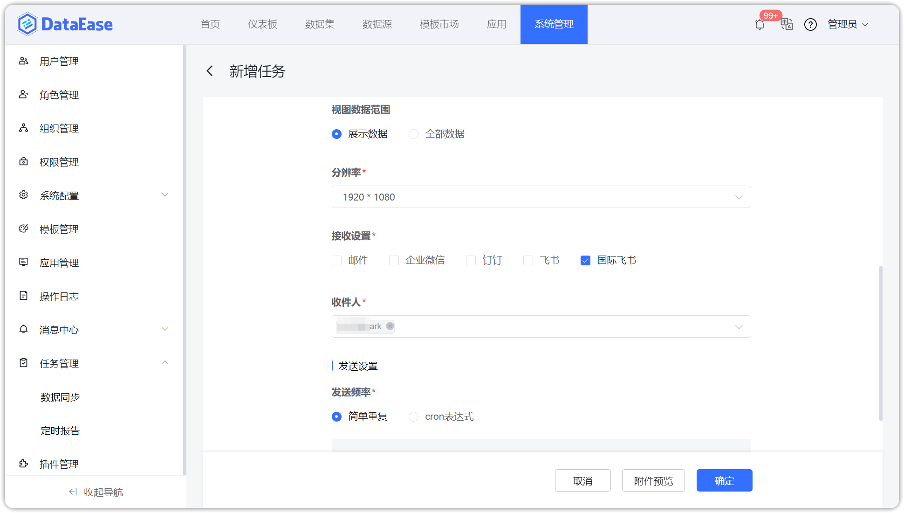{ width="900px" }

!!! Abstract ""
    支持国际飞书平台查看消息。

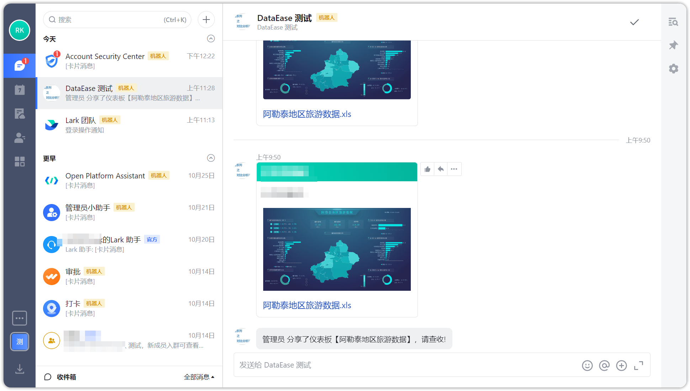{ width="900px" }

### 4.1 配置平台对接信息

!!! Abstract ""
    DataEase 对接国际飞书，需要填写以下信息：

    - 应用 Key
    - 应用密钥
    - 回调域名

{ width="900px" }

!!! Abstract ""
    对接信息的获取，需要以管理员权限登录国际飞书后台；  
    获取回调域名，回调域名填写 DataEase 的访问域名即可，例如 https://dataease.fit2cloud.com，此处域名根据自己的实际情况进行修改；  
    注意此处的回调域名在后续的应用设置中需要用到。

!!! Abstract ""
    获取应用 Key 和应用密钥，需要登录国际飞书管理后台，在【Workplace】的【App Management】中创建一个对应的应用。

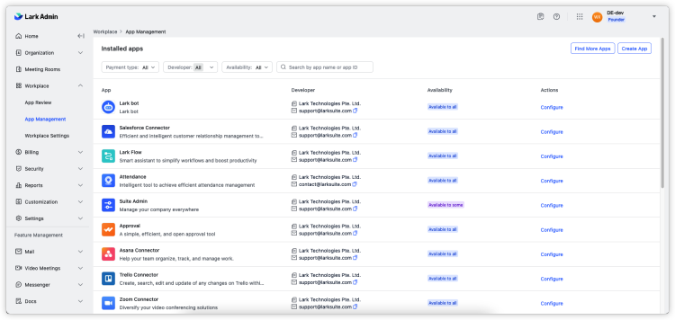{ width="900px" }

!!! Abstract ""
    创建应用，在【App Management】中，点击【Create App】，在弹出的【CreateApp】对话框中输入应用的相关信息后确认即可，此处我们创建一个名叫 "DataEase Test" 的应用。

{ width="900px" }

!!! Abstract ""
    点击【Create】按钮后，创建应用并在列表中点击应用进入应用详情。

{ width="900px" }

!!! Abstract ""
    应用设置，启用机器人。

{ width="900px" }

!!! Abstract ""
    设置回调 URL 和 IP 白名单，假设我们的 DataEase 服务器的域名为 https://dataease.fit2cloud.com，对应的 IP 为111.222.111.222，则在【Security Settings】的【Redirect URLs】里，添加两条记录：  
    https://dataease.fit2cloud.com/plugin/larksuite/callBack，即 http(s)://域名/plugin/larksuite/callBack；  
    https://dataease.fit2cloud.com/plugin/larksuite/bind，即 http(s)://域名/plugin/larksuite/bind；  
    在【IP allowlist】中加入 DataEase 服务器对应的 IP，如111.222.111.222。

{ width="900px" }

### 4.1 Lark 权限设置

!!! Abstract ""
    应用授权，在应用的【Security Settings】里进行应用的相关授权，具体权限参考下图。

{ width="900px" }

!!! Abstract ""
    可在【Manage Scopes】里搜索以下权限：

    - Plain Text
    - contact:user.base:readonly
    - contact:user.email:readonly
    - contact:user.employee_id:readonly
    - contact:user.phone:readonly
    - im:message
    - im:message:send_as_bot
    - im:message:send_multi_users
    - im:resource

!!! Abstract ""
    新建应用版本，在应用的【Version Management & Release】中创建应用版本，如下图所示。

{ width="900px" }

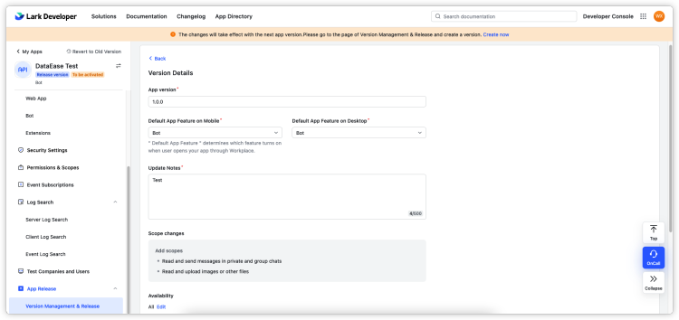{ width="900px" }

{ width="900px" }

!!! Abstract ""
    新建完应用版本后，点击【Submit for release】，请求发布应用版本；  
    管理员在飞书管理后台的【App Review】里可以看到申请发布的应用，通过审核即可。

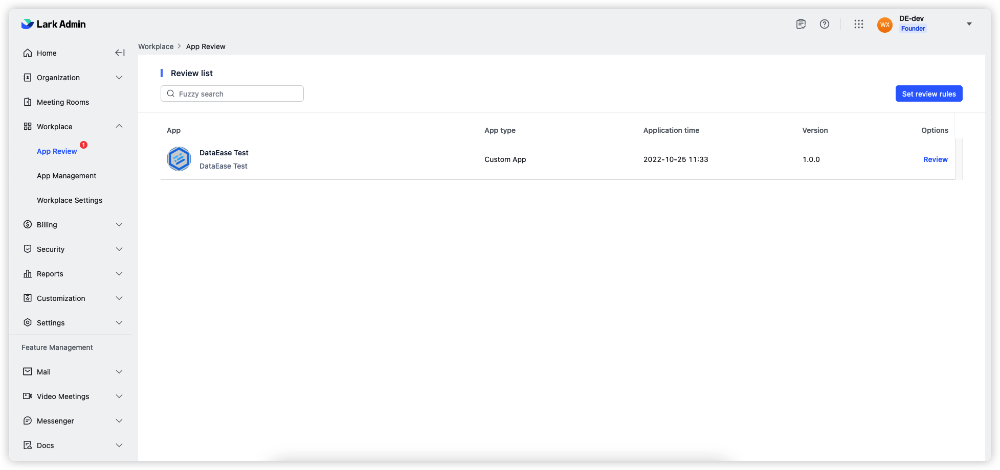{ width="900px" }

!!! Abstract ""
    获取应用 key 和应用密钥，在应用的【Credentials】里可以获取到 App ID 和 App Secret。

{ width="900px" }