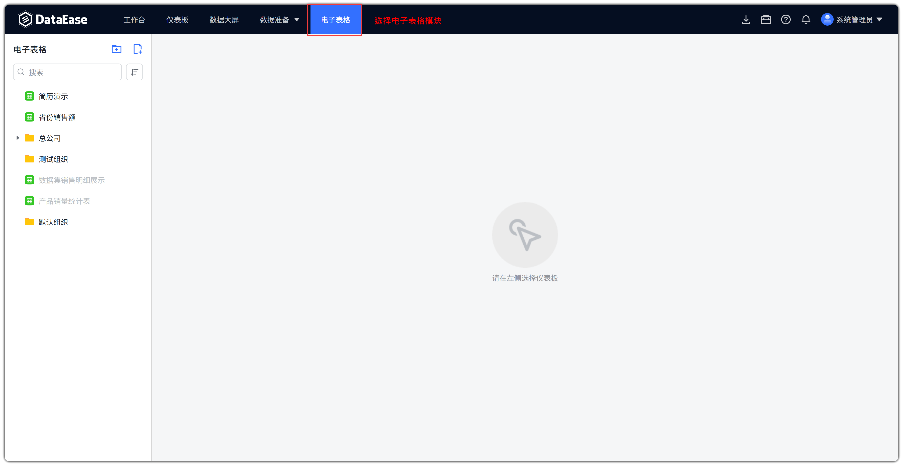
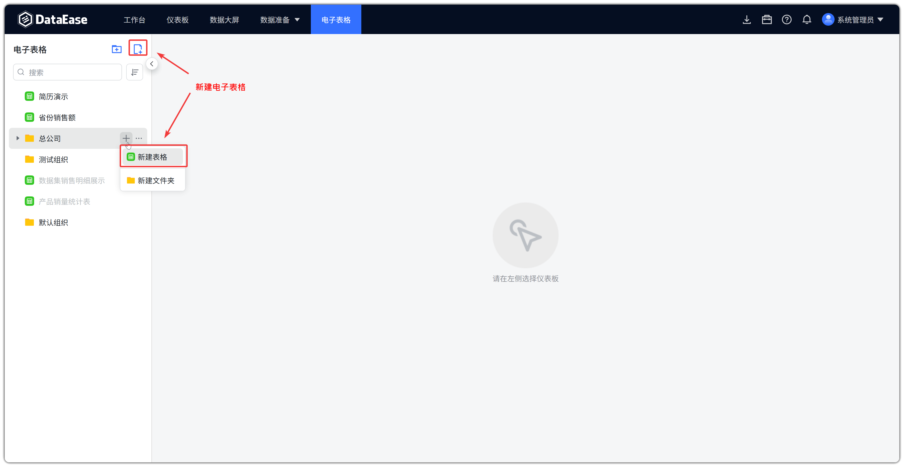
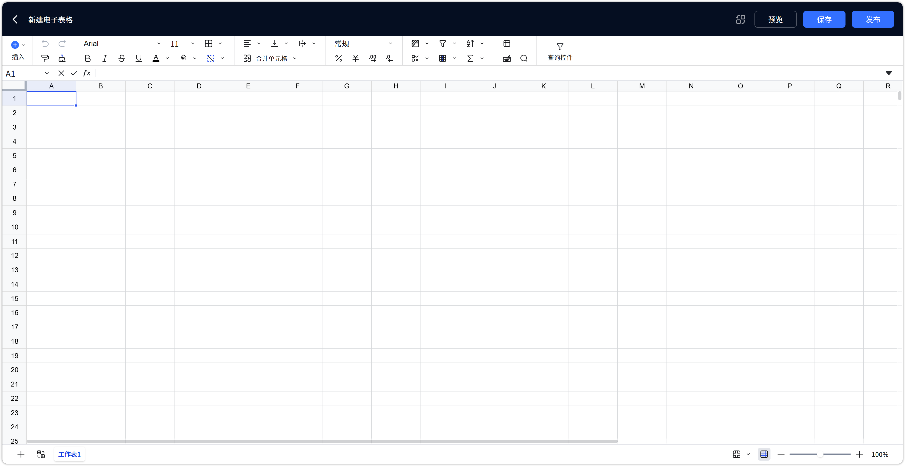
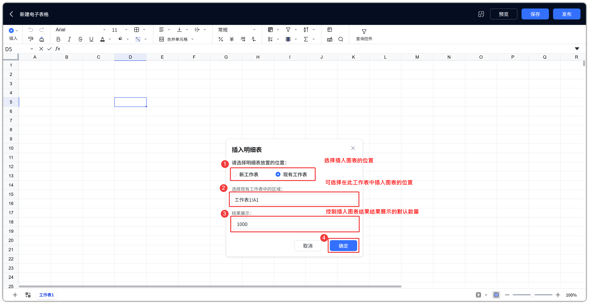
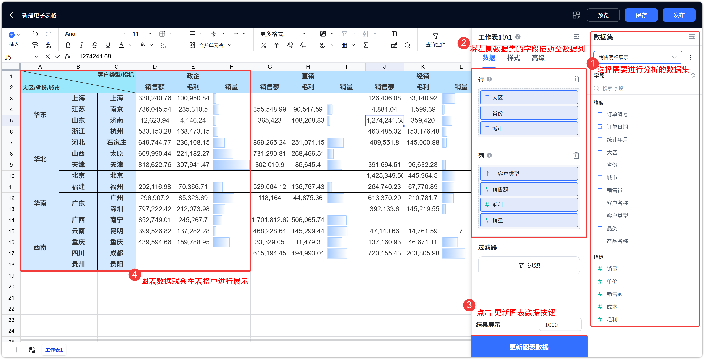
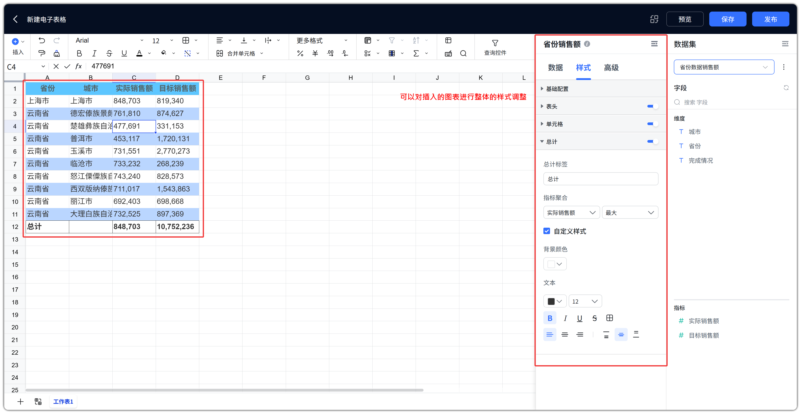
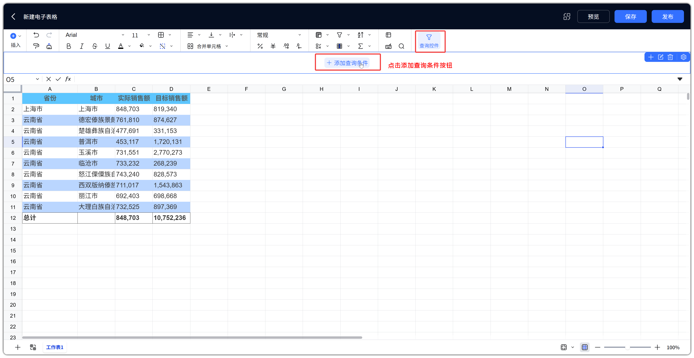
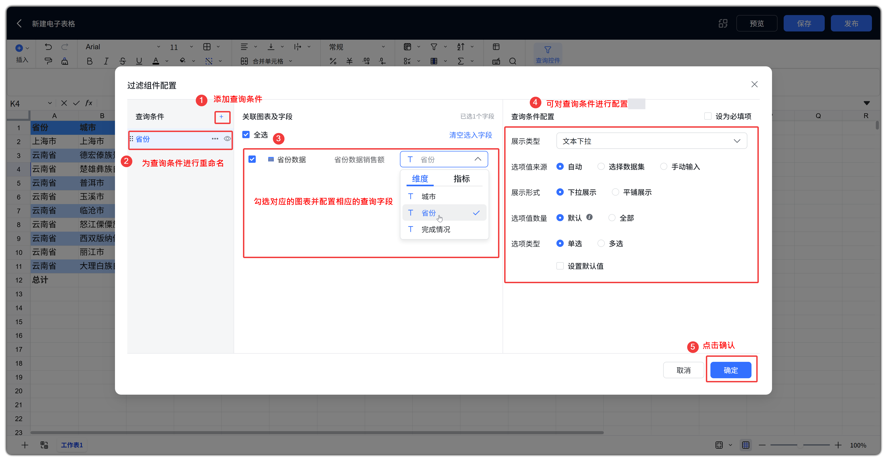
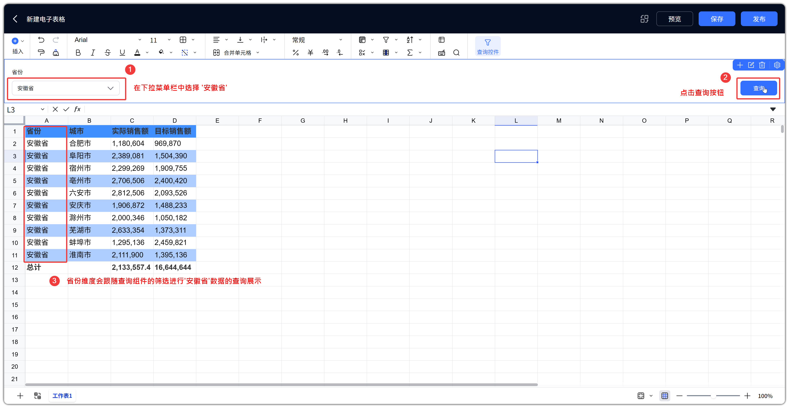
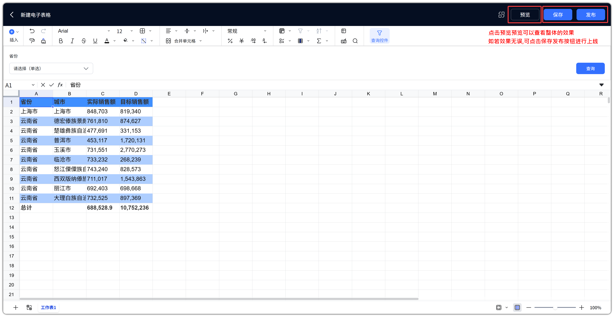

# 电子表格概述

## 1 功能概述

!!! Abstract ""
    【电子表格】是 DataEase v3.0.0 起新增的功能模块，用于在线创建、编辑和发布电子表格。用户可在顶部一级菜单进入该模块，以类 Excel 的表格形式展示和分析数据。

    **资源管理能力**

    - 支持文件夹分类、搜索、按时间 / 名称排序；
    - 支持收藏、预览、全屏预览、重命名、移动到、删除；
    - 支持发布 / 取消发布 / 恢复到发布版本，控制其他用户是否可查看。

    **数据展示能力**

    - 支持插入 **明细表** 、 **透视表** 对象，绑定数据集展示数据；
    - 支持字段排序、汇总、数值格式、日期格式、合计行等配置；
    - 支持 **查询控件** ，按文本 / 数字 / 时间等条件过滤，并联动明细表、透视表对象刷新。

    **单元格编辑能力（Univer 引擎）**

    - 字体、对齐、边框、合并、数字格式、公式、条件格式、数据验证；
    - 斜线单元格（二分 / 三分）、冻结窗格、区域筛选、排序；
    - 插入图片（浮动 / 单元格）、链接、批注、评论。

    **运维能力**

    - 支持替换数据集（全局或按组件），同步更新字段映射；
    - 支持手动 / 自动刷新绑定数据；
    - 编辑区支持预览、保存、发布全流程。

!!! Abstract ""
    **与 Excel 的关系**：单元格编辑能力基于 Univer 引擎，与 Excel 重合度约 90%。DataEase 独有数据集绑定、发布共享、查询控件、明细表 / 透视表对象、数据集替换等。通用编辑见 [电子表格功能详解](spreadsheet_features.md)，特有能力见 [电子表格特殊功能](spreadsheet_special.md)，对照表见 [与 Excel / Univer 的关系](spreadsheet_features.md#excel-univer)。

!!! Abstract ""
    **术语说明**

    - 界面中的【透视表】即按行 / 列维度汇总指标的对象；
    - 查询控件配置中的「关联图表及字段」，指关联当前表格内的 **明细表 / 透视表对象** 及其字段，并非传统 BI 图表组件。

## 2 快速上手

!!! Abstract ""
    本节以制作一张可发布的电子表格为例，用 6 步完成从进入模块到发布的核心路径。

!!! Abstract ""
    **第 1 步：进入电子表格模块**

    - 在工作台顶部一级菜单点击【电子表格】。

{ width="900px" }

!!! Abstract ""
    **第 2 步：新建电子表格**

    - 在左侧标题【电子表格】旁点击【新建文件夹】或【新建表格】图标；
    - 也可在文件夹行的【+】菜单中选择【新建表格】/【新建文件夹】。

{ width="900px" }
{ width="900px" }

!!! Abstract ""
    **第 3 步：插入数据对象**

    - 进入编辑界面，点击工具栏【插入】→【明细表】或【透视表】；
    - 选择放置位置（新工作表 / 现有工作表），设置【结果展示】条数后确定；
    - 在右侧配置区选择数据集并拖拽字段。
    - 点击下方的刷新图表数据按钮即可展示数据。
{ width="900px" }
{ width="900px" }

!!! Abstract ""
    **第 4 步：设置样式**

    - 可设置表头、单元格样式、边框、合并、数字格式等；
    - 长表使用【冻结】固定表头。
{ width="900px" }

!!! Abstract ""
    **第 5 步：配置查询控件（可选）**

    - 点击工具栏【查询控件】→【+ 添加查询条件】；
    - 为条件关联明细表 / 透视表字段，实现联动过滤（详见 [查询控件](spreadsheet_special.md#query-control)）。
{ width="900px" }
{ width="900px" }
{ width="900px" }
!!! Abstract ""
    **第 6 步：预览、保存并发布**

    - 【预览】确认效果 →【保存】→【发布】上线。
{ width="900px" }

!!! Abstract ""
    **避坑提示**

    - 未发布表格对其他用户不可正式查看，需先发布；
    - 编辑过程中随时保存；有未发布修改时可通过【恢复到发布版本】回退。
