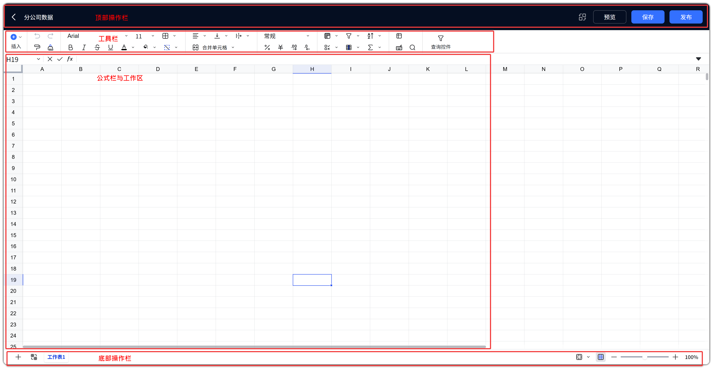
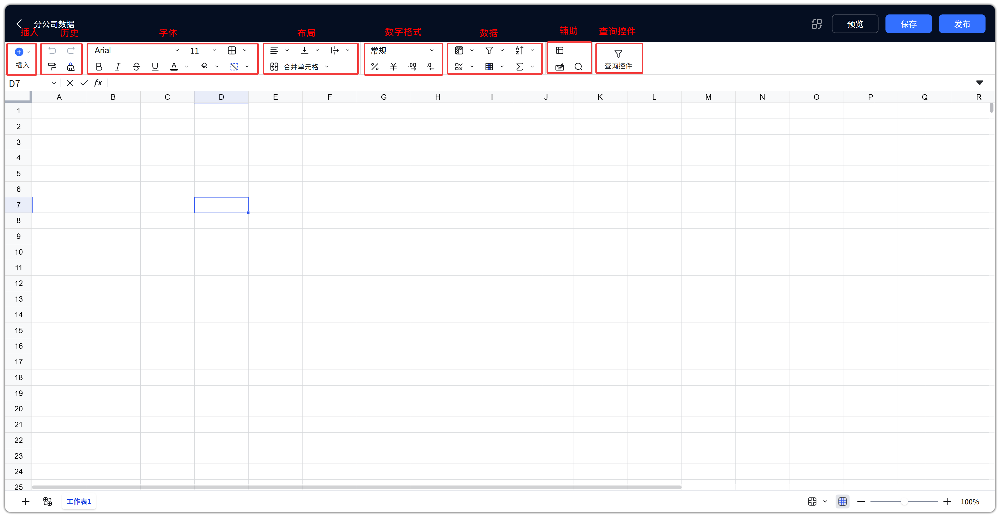
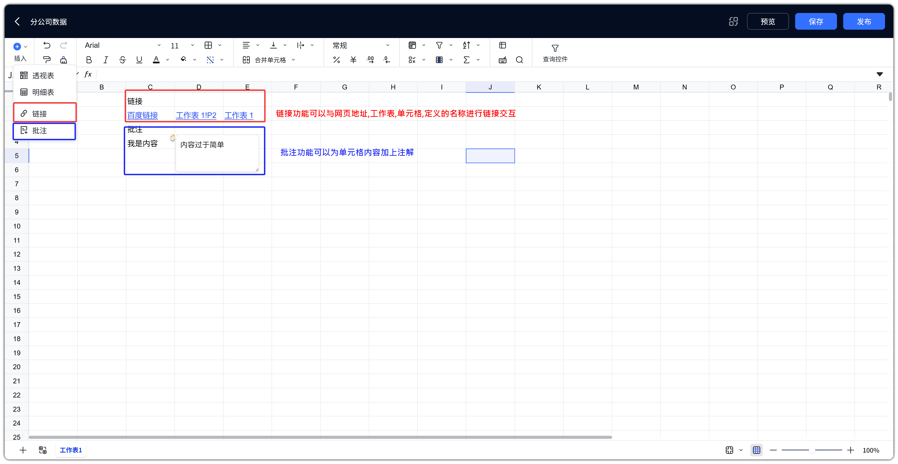
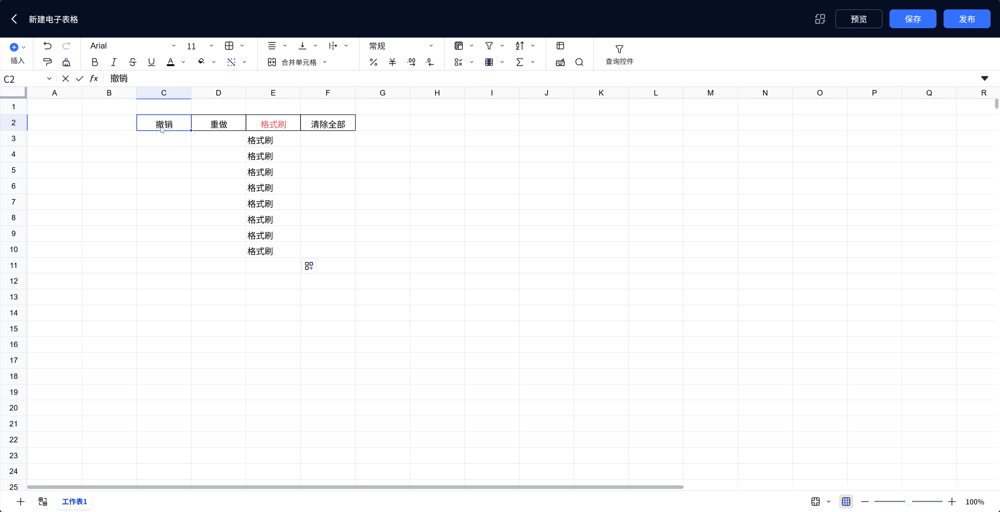
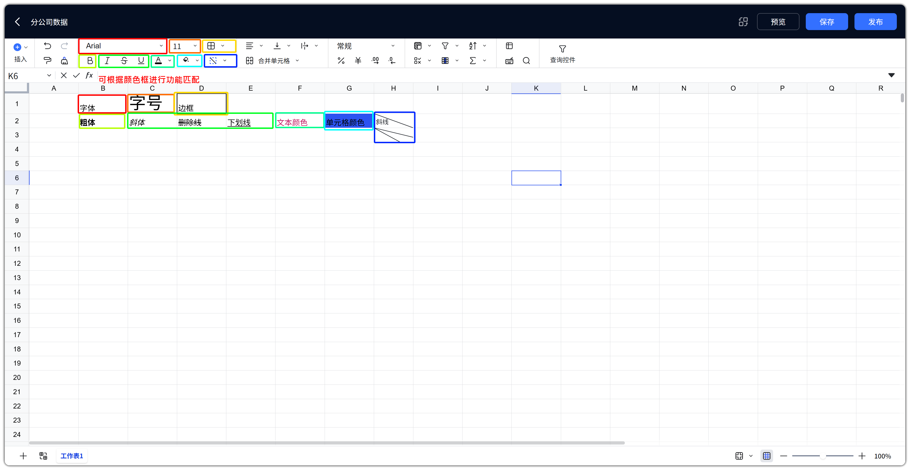
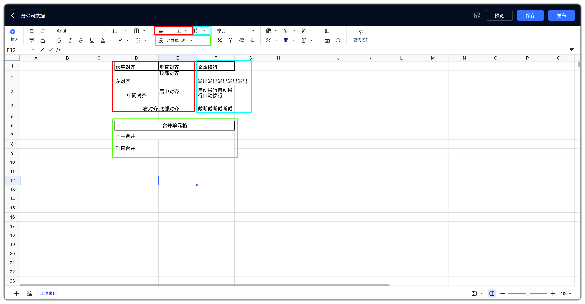
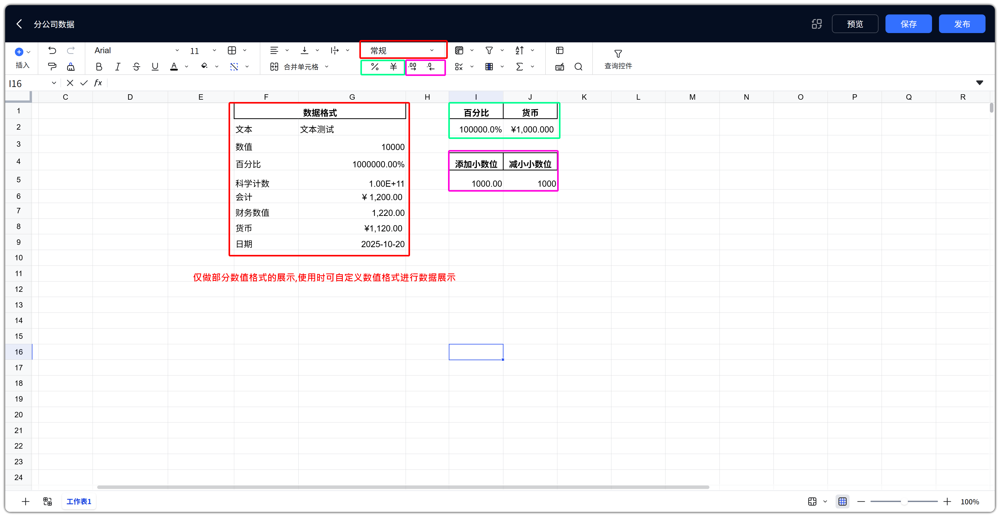
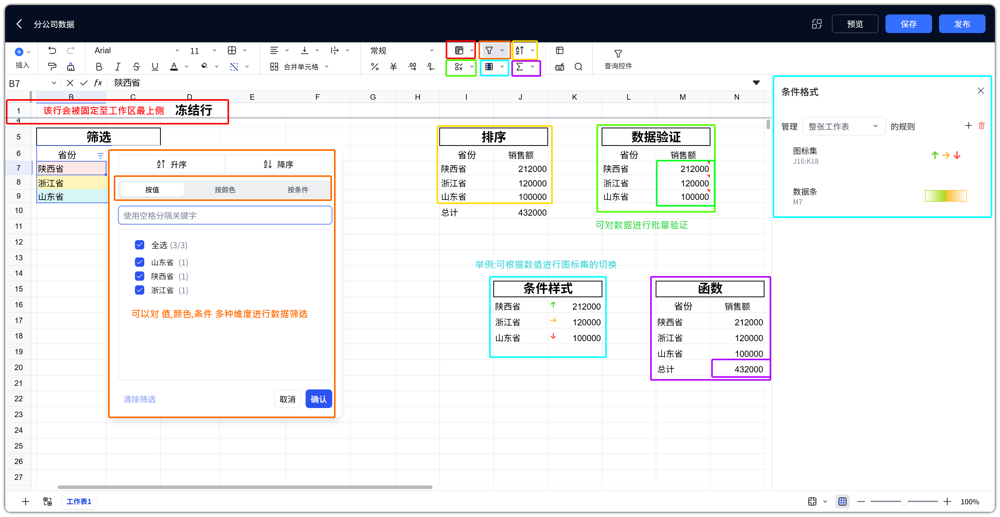
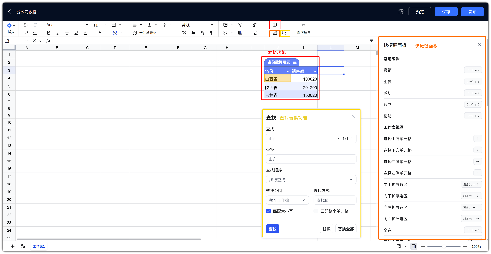
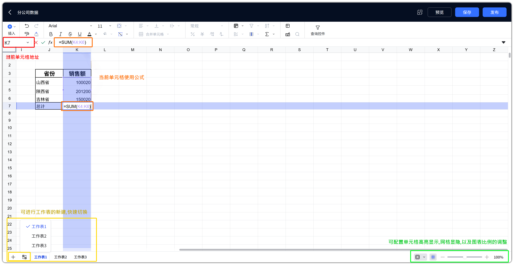

# 电子表格功能详解

!!! Abstract ""
    电子表格编辑能力基于 [Univer Sheets](https://docs.univer.ai/guides/sheets) 引擎；DataEase 在此之上扩展了明细表 / 透视表、查询控件、数据集复制粘贴、发布运维等能力。

    DataEase 特有能力的详细说明见 [电子表格特殊功能](spreadsheet_special.md)；发布与数据集替换见 [发布运维](spreadsheet_publish.md)。

## 1 界面总览

!!! Abstract ""
    编辑器采用类 Excel 布局（自定义 Ribbon，单行分组展示）：

    | 区域 | 内容 |
    | --- | --- |
    | 顶部操作区 | 返回、替换数据集、预览、保存、发布 |
    | Ribbon 工具栏 | 插入、历史、字体、布局、数字格式、数据（冻结 / 筛选 / 排序等）、辅助、查询控件 |
    | 公式栏 | 单元格地址、公式 / 内容编辑 |
    | 单元格区 | 网格编辑；选中明细表 / 透视表时右侧出现配置面板 |
    | 右键菜单 | 复制粘贴、插入删除、冻结、排序、粘贴数据集等 |
    | 底部状态区 | 工作表标签、缩放、十字高亮、网格线显隐 |

{ width="900px" }

## 2 顶部操作区

!!! Abstract ""
    | 按钮 | 功能说明 |
    | --- | --- |
    | 返回 | 返回目录列表；有未保存修改时会提示 |
    | 预览 | 预览当前表格；下拉支持【全屏预览】 |
    | 保存 | 保存当前编辑 |
    | 发布 | 发布上线。下拉项随状态变化：已发布时可【取消发布】；已发布后又修改并保存、尚未再次发布时，可【恢复到发布版本】 |
    | 替换数据集 | 右上角循环箭头图标，批量替换表格内使用的数据集（详见 [数据集替换](spreadsheet_publish.md#1-数据集替换)） |
!!! Abstract ""
    **典型操作**：预览 → 保存 → 发布。
    | 状态 | 含义 |
    | --- | --- |
    | 未发布 | 仅创建者 / 有权限用户可编辑，其他用户不可正式查看 |
    | 已发布 | 其他用户可在目录中预览 |
    | 已保存未发布 | 相对上次发布内容又有保存修改，尚未再次发布；此时可恢复到发布版本或取消发布 |

## 3 工具栏（Ribbon）

!!! Abstract ""
    工具栏基于 Univer Ribbon，由 DataEase 重组为若干分组。

### 3.1 分组总览

!!! Abstract ""
    | 分组 | 包含项 |
    | --- | --- |
    | 插入 | 【插入】下拉 |
    | 历史 | 撤销、重做、格式刷、清除 |
    | 字体 | 字体、字号、边框、粗体、斜体、删除线、下划线、字体颜色、填充颜色、斜线单元格 |
    | 布局 | 水平对齐、垂直对齐、自动换行、合并单元格 |
    | 数字格式 | 数字格式面板（默认显示「常规」）、百分比、货币、增加小数位、减少小数位 |
    | 数据 | 冻结、筛选、排序、数据验证、条件格式、函数 |
    | 辅助 | 表格、快捷键面板、查找替换 |
    | 查询控件 | 【查询控件】（详见 [电子表格特殊功能 - 查询控件](spreadsheet_special.md#5-查询控件)） |
{ width="900px" }

### 3.2 插入

!!! Abstract ""
    | 菜单项 | 说明 |
    | --- | --- |
    | 透视表 | 按行 / 列维度汇总指标，详见 [透视表](spreadsheet_special.md#4-透视表) |
    | 明细表 | 逐行展示数据集明细，详见 [明细表](spreadsheet_special.md#3-明细表) |
    | 链接 | 插入超链接 |
    | 批注 | 单元格批注 |

{ width="900px" }

!!! Abstract ""
    【插入】下拉**不包含**传统 BI 图表类型。数据可视化请用明细表 / 透视表，或通过查询控件联动，详见 [电子表格特殊功能](spreadsheet_special.md)。

### 3.3 历史

!!! Abstract ""
    | 按钮 | 作用 |
    | --- | --- |
    | 撤销 | 撤销上一步操作 |
    | 重做 | 恢复已撤销操作 |
    | 格式刷 | 复制单元格格式到其他区域 |
    | 清除 | 清除选中区域内容 / 格式 |

{ width="900px" }
### 3.4 字体

!!! Abstract ""
    | 按钮 | 作用 |
    | --- | --- |
    | 字体 / 字号 | 设置字体与字号（默认 Arial / 11） |
    | 粗体 / 斜体 / 删除线 / 下划线 | 文本样式 |
    | 字体颜色 / 填充颜色 | 文字色、单元格背景色 |
    | 边框 | 设置单元格边框 |
    | 斜线单元格 | 二分 / 三分斜线表头，可取消 |
{ width="900px" }

### 3.5 布局

!!! Abstract ""
    | 按钮 | 作用 |
    | --- | --- |
    | 水平对齐 | 左 / 中 / 右等水平对齐 |
    | 垂直对齐 | 上 / 中 / 下等垂直对齐 |
    | 自动换行 | 单元格文本换行 |
    | 合并单元格 | 合并 / 取消合并（带下拉） |

{ width="900px" }

### 3.6 数字格式

!!! Abstract ""
    | 按钮 | 作用 |
    | --- | --- |
    | 常规（数字格式面板） | 打开数字格式设置（常规、数值、日期、百分比、货币等） |
    | 百分比 | 快捷设为百分比 |
    | 货币 | 快捷设为货币 |
    | 增加小数位 / 减少小数位 | 调整小数位数 |
{ width="900px" }

### 3.7 数据

!!! Abstract ""
    | 按钮 | 作用 |
    | --- | --- |
    | 冻结 | 下拉：【冻结至当前行】【冻结至当前列】【冻结至当前行列】【取消冻结】 |
    | 筛选 | Excel 式区域筛选（与查询控件不同，见 [筛选 vs 查询控件](spreadsheet_special.md#5-查询控件)） |
    | 排序 | 对选中区域排序 |
    | 数据验证 | 按规则限制或校验单元格可输入内容（如下拉、数值范围等） |
    | 条件格式 | 按规则美化单元格显示：突出显示、最前/最后/平均值、自定义公式、色阶、数据条、图标集； |
    | 函数 | 常用函数及分类函数列表（SUM、AVERAGE、IF 等） |

{ width="900px" }

### 3.8 辅助与查询控件

!!! Abstract ""
    | 按钮 | 作用 |
    | --- | --- |
    | 表格 | 将区域转换为表格对象 |
    | 快捷键面板 | 查看快捷键 |
    | 查找替换 | 在表格内查找 / 替换 |
    | 查询控件 | 打开 / 关闭查询栏，详见 [查询控件](spreadsheet_special.md#5-查询控件) |

{ width="900px" }

### 3.9 公式栏、工作表与底部

!!! Abstract ""
    | 元素 | 说明 |
    | --- | --- |
    | 地址框 | 当前单元格地址，可输入跳转 |
    | 公式栏 | 编辑单元格内容或公式 |
    | 工作表标签 | 切换 / 新增工作表；对标签可：删除、复制、重命名、更改颜色、隐藏、取消隐藏 |
    | 十字高亮 | 开启后高亮显示选中的单元格 |
    | 缩放 | 调整显示比例 |
    | 切换网格 | 控制工作表单元格的网格显隐 |

{ width="900px" }

## 4 DataEase 特殊功能（入口）

!!! Abstract ""
    以下能力为 DataEase 在 Univer 之上的扩展，本章仅作入口说明，完整操作见 [电子表格特殊功能](spreadsheet_special.md)。

    | 能力 | 简要说明 | 详细文档 |
    | --- | --- | --- |
    | 明细表 / 透视表 | 【插入】中绑定数据集展示数据 | [明细表](spreadsheet_special.md#3-明细表)、[透视表](spreadsheet_special.md#4-透视表) |
    | 查询控件 | 配置条件并联动数据对象 | [查询控件](spreadsheet_special.md#5-查询控件) |
    | 数据集复制粘贴 | 在表格内复用数据对象 | [数据集复制粘贴](spreadsheet_special.md#6-数据集复制粘贴) |
    | 右侧配置面板 | 选中对象后配置字段与样式 | [右侧配置面板](spreadsheet_special.md#7-右侧配置面板) |
    | 替换数据集 | 批量切换数据集并映射字段 | [数据集替换](spreadsheet_publish.md#1-数据集替换) |

## 5 与 Excel / Univer 的关系

!!! Abstract ""
    | 能力 | 来源 | 说明 |
    | --- | --- | --- |
    | 单元格编辑、公式、数字格式、条件格式、数据验证、冻结、筛选、排序 | Univer | 与 Excel 高度重合，具体函数与规则以编辑器内为准；官方说明见 [Univer Sheets](https://docs.univer.ai/guides/sheets) |
    | 明细表 / 透视表、查询控件、数据集复制粘贴、发布 / 替换数据集 | DataEase | 平台扩展能力，详见 [电子表格特殊功能](spreadsheet_special.md) |

