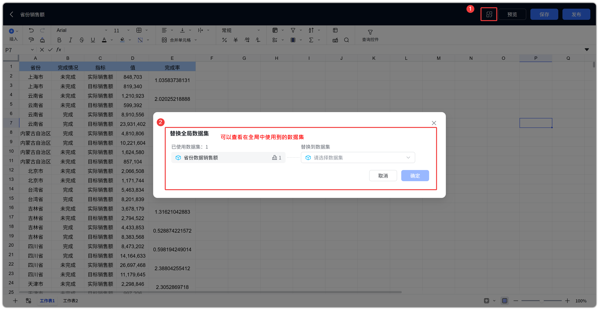
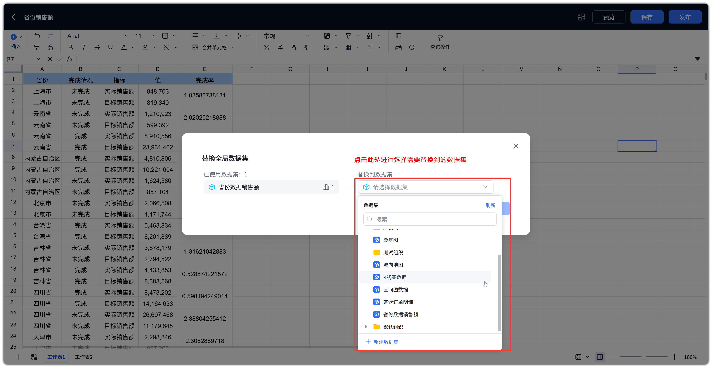
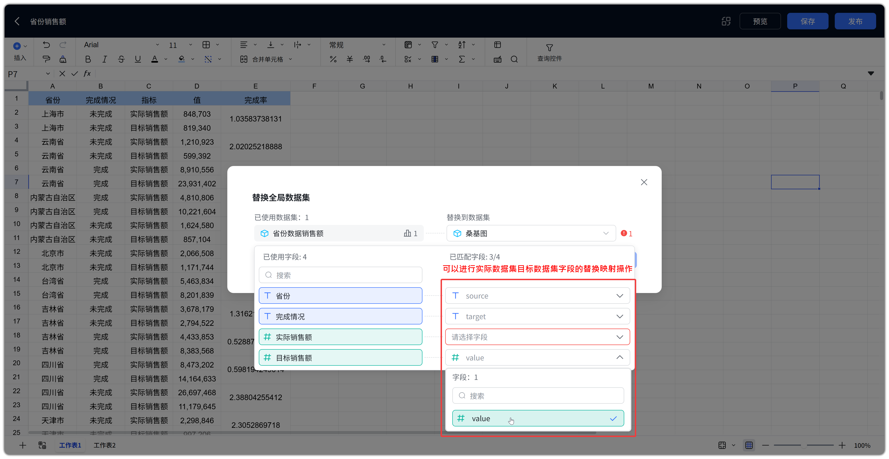
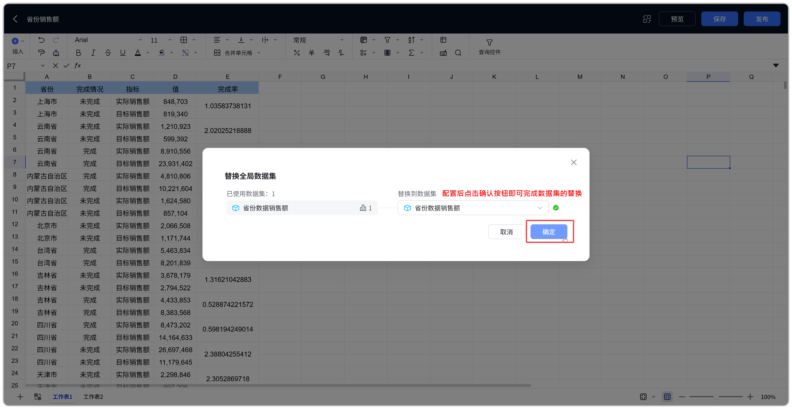
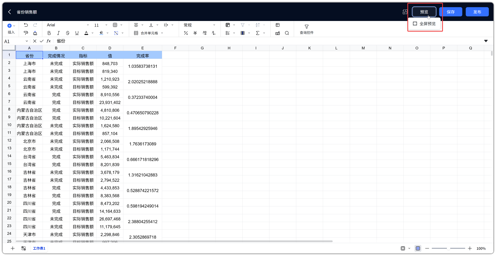

# 发布运维

## 1 数据集替换

!!! Abstract ""
    当数据源或数据集发生变更，可使用【替换数据集】批量切换表格内使用的数据集，并映射字段。替换后，使用旧数据集的明细表 / 透视表及查询控件字段会同步更新。

### 1.1 打开替换

!!! Abstract ""
    在编辑器右上角点击【替换数据集】图标（循环箭头），弹出【替换全局数据集】对话框。

    左侧展示当前表格已使用的数据集及引用次数；右侧为【替换为新数据集】，用于选择目标数据集。
{ width="900px" }

### 1.2 选择目标数据集

!!! Abstract ""
    点击右侧下拉框，搜索或选择要替换到的数据集。列表底部支持【+ 新建数据集】。
{ width="900px" }

### 1.3 字段映射

!!! Abstract ""
    选中目标数据集后，左侧列出原数据集已使用的字段，右侧为每个字段选择新数据集中的对应字段。

    界面会显示已匹配字段数量（如「已匹配字段: 3/4」）。名称或类型不一致的字段需手动选择；未完成映射时，下拉框会标红，确定按钮不可用。
{ width="900px" }

### 1.4 确认替换

!!! Abstract ""
    配置完成后点击【确定】，完成数据集替换。
{ width="900px" }

!!! Abstract ""
    若部分组件刷新失败，系统会提示失败数量，可稍后手动刷新数据。

## 2 预览
!!! Abstract ""

| 入口 | 说明 |
| --- | --- |
| 目录区【预览】 | 在列表页只读预览 |
| 目录区【全屏预览】 | 浏览器全屏预览 |
| 编辑器【预览】 | 编辑态预览；可下拉全屏预览 |

{ width="900px" }

## 3 发布流程
!!! Abstract ""
1. 编辑完成并【保存】；
2. 点击【发布】上线；
3. 需要下线时，在编辑器或目录菜单选择【取消发布】；
4. 若发布后又有修改但未再次发布，可通过【恢复到发布版本】回退到上次发布内容。

