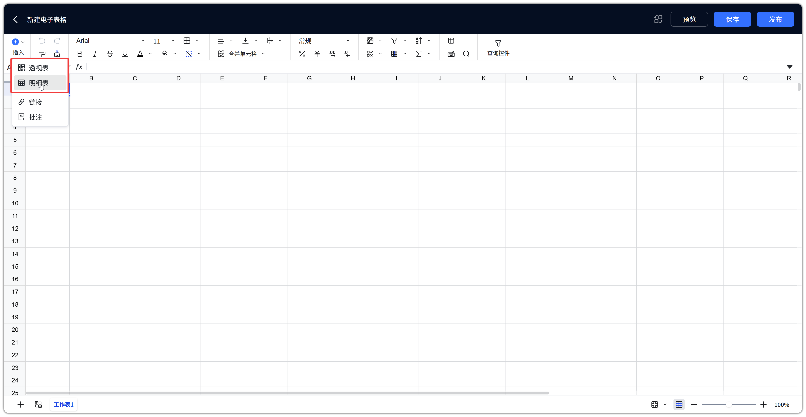
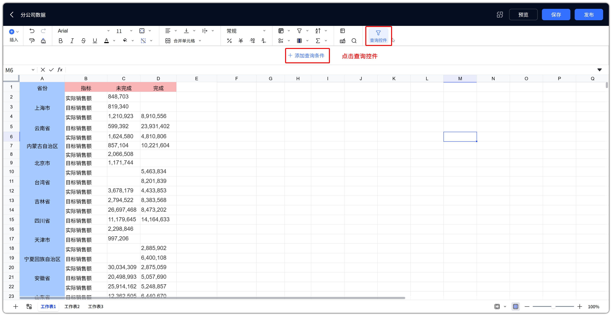
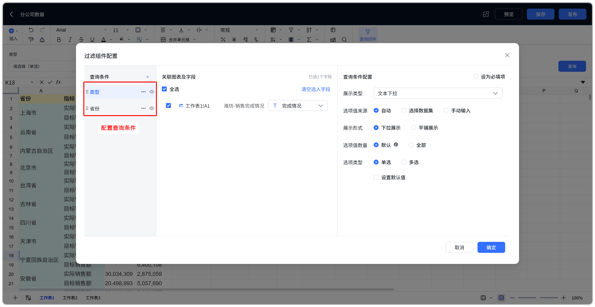
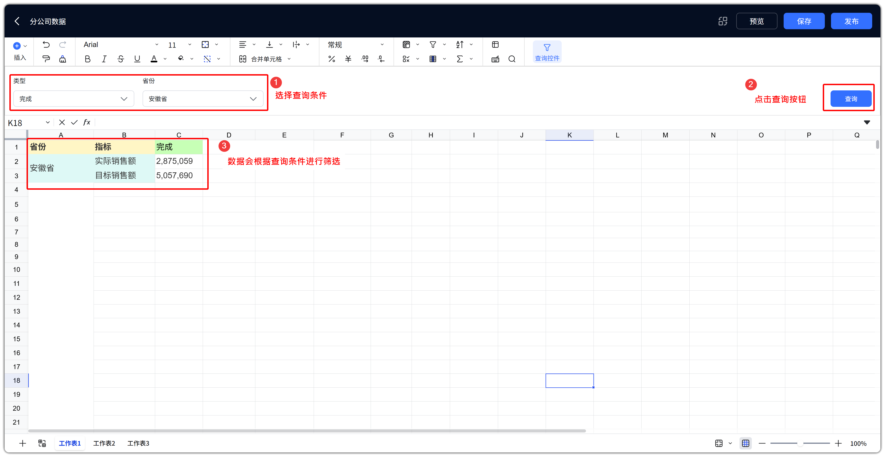
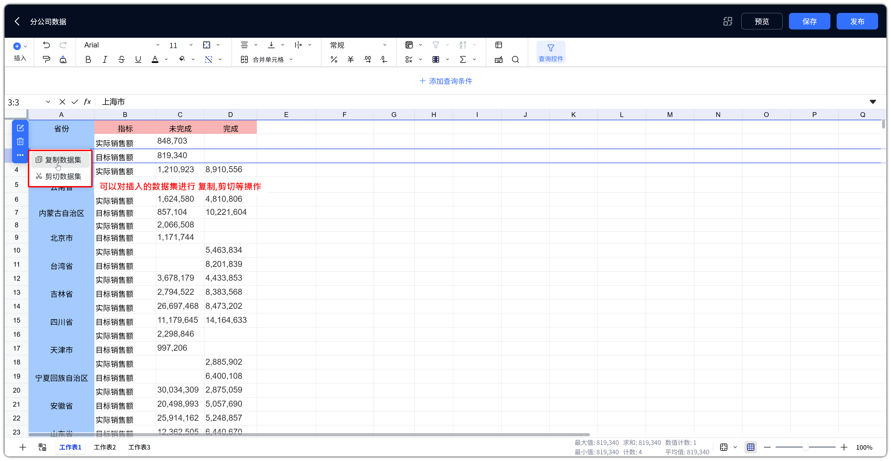
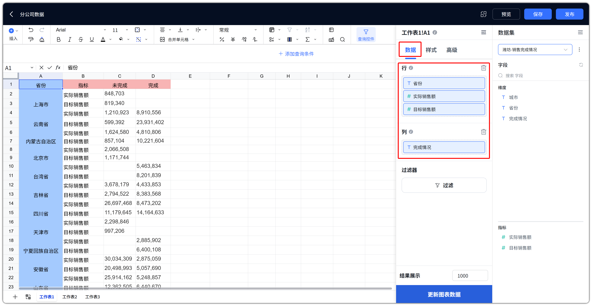
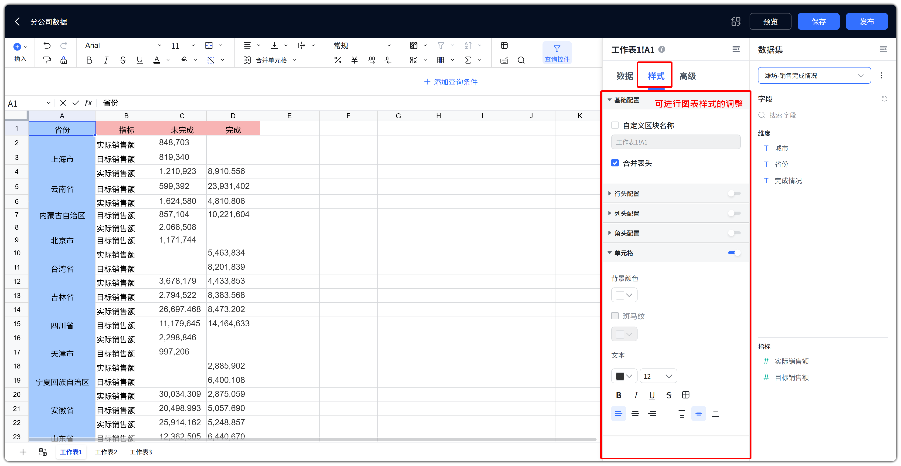
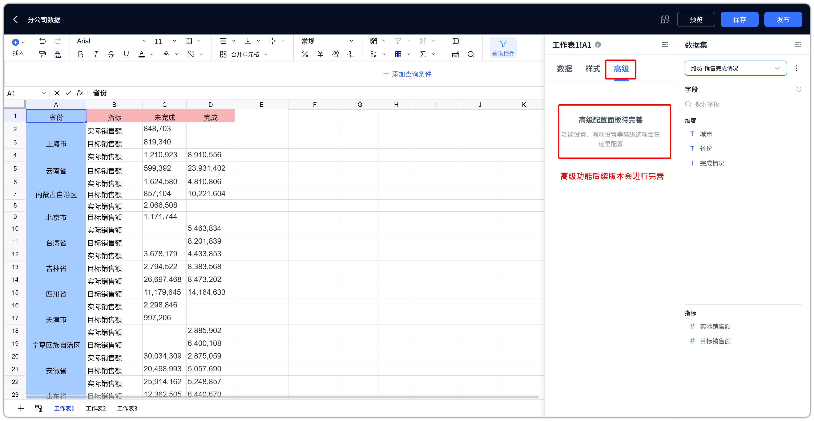

# 电子表格特殊功能

!!! Abstract ""
    本章汇总 DataEase 电子表格相对 Excel / Univer 的扩展能力，包括明细表、透视表、查询控件、数据集复制粘贴等。通用单元格编辑（字体、对齐、公式、冻结等）见 [电子表格功能详解](spreadsheet_features.md)；发布与数据集替换见 [发布运维](spreadsheet_publish.md)。

## 1 能力概览

!!! Abstract ""
| 能力 | 说明 |
| --- | --- |
| 明细表 | 绑定数据集，逐行展示明细数据 |
| 透视表 | 绑定数据集，按行 / 列维度汇总指标 |
| 查询控件 | 配置查询条件，联动过滤明细表 / 透视表 |
| 数据集复制粘贴 | 在表格内复制 / 剪切 / 粘贴已绑定数据集的对象 |
| 右侧配置面板 | 选中数据对象后配置字段、样式与数据集 |
| 替换数据集 | 批量切换表格内数据集并映射字段（见 [发布运维](spreadsheet_publish.md#1-数据集替换)） |

!!! Abstract ""
    **术语说明**：查询控件配置中的「关联图表及字段」，指关联当前表格内的 **明细表 / 透视表对象** 及其字段，并非传统 BI 图表组件。

## 2 插入明细表 / 透视表

!!! Abstract ""
    明细表与透视表共用同一插入对话框：

    1. 点击工具栏【插入】→ 选择【明细表】或【透视表】；
    2. 选择【新工作表】或【现有工作表】（选现有工作表时需点选区域）；
    3. 设置【结果展示】条数（默认 1000，上限受系统参数「电子表格查询数量上限」约束）；
    4. 点击【确定】后，在右侧配置数据集与字段。

{ width="900px" }
{ width="900px" }

!!! Abstract ""
    【插入】下拉**不包含**传统 BI 图表类型。数据可视化请使用明细表 / 透视表，并通过查询控件联动过滤。

## 3 明细表

!!! Abstract ""
    **用途**：逐行展示数据集明细，适合清单、对账、明细报表。

    **字段配置**

    - 配置区【数据列 / 维度或指标】：拖入需要展示的字段（维度、指标均可）；
    - 支持字段重命名、隐藏、排序（升序 / 降序 / 自定义排序）；
    - 支持日期粒度、显示格式、数值格式等字段级配置。

    **样式配置**

    - 自定义区块名称、隐藏表头、合并单元格；
    - 表头样式、单元格样式、边框；
    - 合计行：按指标配置合计方式。

    **其他**

    - 支持显示图片字段；
    - 渲染区域受保护，不可直接编辑单元格内容；
    - 支持行列冻结。
{ width="900px" }

## 4 透视表

!!! Abstract ""
    **用途**：按维度汇总指标，适合交叉分析、统计报表。

    **字段配置**

    - 【行】：拖入维度或指标（指标须连续放在末尾）；
    - 【列】：拖入维度或指标（规则同行区）；
    - 行、列不能全部为空；同一字段不可同时出现在行和列；
    - 指标支持汇总方式：求和、平均值、最大值、最小值、计数、去重计数；
    - 支持快速计算：占比、累加；支持数值格式、排序、自定义排序。

    **样式配置**

    - 行头、列头、角头、单元格样式；
    - 自定义区块名称、边框等。

    **其他**

    - 渲染区域受保护；
    - 支持行列冻结。
{ width="900px" }

!!! Abstract ""
    **明细表 vs 透视表**

    | 对比项 | 明细表 | 透视表 |
    | --- | --- | --- |
    | 展示方式 | 逐行明细 | 按行 / 列交叉汇总 |
    | 字段区域 | 数据列 | 行、列 |
    | 典型场景 | 销售明细、对账单 | 地区 × 品类汇总 |

## 5 查询控件

!!! Abstract ""
    【查询控件】位于工具栏右侧。点击后，公式栏上方出现查询栏，提供：

    - 【+ 添加查询条件】
    - 【打开查询条件配置】
    - 【删除查询组件】
    - 【打开样式面板】

    查询条件用于过滤并联动刷新表格内的明细表 / 透视表对象。

{ width="900px" }

### 5.1 查询条件类型

!!! Abstract ""
    根据关联字段类型，可配置以下条件：
| 类型 | 适用字段 | 说明 |
| --- | --- | --- |
| 文本下拉 | 文本 | 下拉选择文本值 |
| 文本搜索 | 文本 | 单条件 / AND / OR 组合搜索 |
| 下拉树 | 文本 | 多级树形下拉，需设计树结构 |
| 数字下拉 | 数字 | 下拉选择数值 |
| 数字范围 | 数字 | 最小值—最大值区间 |
| 时间 | 日期 | 单个时间点，支持固定 / 动态时间 |
| 时间范围 | 日期 | 起止时间，支持固定 / 动态时间 |

{ width="900px" }

### 5.2 配置步骤

!!! Abstract ""
    1. 点击【查询控件】打开查询栏；
    2. 点击【+ 添加查询条件】或【打开查询条件配置】；
    3. 在配置对话框中：
        - 左侧管理条件列表（重命名、删除、显示 / 隐藏）；
        - 为每个条件选择展示类型；
        - 在【关联图表及字段】中勾选需要联动的明细表 / 透视表及字段；
        - 下拉树需设计层级并关联各层字段；
    4. 可通过【打开样式面板】配置查询栏样式：排列方式、位置、条件名称样式、是否展示查询 / 重置 / 清空按钮；
    5. 保存配置。不需要查询栏时，可【删除查询组件】。

{ width="900px" }
{ width="900px" }
{ width="900px" }

### 5.3 查询行为与联动

!!! Abstract ""
    - **展示查询按钮**：用户点击【查询】后才刷新；
    - **不展示查询按钮**：条件变更后立即刷新；
    - 支持【重置】【清空】恢复条件；
    - 条件为空或填写不完整时会提示；
    - 查询后，关联的明细表 / 透视表按条件过滤数据；多个条件之间按配置逻辑共同生效。
{ width="900px" }
{ width="900px" }

!!! Abstract ""
    **筛选 vs 查询控件**：工具栏【筛选】作用于普通单元格区域；【查询控件】联动明细表 / 透视表对象。

## 6 数据集复制粘贴

!!! Abstract ""
| 操作 | 说明 |
| --- | --- |
| 复制数据集 / 剪切数据集 | 选中已绑定数据集的明细表 / 透视表时，对象操作条提供复制 / 剪切数据集 |
| 粘贴数据集 | 在目标位置右键【粘贴数据集】，将已复制 / 剪切的数据对象粘贴过去 |

{ width="900px" }

## 7 右侧配置面板

!!! Abstract ""
    选中明细表或透视表后，右侧出现配置面板，通常包括：

    - **数据**：拖拽维度 / 指标到行、列等区域，设置过滤与结果展示条数，点击【更新图表数据】刷新；
    - **样式**：表头、单元格、边框、合计行等；
    - **高级**：按对象能力展示额外选项(目前在设计中)。

    最右侧【数据集】面板可切换当前对象绑定的数据集，并按维度 / 指标浏览字段。
{ width="900px" }
{ width="900px" }
{ width="900px" }