## 1 基础设置

!!! Abstract ""
    如下图所示，在启用其他登录方式后，可设置系统默认登录方式，设置后在登陆界面不需再自行选择。

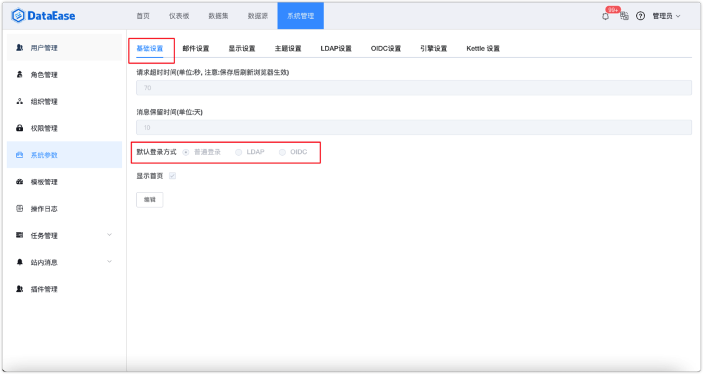{ width="900" }

## 2 显示设置

!!! Abstract ""
    可在此界面设置系统的显示 logo、登录页面头部 logo、登录页面右侧图片、登录页面标题和系统名称，图片类信息可以有"清空"和"上传"操作；  
    如下图所示。为了显示效果，建议上传的图片大小符合系统中的提示。如：头部系统 logo，建议大小为 135px\*30px。

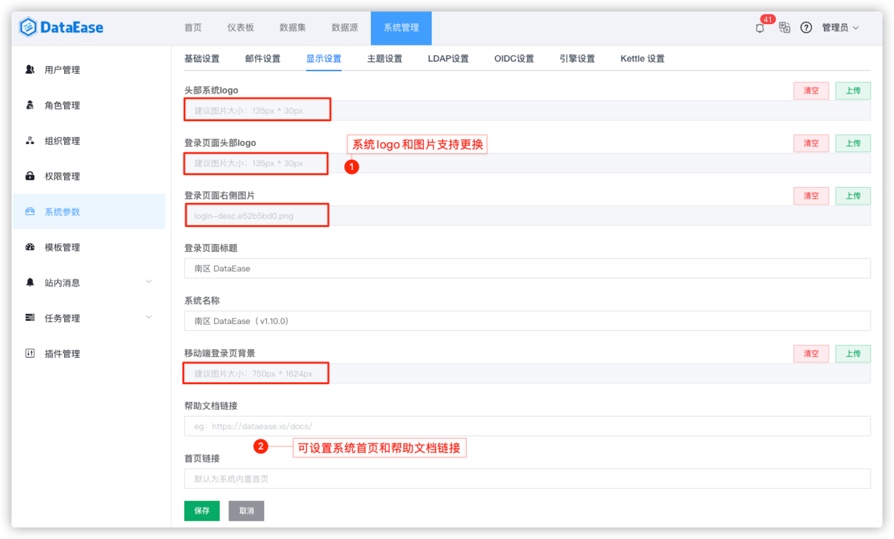{ width="900px" }

!!! Abstract ""
    显示设置配置完成后的图示如下。

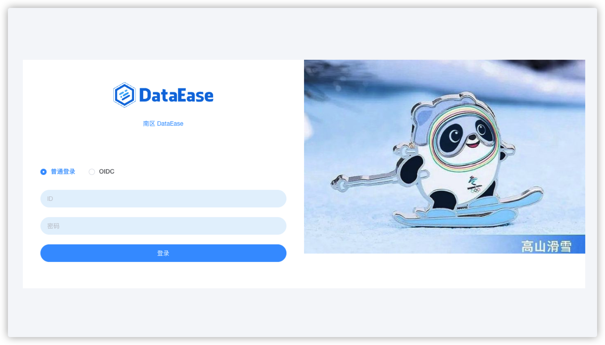{ width="900px" }

## 3 主题设置

!!! Abstract ""
    该主题应用于系统外观，包括"基础配色"、"字体颜色"、"边框颜色"、"背景颜色"，系统初始化时有两种内置主题，分别为"默认主题"与"深色主题"，除此外，用户可自定义各类参数保存为自定义主题。

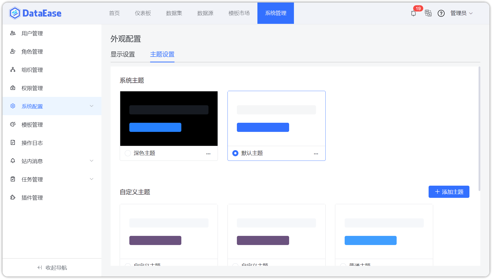{ width="900px" }

!!! Abstract ""
    切换主题：在系统内置主题与自定义主题中选择需要切换的主题保存即可。

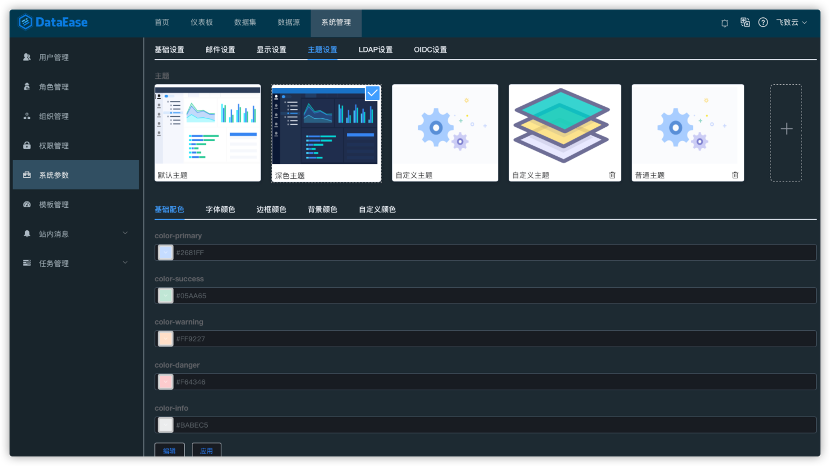{ width="900px" }

!!! Abstract ""
    删除主题：点击主题右下方的删除标记，可删除该主题。  
    **注意：** 系统内置主题不支持用户删除。

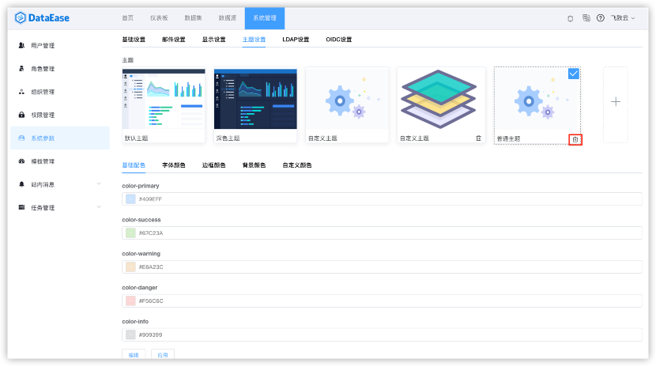{ width="900px" }

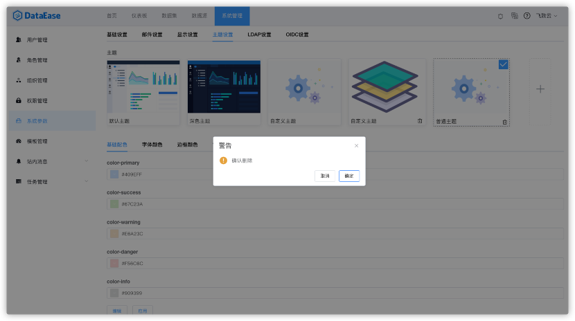{ width="900px" }

## 4 LDAP 设置

!!! Abstract ""
    将相应 LDAP 信息配置在该界面后即可。

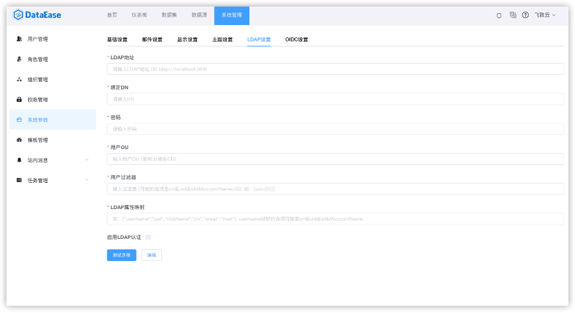{ width="900px" }

!!! Abstract ""
    配置 LDAP 的过程可参考下图，注意勾选下方"启用 LDAP 认证"后开启此功能。

    **提示：** 配置完成可点击下方【测试连接】即时测试配置信息是否正确，网络是否连通。

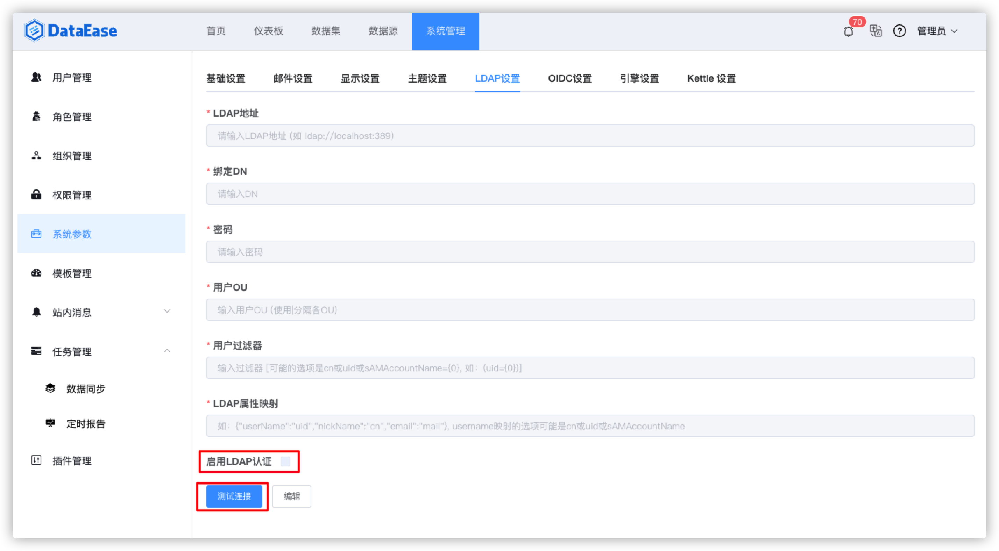{ width="900px" }

!!! Abstract ""
    配置完成后，随即跳转到登录页面即可使用 LDAP 方式登录。

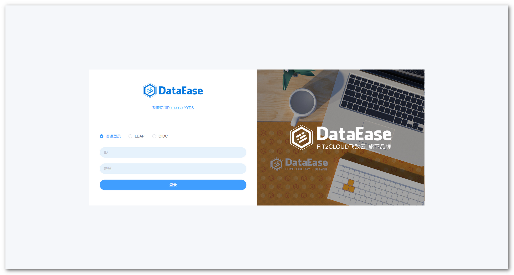{ width="900px" }

## 5 OIDC 设置

!!! Abstract ""
    可以编辑和启用 OIDC 的认证信息作为认证授权。

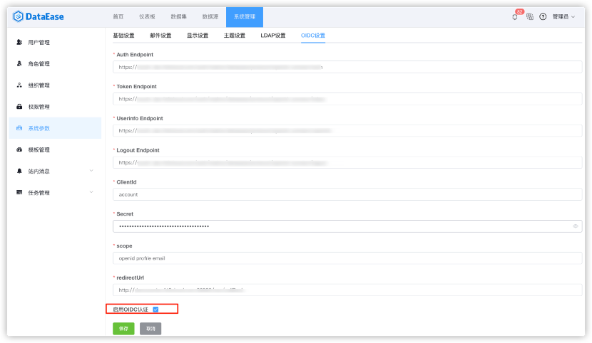{ width="900px" }

!!! Abstract ""
    OIDC 认证类型支持 Secret 与 Basic Auth 方式，可根据实际情况自行选择。

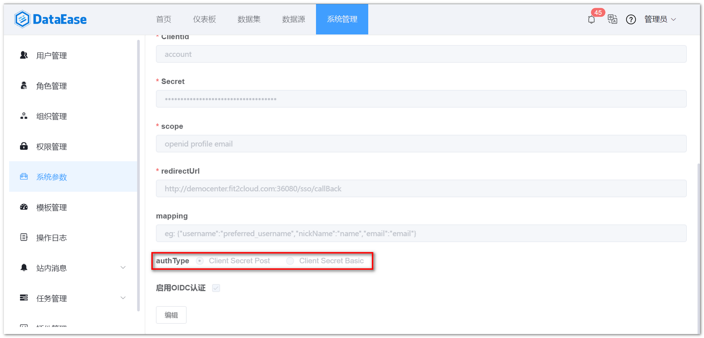{ width="900px" }

!!! Abstract ""
    配置完成后，随即跳转到登录页面即可使用 OIDC 登录。

{ width="900px" }

## 6 CAS 设置
    
!!! Abstract ""
    支持 CAS 单点登录设置，须开启默认登录方式，在【基础设置】配置默认登录方式为 CAS，开启后不可选择其他登录方式。  
    **注意：** 如果需要还原其他登录方式，可以通过页面访问指定 URL（/cas/reset/{adminAcount}/{adminPwd}）来重置登录方式。

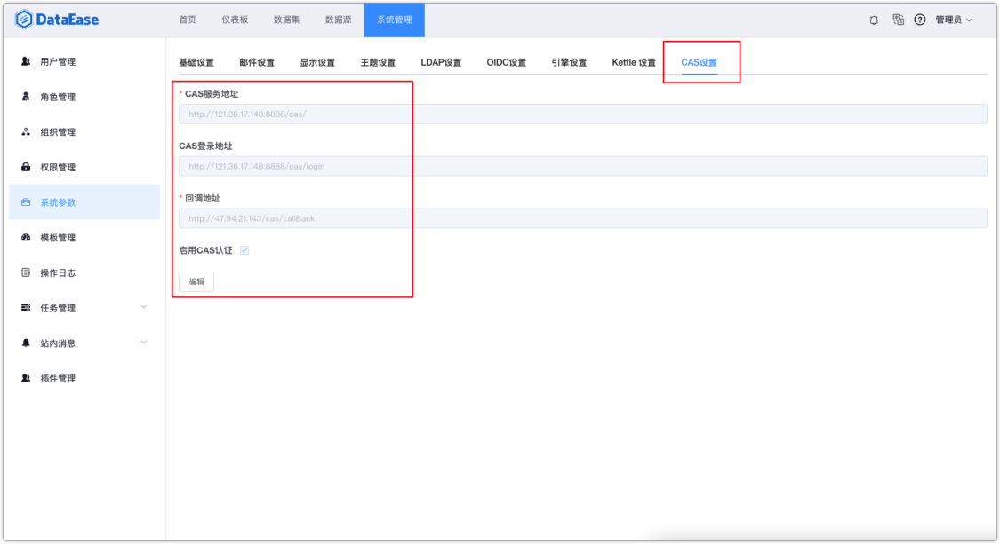{ width="900" }

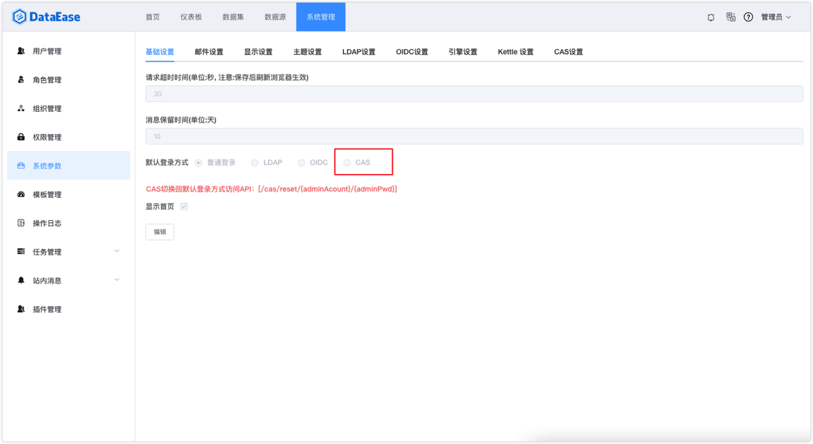{ width="900" }