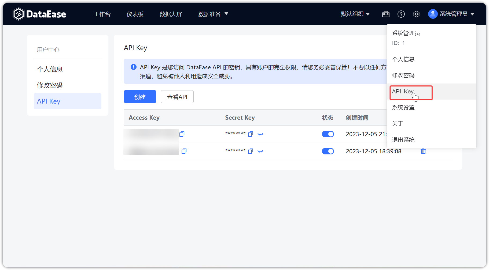
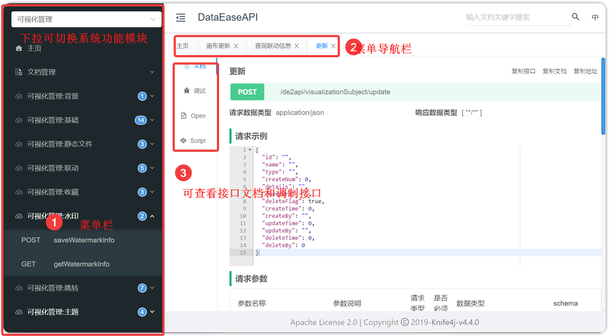
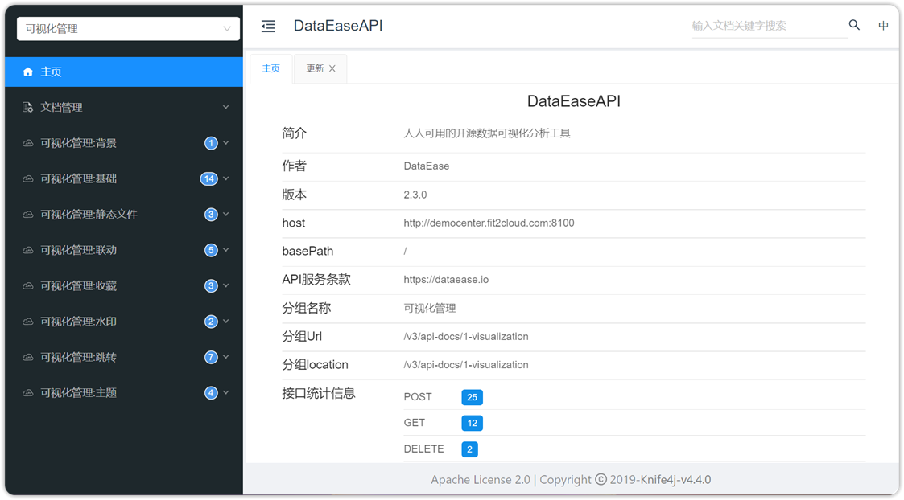
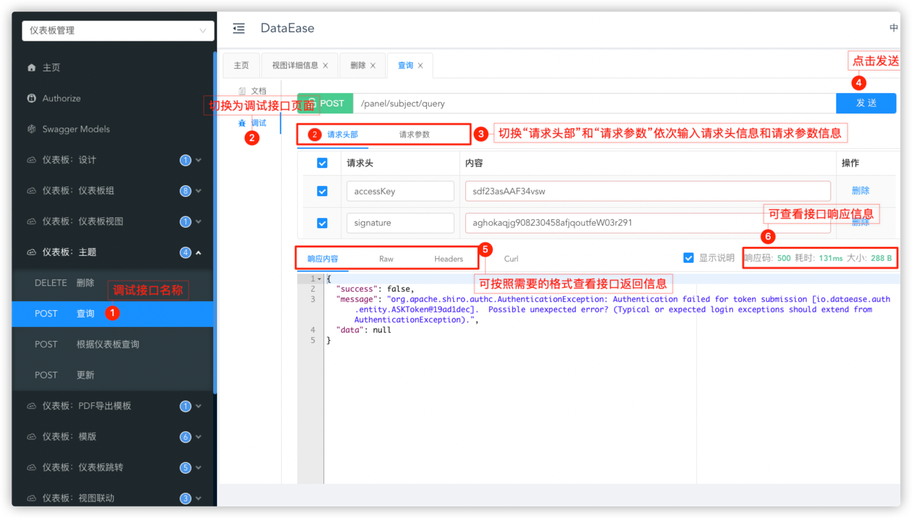

## 1 系统 API Keys 管理

!!! Abstract ""
    对 API Keys 的管理包括"创建"、"复制"、"显示" Secret Key、选择"状态"是否可用和"删除"的操作。

{ width="900px" }

## 2 系统 API 查看

!!! Abstract ""
    用户可通过【创建】获取到 API Key，可供调试的接口如下图所示。

{ width="900px" }

!!! Abstract ""
    支持查看 API 文档，如下图所示。

{ width="900px" }

## 3 系统 API 在线调试

!!! Abstract ""
    系统提供了丰富的接口调试功能，用户可以依据下图的操作进行接口的调试。

{ width="900px" }

