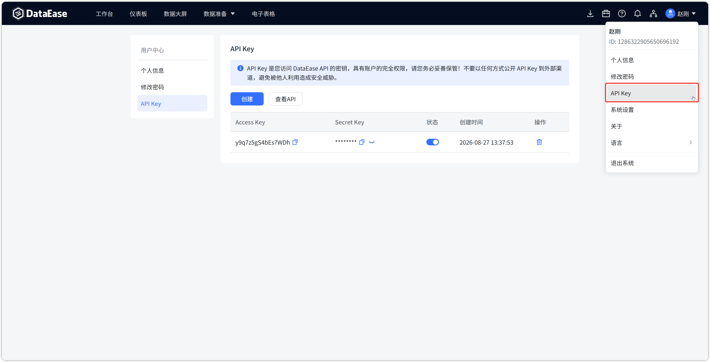
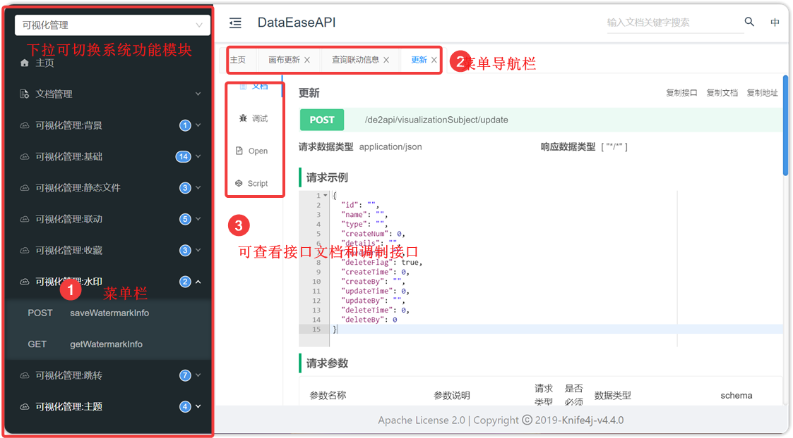
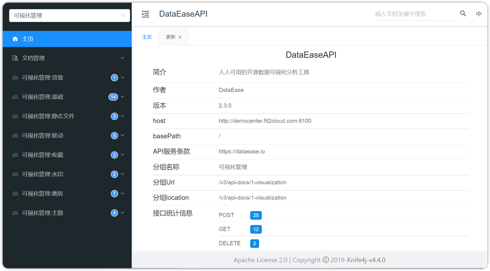
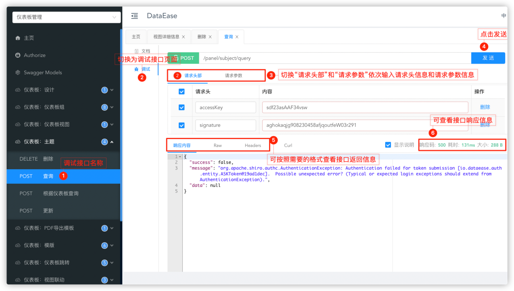

## 1 系统 API Keys 管理

!!! Abstract ""
    对 API Keys 的管理包括"创建"、"复制"、"显示" Secret Key、选择"状态"是否可用和"删除"的操作。

{ width="900px" }

## 2 系统 API 查看

!!! Abstract ""
    用户可通过【创建】获取到 API Key，可供调试的接口如下图所示。

{ width="900px" }

!!! Abstract ""
    支持查看 API 文档，如下图所示。

{ width="900px" }

## 3 系统 API 在线调试

!!! Abstract ""
    系统提供了丰富的接口调试功能，用户可以依据下图的操作进行接口的调试。

{ width="900px" }

## 4 系统 API 调用示例（Java）

### 4.1 准备 API Key

!!! Abstract ""
    进入 API Key 页面，创建 API Key，创建后获取到 accessKey 和 secretKey（API Key 是访问 DataEase API 的密钥，具有账户的完全权限）。

{ width="900px" }

### 4.2 Java 示例代码

!!! Abstract ""
    根据获取到的 accessKey 和 secretKey，生成接口调用需要的 token 认证信息，写入请求头的 x-de-ask-token 参数中进行接口调用，参考以下代码示例。

```java
package io.dataease.api;

import com.auth0.jwt.JWT;
import com.auth0.jwt.JWTCreator;
import com.auth0.jwt.algorithms.Algorithm;
import org.apache.commons.codec.binary.Base64;

import javax.crypto.Cipher;
import javax.crypto.spec.IvParameterSpec;
import javax.crypto.spec.SecretKeySpec;
import java.io.*;
import java.net.HttpURLConnection;
import java.net.URL;
import java.util.UUID;

public class Main {
    // todo: 替换为上一步获取到的 accessKey 和 secretKey
    static String accessKey = "xxxxxxxxxxxxxxxx";
    static String secretKey = "xxxxxxxxxxxxxxxx";

    public static void main(String[] args) {
        try {
            // todo: 替换为需要调用的接口地址
            URL url = new URL("https://xxxxxxxxxx/de2api/user/pager/1/10");

            // 生成认证 token
            String signature = aesEncrypt(accessKey + "|" + UUID.randomUUID() + "|" + System.currentTimeMillis(), secretKey, accessKey);
            Algorithm algorithm = Algorithm.HMAC256(secretKey);
            JWTCreator.Builder builder = JWT.create();
            builder.withClaim("accessKey", accessKey).withClaim("signature", signature);
            String token = builder.sign(algorithm);

            HttpURLConnection urlConnection = (HttpURLConnection) url.openConnection();
            urlConnection.setRequestProperty("Accept", "application/json;charset=UTF-8");
            urlConnection.setRequestProperty("Content-Type", "application/json");
            urlConnection.setRequestProperty("accessKey", accessKey);
            urlConnection.setRequestProperty("signature", signature);
            urlConnection.setRequestProperty("x-de-ask-token", token);
            urlConnection.setRequestMethod("POST");
            urlConnection.setDoInput(true);
            urlConnection.setDoOutput(true);

            // todo: 组织请求体
            String jsonData = "{\n" +
                    "  \"keyword\": \"\",\n" +
                    "  \"conditions\": [\n" +
                    "    {\n" +
                    "      \"field\": \"\",\n" +
                    "      \"operator\": \"\",\n" +
                    "      \"value\": {}\n" +
                    "    }\n" +
                    "  ],\n" +
                    "  \"orders\": []\n" +
                    "}";
            DataOutputStream outputStream = new DataOutputStream(urlConnection.getOutputStream());
            outputStream.write(jsonData.getBytes());
            outputStream.flush();
            urlConnection.connect();

            // 获取响应体
            BufferedReader reader = new BufferedReader(new InputStreamReader(urlConnection.getInputStream()));
            String line;
            StringBuilder responseBody = new StringBuilder();
            while ((line = reader.readLine()) != null) {
                responseBody.append(line);
            }
            System.out.println("响应体：\n" + responseBody);
        } catch (Exception e) {
            e.printStackTrace();
        }
    }


    public static String aesEncrypt(String src, String secretKey, String iv) throws Exception {
        byte[] raw = secretKey.getBytes("UTF-8");
        SecretKeySpec secretKeySpec = new SecretKeySpec(raw, "AES");
        Cipher cipher = Cipher.getInstance("AES/CBC/PKCS5Padding");
        IvParameterSpec iv1 = new IvParameterSpec(iv.getBytes());
        cipher.init(Cipher.ENCRYPT_MODE, secretKeySpec, iv1);
        byte[] encrypted = cipher.doFinal(src.getBytes("UTF-8"));
        return Base64.encodeBase64String(encrypted);
    }
}
```

### 4.3 Maven 依赖

```xml
<dependency>
    <groupId>com.auth0</groupId>
    <artifactId>java-jwt</artifactId>
    <version>3.12.1</version>
</dependency>

<dependency>
    <groupId>commons-codec</groupId>
    <artifactId>commons-codec</artifactId>
    <version>1.15</version>
</dependency>
```

## 5 系统 API 调用示例（Postman）

### 5.1 获取接口信息

!!! Abstract ""
    接口地址和请求参数可以通过以下方式获取：

    方式一：查看API文档

{ width="900px" }

{ width="900px" }

!!! Abstract ""
    方式二：通过浏览器控制台查看网络请求。

{ width="900px" }

### 5.2 配置 Pre-script

{ width="900px" }

!!! Abstract ""
    需将 accessKey 和 secretKey 的值替换为第一步创建的 AccessKey/SecretKey

    脚本内容如下：

```javascript
// 定义 accessKey 和 secretKey
const accessKey = "替换成你的AccessKey";
const secretKey = "替换成你的SecretKey";

// 手动实现生成 UUID 的函数
function generateUUID() {
    return 'xxxxxxxx-xxxx-4xxx-yxxx-xxxxxxxxxxxx'.replace(/[xy]/g, function(c) {
        var r = Math.random() * 16 | 0, v = c === 'x' ? r : (r & 0x3 | 0x8);
        return v.toString(16);
    });
}
// 定义 AES 加密函数
function aesEncrypt(plaintext, secretKey, accessKey) {
    const key = CryptoJS.enc.Utf8.parse(secretKey);
    const iv = CryptoJS.enc.Utf8.parse(accessKey);
    const encrypted = CryptoJS.AES.encrypt(plaintext, key, {
        iv: iv,
        mode: CryptoJS.mode.CBC,
        padding: CryptoJS.pad.Pkcs7
    });
    return encrypted.toString();
}

// 生成签名
const signature = aesEncrypt(accessKey + "|" + generateUUID() + "|" + Date.now(), secretKey, accessKey);

// 手动生成 JWT 头部
const header = {
    alg: "HS256",
    typ: "JWT"
};
const encodedHeader = btoa(JSON.stringify(header)).replace(/=+$/, '');

// 手动生成 JWT 负载
const payload = {
    accessKey: accessKey,
    signature: signature
};
const encodedPayload = btoa(JSON.stringify(payload)).replace(/=+$/, '');

// 手动生成 JWT 签名
const baseString = encodedHeader + '.' + encodedPayload;
const hmac = CryptoJS.HmacSHA256(baseString, secretKey);
const encodedSignature = CryptoJS.enc.Base64.stringify(hmac).replace(/=+$/, '').replace(/\+/g, '-').replace(/\//g, '_');

// 组合成完整的 JWT
const token = encodedHeader + '.' + encodedPayload + '.' + encodedSignature;

// 设置为环境变量，方便在请求中使用
pm.environment.set("accessKey", accessKey);
pm.environment.set("signature", signature);
pm.environment.set("x-de-ask-token", token);
```

### 5.3 配置 Headers

!!! Abstract ""
    Headers 按照图示配置，无需修改

{ width="900px" }

```text
accessKey: {{accessKey}}
signature: {{signature}}
x-de-ask-token: {{x-de-ask-token}}
```

### 5.4 配置请求体并发送请求

!!! Abstract ""
    Body 按照 API 请求要求填写，此处以获取仪表板列表树为例

{ width="900px" }

### 5.5 测试验证

{ width="900px" }