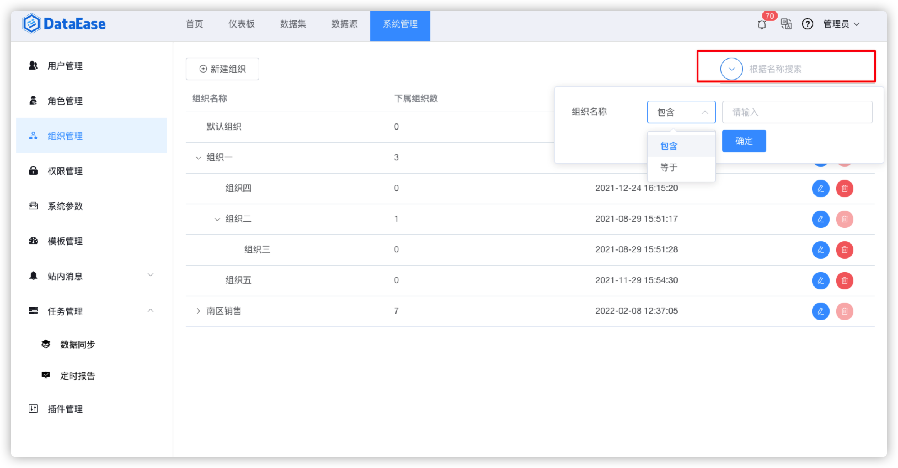
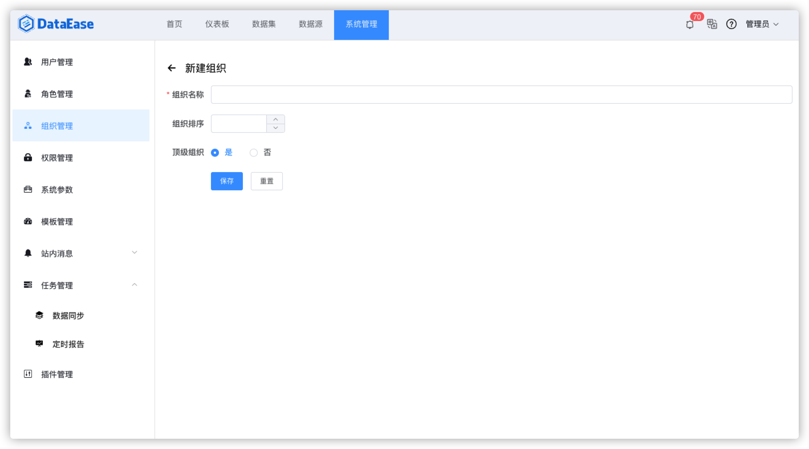
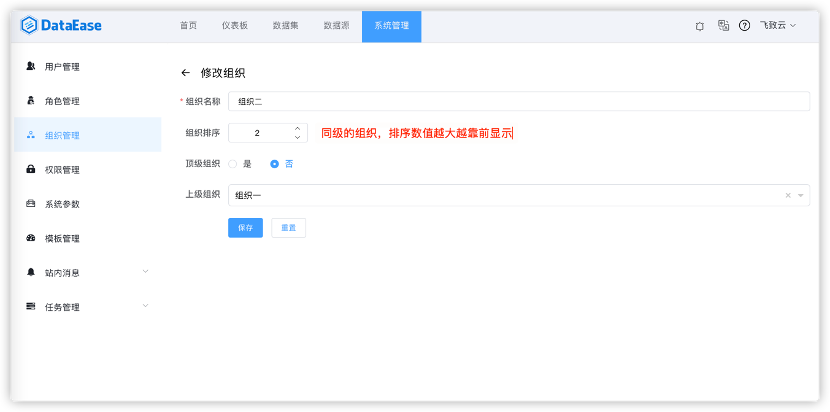
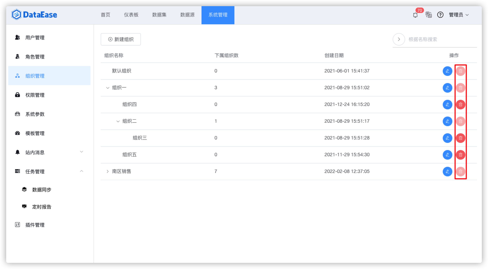

##1 查询组织
!!! Abstract ""
    组织列表右上角支持根据组织名称搜索组织信息，系统也支持高级搜索，包括模糊和非模糊查询。

{ width="900px" }

##2 新建组织
!!! Abstract ""
    组织呈现树状，可以在父节点组织下新建子节点组织。
    

{ width="900px" }

##3 修改组织
!!! Abstract ""
    修改同级组织排序：同级的子组织节点可以通过设置"组织排序"值作为实际排序顺序，组织排序中设置的排序数值越大，会更靠前显示。

{ width="900px" }

##4 删除组织
!!! Abstract ""
    系统支持对组织进行删除操作，删除成功后，之前在此组织的用户将不在对应组织中。

    **提示：** 当 "下属组织数" 不为 0 时，不能进行删除操作，需要清空子组织信息后才能删除。

{ width="900px" }
