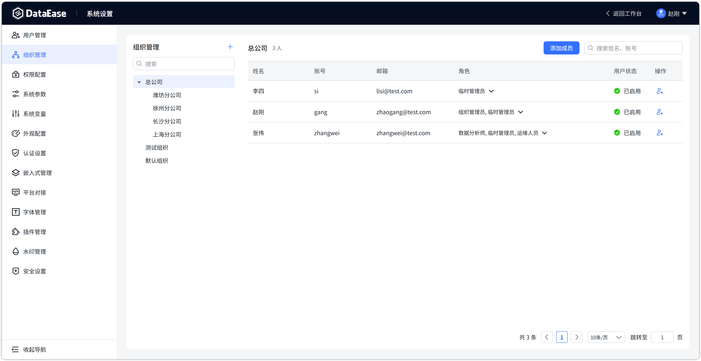
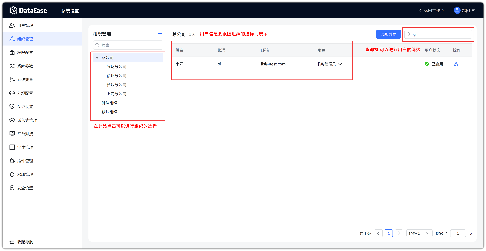
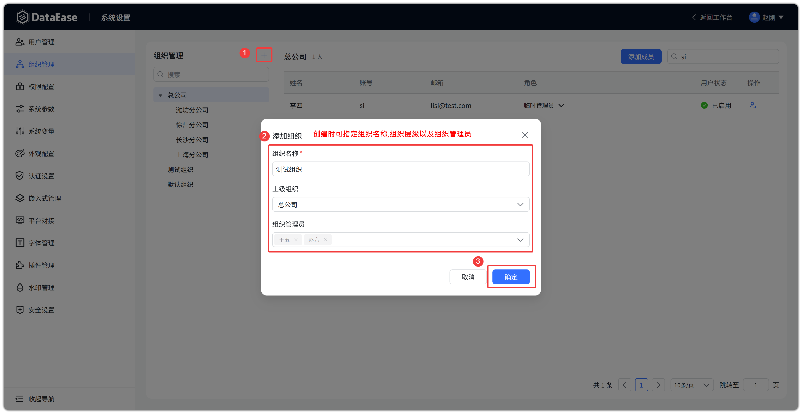
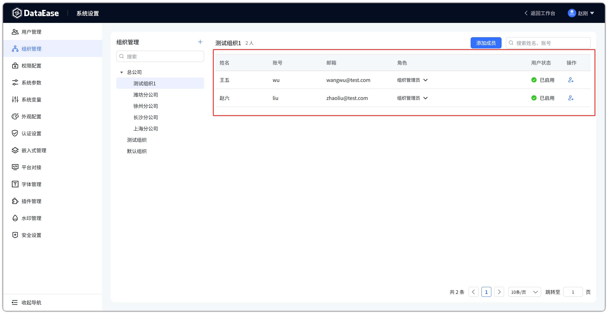
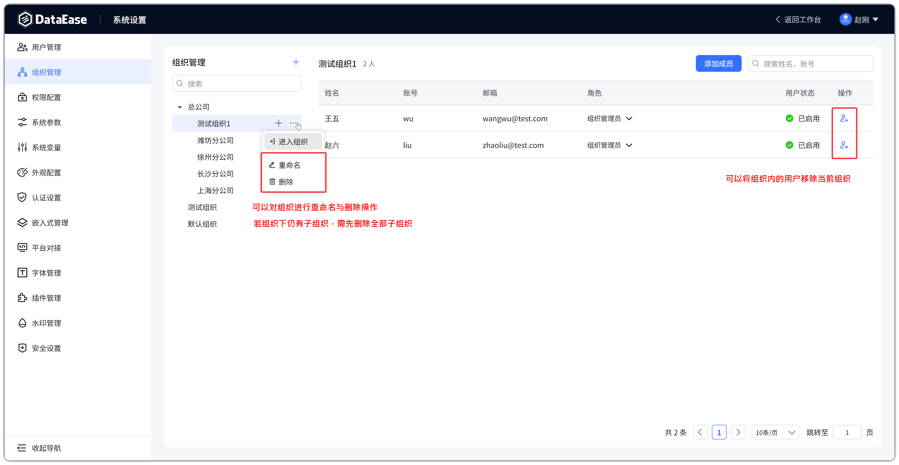
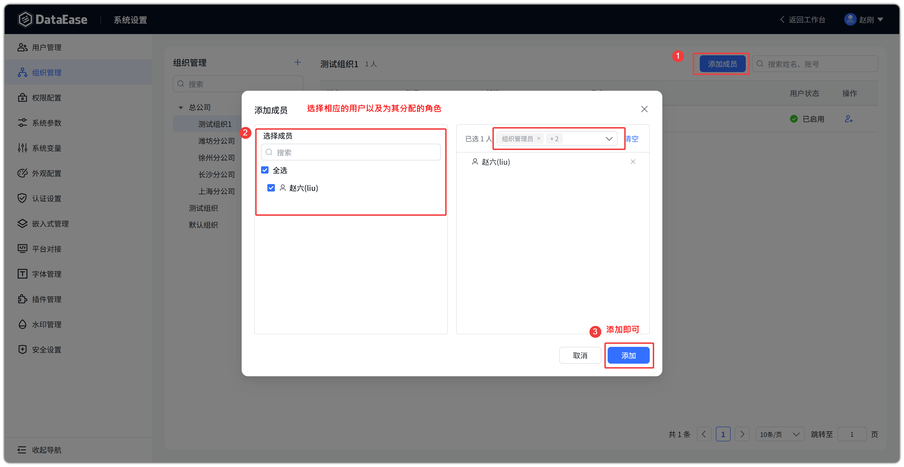
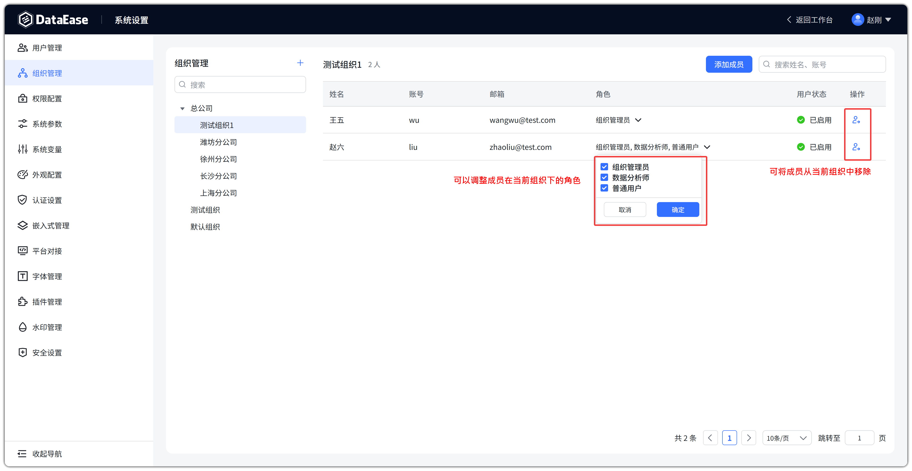
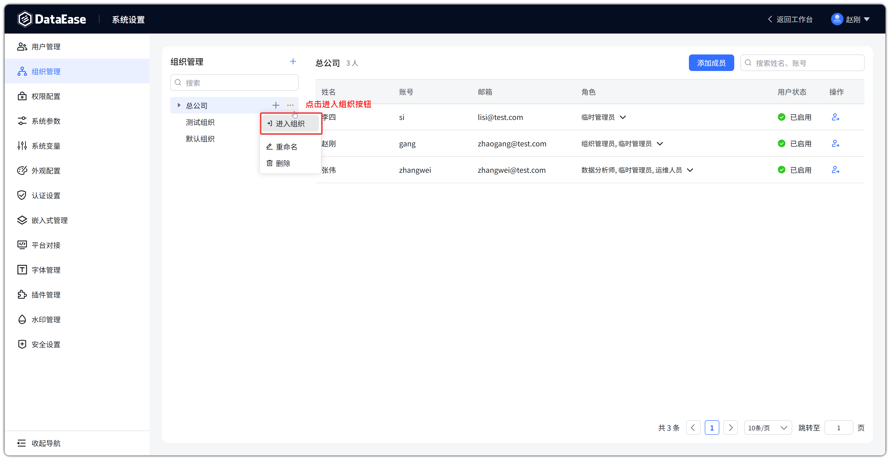
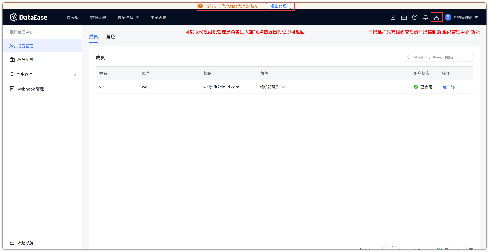

# 组织管理

## 1 功能概述

!!! Abstract ""
    【组织管理】位于【系统设置】下，供系统管理员维护组织（工作空间）架构，并将用户加入或移出组织。

    页面为左右布局：左侧组织树（可搜索、可新建组织），右侧为选中组织的成员列表。未选中组织时提示「请先在左侧选择组织」。

    选中组织后，右侧显示组织名称、人数、【添加成员】按钮，以及成员列表（姓名、账号、邮箱、角色、用户状态、操作）。

!!! Abstract ""
    **与【组织管理中心】的分工**

    | 操作 | 系统设置-组织管理 | 组织管理中心-成员管理 |
    | --- | --- | --- |
    | 新建 / 删除组织 | 支持 | 不支持 |
    | 将用户加入组织 | 支持（【添加成员】） | 不支持 |
    | 将用户移出组织 | 支持（操作列） | 不支持 |
    | 调整成员在本组织内的角色 | 支持 | 支持 |
    | 创建自定义角色 | 不支持 | 支持 |
    | 进入组织代管 | 支持 | — |

    这就是两边的核心差异：系统管理员把用户放进某个组织；组织管理员进入该组织的【组织管理中心】后，只能调整该用户在本组织内的角色，不能再把它移出组织。

{ width="900px" }

## 2 查询与选择组织

!!! Abstract ""
    左侧组织树支持按名称搜索。点击组织节点后，右侧加载该组织成员，在右上角查询框可以进行空间用户的查询。

    选中「总公司」后，右侧显示人数、【添加成员】，以及该组织成员列表。

{ width="900px" }

## 3 新建组织

!!! Abstract ""
    组织树标题旁可新建一级组织；也可在某个组织下新建子组织。创建时可指定组织管理员。

{ width="900px" }
{ width="900px" }

## 4 修改与删除组织

!!! Abstract ""
    支持修改组织名称。删除组织后，该组织下的资源将一并删除。若组织下仍有子组织，需先删除全部子组织。
{ width="900px" }

## 5 添加成员

!!! Abstract ""
    选中组织后，点击右侧【添加成员】，将平台中尚未加入该组织的用户加入当前组织，并可指定其在该组织下的角色。

    加入后，该用户才会出现在对应组织的【组织管理中心-成员管理】列表中。

    弹窗左侧列出尚未加入该组织的平台用户，右侧选择成员角色后点击【添加】。

{ width="900px" }

## 6 调整角色与移出组织

!!! Abstract ""
    - **调整角色**：点击成员行的角色列，勾选该成员在当前组织下的角色。可选角色包含内置角色（组织管理员、数据分析师、普通用户）及该组织的自定义角色。
    - **移出组织**：操作列可将成员从当前组织中移除，**不会删除** 平台账号。移出后，该用户不再出现在该组织的【组织管理中心】成员列表中。

{ width="900px" }

## 7 进入组织

!!! Abstract ""
    系统管理员可在组织节点上选择【进入组织】，以代理身份进入目标组织的【组织管理中心】，代行组织管理员进行成员、权限等日常维护。

{ width="900px" }
{ width="900px" }