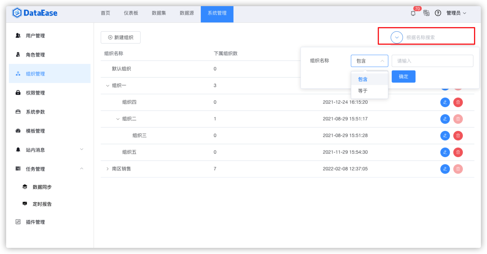
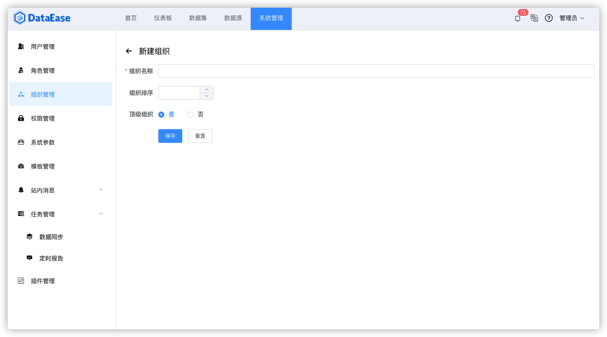
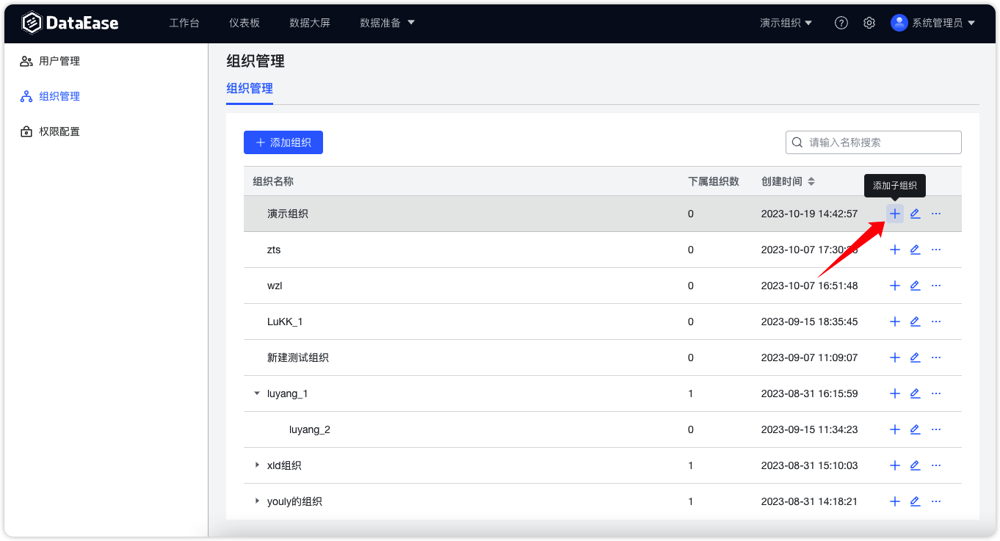
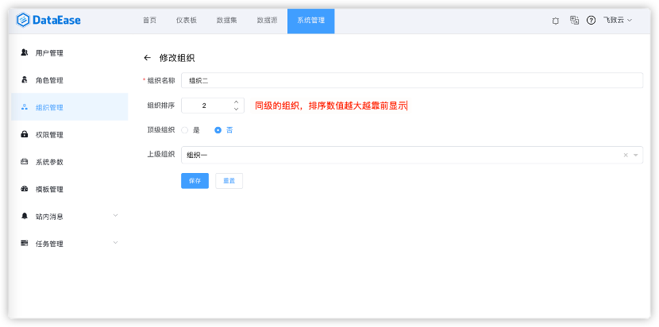
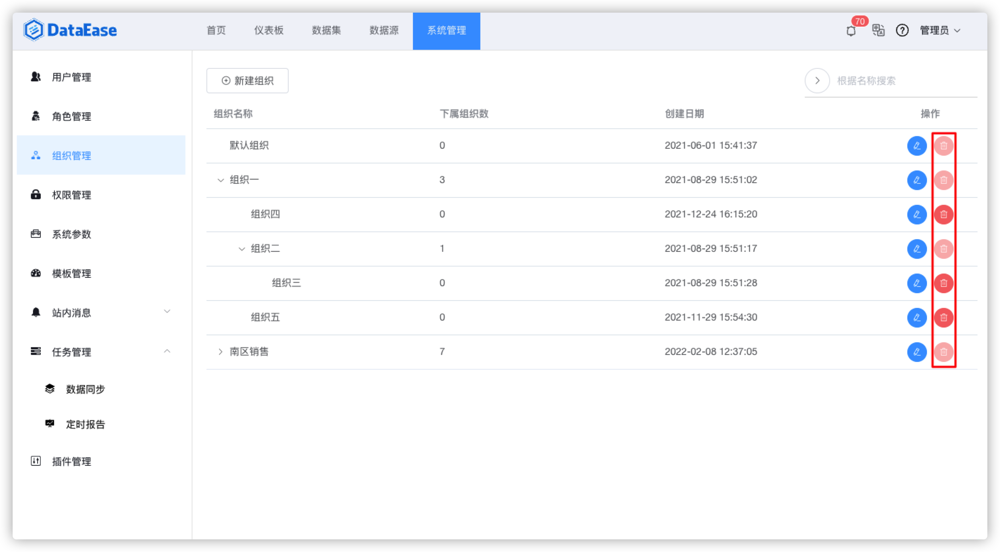

!!! Abstract ""

    - 组织为角色和资源的所属；
    - 支持多级组织，且未做层级限制；
    - 组织间相互隔离：同级之间相互隔离、上下级相互隔离（上级不继承下级组织的资源）。

!!! Abstract ""
    组织管理位于【系统设置】下。v3.0.0 起，原【组织管理中心】下的用户管理、组织管理统一并入【系统设置】；组织管理中心的成员维护通过【系统设置-用户管理】与【系统设置-组织管理】协作完成。

## 1 查询组织

!!! Abstract ""
    组织列表右上角支持根据组织名称搜索组织信息。

{ width="900px" }

## 2 新建组织

!!! Abstract ""
    支持添加组织，添加组织时可以选择上级组织，如不选则默认创建一级组织。

{ width="900px" }

!!! Abstract ""
    支持在父节点组织下新建子节点组织。

{ width="900px" }

## 3 修改组织

!!! Abstract ""
    支持修改组织名称。

{ width="900px" }

## 4 删除组织

!!! Abstract ""
    系统支持对组织进行删除操作，删除成功后，之前在此组织的所有资源将一并删除。

    **提示：** 如果组织下具有子组织，则需要先将子组织删除后才能删除当前组织。

{ width="900px" }