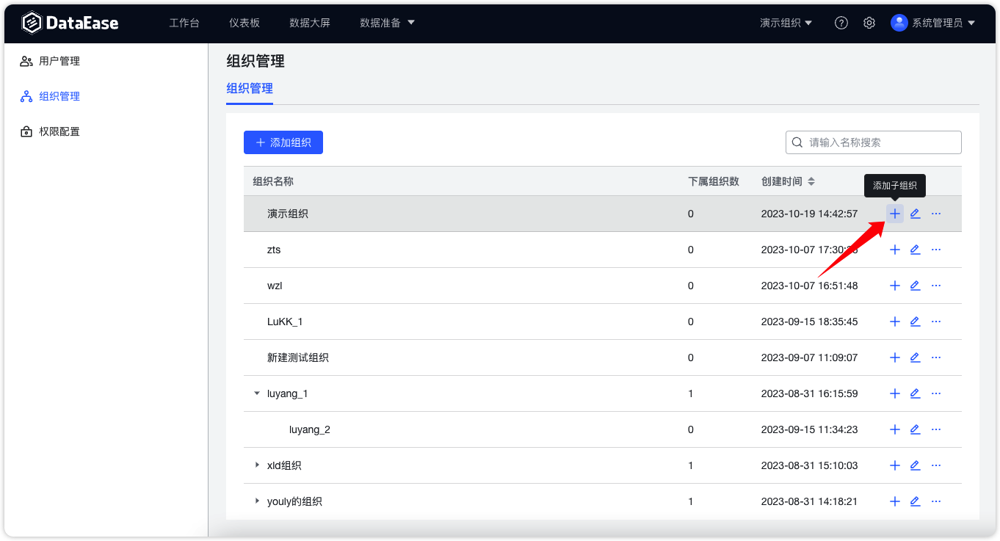
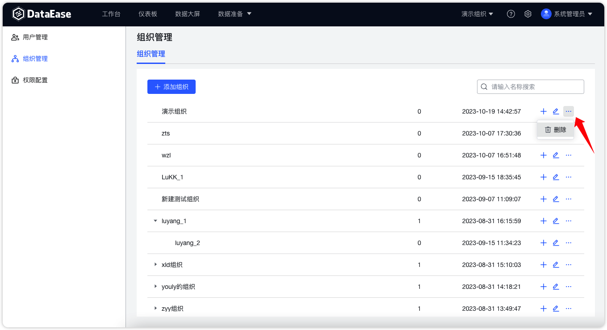

## 1 查询组织

!!! Abstract ""
    组织列表右上角支持根据组织名称搜索组织信息，系统也支持高级搜索，包括模糊和非模糊查询。

{ width="900px" }

## 2 查看组织成员

!!! Abstract ""
    支持对组织成员进行查看和管理操作，系统也支持搜索组织名称和用户名称进行查看。

{ width="900px" }

!!! Abstract ""
    支持为组织添加、移除成员。

{ width="900px" }

{ width="900px" }

## 2 新建组织

!!! Abstract ""
    组织呈现树状，支持添加组织。

{ width="900px" }

!!! Abstract ""
    支持在父节点组织下新建子节点组织。

{ width="900px" }

## 3 修改组织

!!! Abstract ""
    支持修改组织名称，支持修改关联上级组织进行组织上下级关系的调整。

{ width="900px" }

## 4 删除组织

!!! Abstract ""
    系统支持对组织进行删除操作，删除成功后，之前在此组织的用户将不在对应组织中。

    **提示：** 默认组织不能进行删除操作。

{ width="900px" }