## 1 权限说明

!!! Abstract ""
    通过权限配置，使不同用户在 DataEase 中具备不同的使用与操作权限，其中权限分为以下三类：

    - **菜单权限：** 功能模块（工作台、仪表板、数据大屏、数据准备/数据集、数据准备/数据源、系统管理/用户管理、系统管理/组织管理、系统管理/权限配置）的授权；
    - **资源权限：** 数据源、数据集、数据大屏、仪表板模块下的资源授权；
    - **数据权限：** 数据行列权限的授权。

!!! Abstract ""
    权限配置有两个视角，按用户配置与按资源配置，其本质上没有差异，可根据配置需求选择更方便的视角即可。
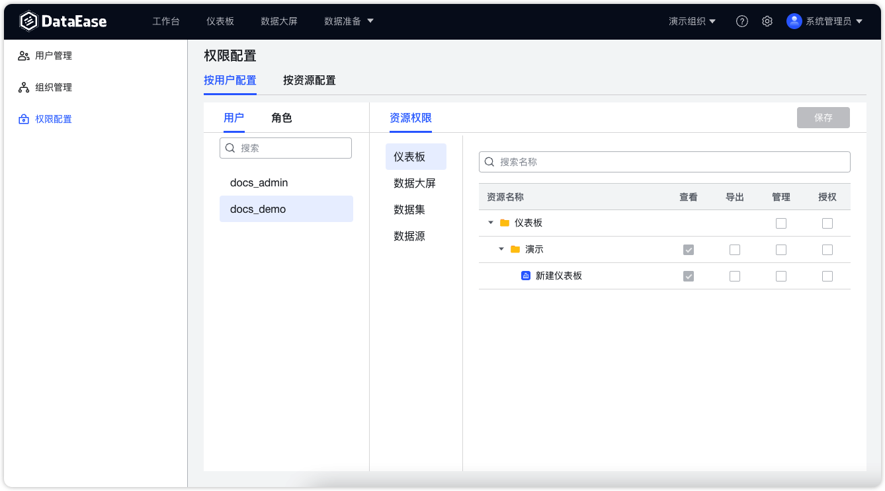{ width="900px" }
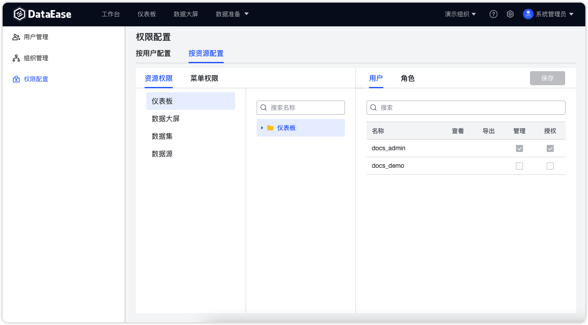{ width="900px" }

## 2 菜单权限

!!! Abstract ""
    菜单权限只能与角色进行绑定，无法直接授予给用户。可授权菜单包括以下类型：

    - 工作台
    - 仪表板
    - 数据大屏
    - 数据准备/数据集
    - 数据准备/数据源
    - 系统管理/用户管理
    - 系统管理/组织管理
    - 系统管理/权限配置

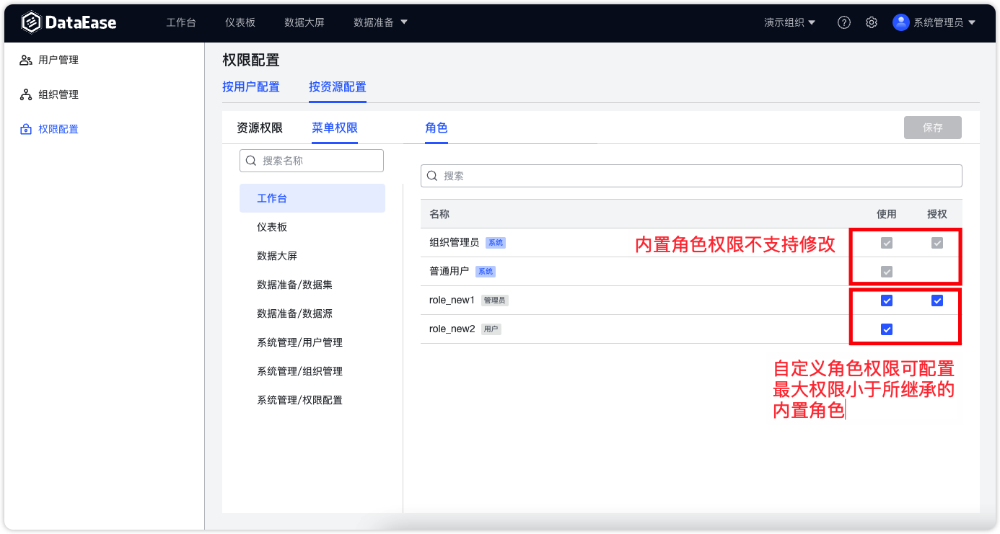{ width="900px" }

## 3 资源权限
!!! Abstract ""
    资源权限可按照用户或角色进行授予。**菜单权限和资源权限分离**，用户或角色可仅拥有资源权限，如 API 用户。  
    **资源可通过分组进⾏权限继承**，即资源组授权给对应的角色或⽤户后，这些角色和⽤户对该资源分组下的新增资源⾃动拥有对应的权限。
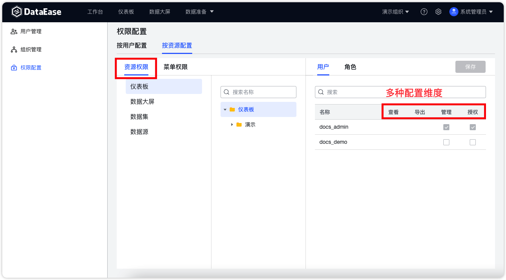{ width="900px" }

## 4 行列权限

!!! Abstract ""

    "行列权限"是数据集的权限类型之一，对行列权限的设置可以达到针对同一个数据集数据，不同的维度能查看对应权限的数据资源的目的；  
    "行权限"是对行数据的权限进行不同维度的重新分配，例如，可以通过行权限的配置，使"运维部门"员工仅能查看运维相关的数据；  
    "列权限"是对列数据的过滤，包括对列数据的"禁用"和"脱敏"操作。配置"禁用"后的整列，字段名和数据都不会被看见；"脱敏"后的列数据，能看见字段名，数据会被以 "******" 展示；  
    "白名单"，白名单中的人员不受该规则限制，白名单可添加多人。

### 4.1 行权限

!!! Abstract ""  
    按照数据内容过滤，常用场景比如不同部门只能看到自己部门的数据，不同产品线只能看到自己产品线的数据，不同门店只能看到自己门店的数据等；  
    系统支持从 3 种不同的维度配置行权限（维度包括"角色"、"用户"、"系统变量"）；  
    其中系统变量是除了系统内置的"账号"、"姓名"、"邮箱"系统变量，系统管理员可在系统设置中增加自定义变量，组织管理员可以为组织内成员配置这些系统变量。使数据集数据与系统内置数据建立联系，可以实现轻松快捷地实现不同的用户访问各自所属的数据资源。
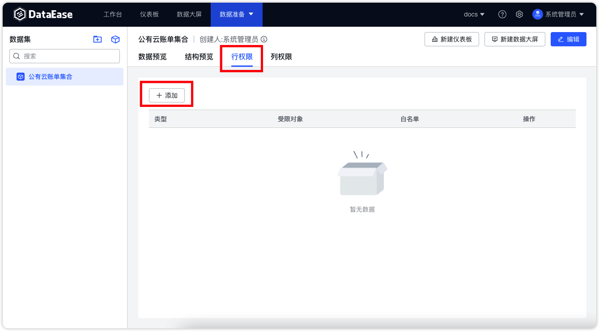{ width="900px" }
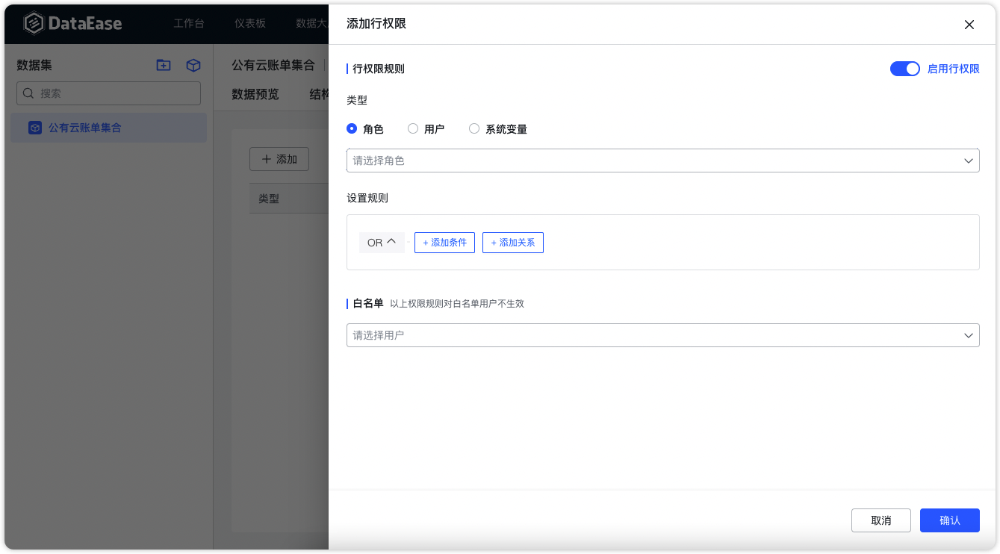{ width="900px" }
!!! Abstract ""  
    白名单：在每条行权限的配置中，可以将用户加入白名单，权限规则对白名单用户不生效。
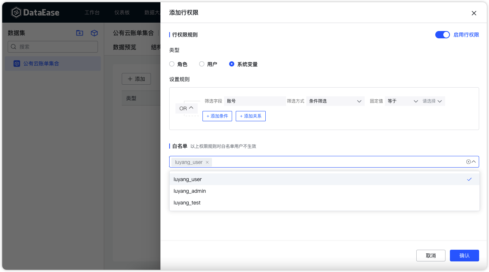{ width="900px" }

### 4.2 列权限

!!! Abstract ""  
    列权限按照字段过滤，常用场景比如一些敏感字段数据不适合某些角色人查看及使用，像是销售金额、客户身份证号等。
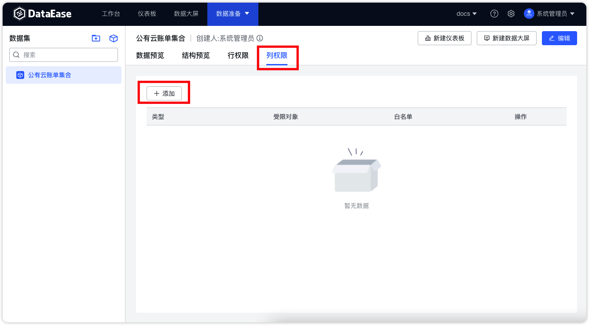{ width="900px" }
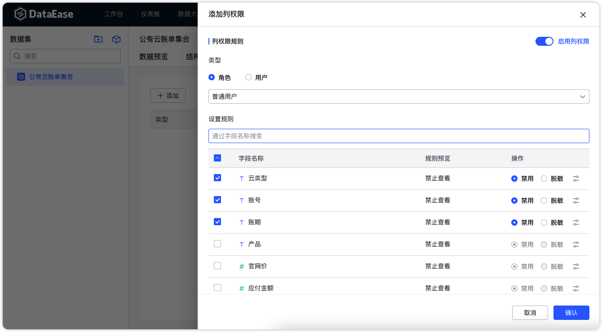{ width="900px" }

!!! Abstract ""  
    支持两种配置类型：

    - **禁用：** 用户完全看不到该字段，甚至不知道该字段的存在； 
    - **脱敏：** 用户可以看见该字段，知道这个 字段的存在，但是看不到真实的信息，会有 * 替代真实信息做脱敏处理。
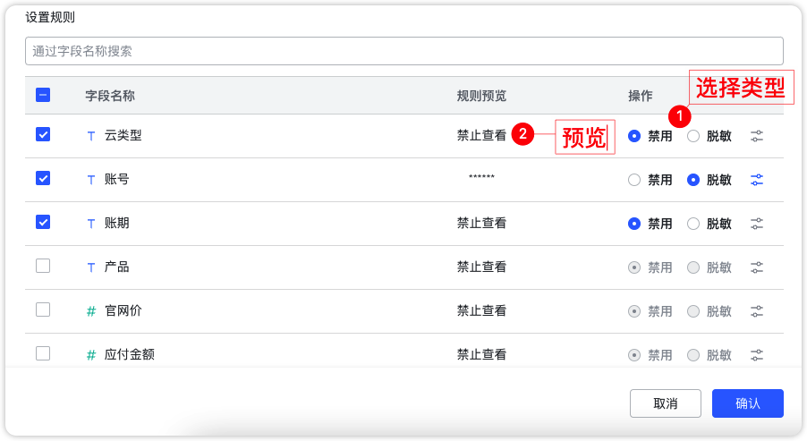{ width="900px" }

!!! Abstract ""  
    脱敏规则支持选择系统内置规则或用户自定义，比如设置从第 M 位至第 N 位显示为 *。
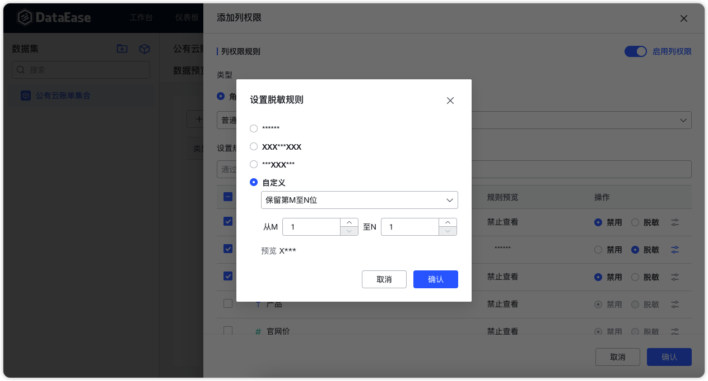{ width="900px" }