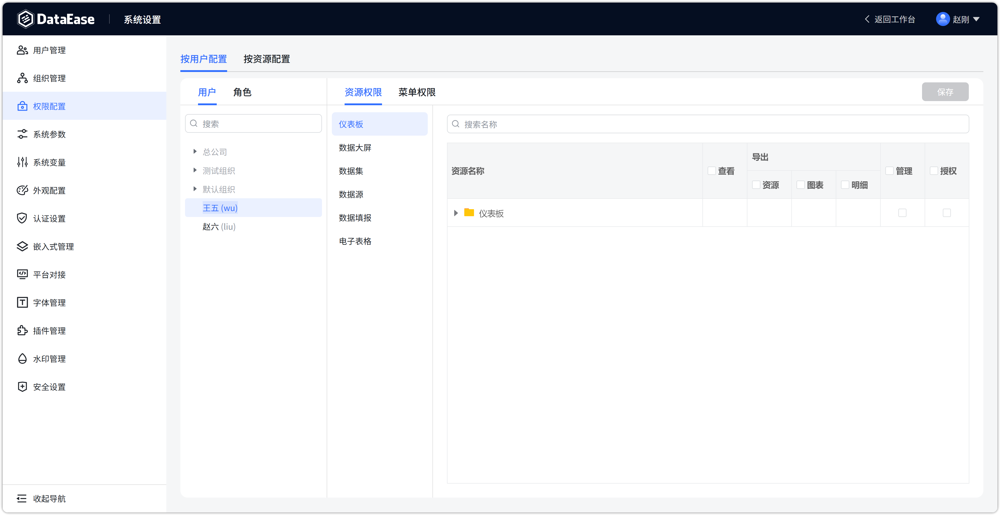
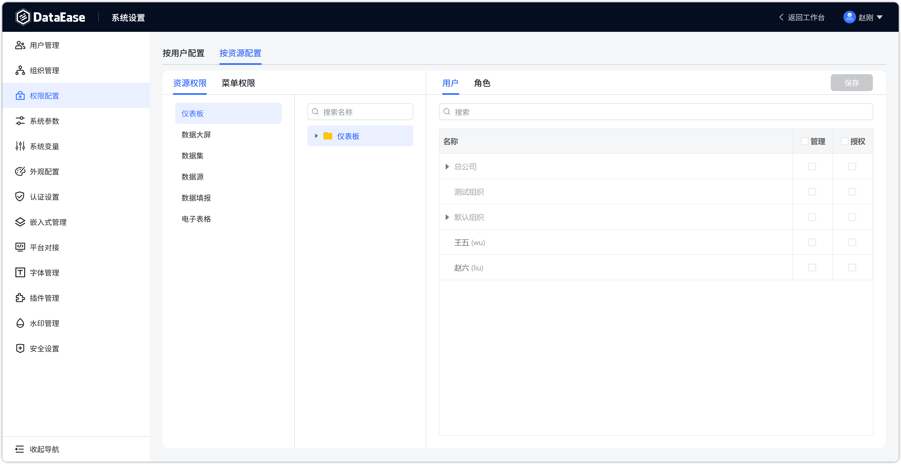
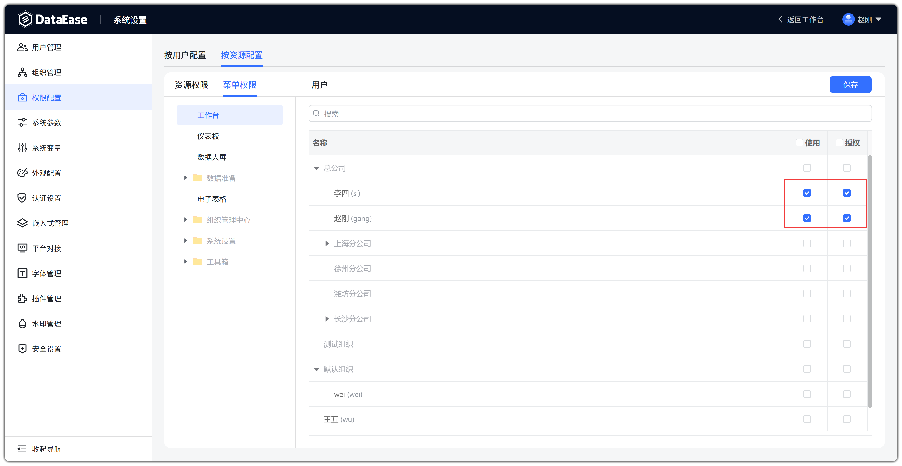
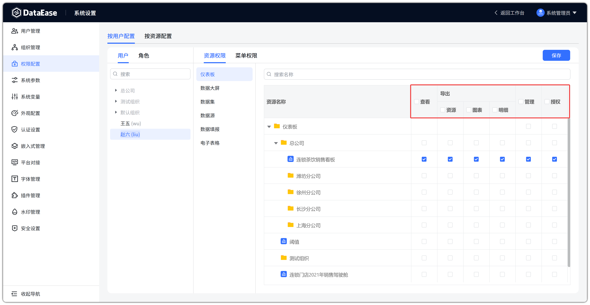
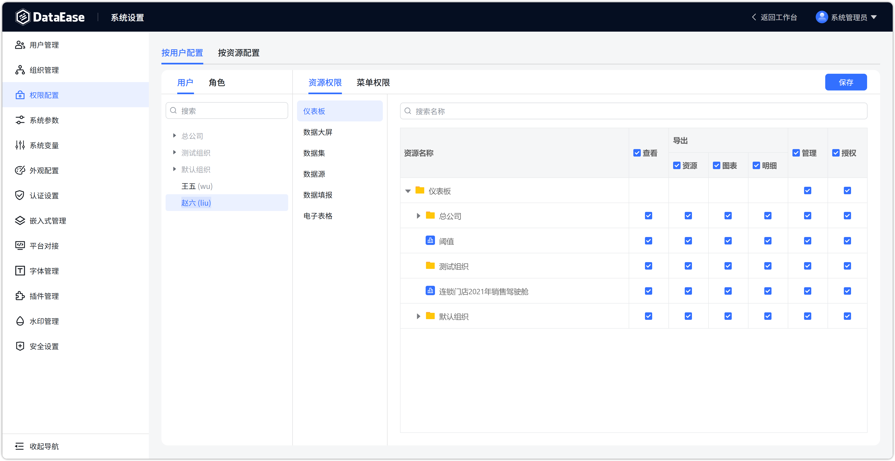
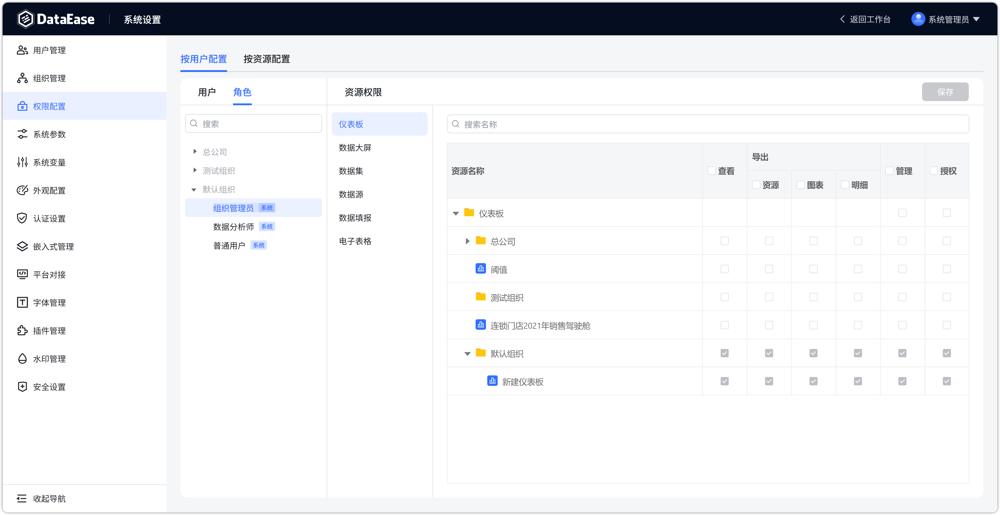

# 权限配置

## 1 功能概述

!!! Abstract ""
    【权限配置】位于【系统设置】下。入口：右上角头像菜单 →【系统设置】→【权限配置】。

    通过权限配置，使不同用户在 DataEase 中具备不同的使用与操作权限。权限分为以下三类：

    - **菜单权限：** 功能模块（工作台、仪表板、数据大屏、数据准备、系统设置等）的授权；
    - **资源权限：** 仪表板、数据大屏、数据集、数据源、数据填报、电子表格等资源的授权；
    - **数据权限：** 数据行列权限的授权，在数据集中配置，见 [数据集](dataset.md)。

!!! Abstract ""
    页面顶部为【按用户配置】【按资源配置】两个视角，其下再分【用户】【角色】。两个视角本质上没有差异，可根据配置需求选择更方便的一方即可。左侧可按组织树选择范围（如总公司、测试组织、默认组织）。

    用可进入系统设置的账号实测：

    - 选中【用户】时，右侧同时有【资源权限】【菜单权限】；
    - 选中【角色】时，右侧只有【资源权限】，没有【菜单权限】。
{ width="900px" }
{ width="900px" }

!!! Abstract ""
    **与【组织管理中心-权限配置】的区别**

    | 对比项 | 系统设置-权限配置 | 组织管理中心-权限配置 |
    | --- | --- | --- |
    | 入口 | 右上角【系统设置】 | 顶部【组织管理中心】 |
    | 管理范围 | 全平台，可按组织选择 | 当前组织 |
    | 选中用户时的菜单权限 | 有【菜单权限】页签 | 无 |
    | 选中角色时的菜单权限 | 无 | 有【菜单权限】页签 |
    | 资源权限 | 有 | 有 |

    系统设置里，菜单权限只赋给**个人**；组织管理中心里，菜单权限赋给**角色**。组织内角色的菜单授权请到 [组织管理中心-权限配置](org_center_permission.md) 操作。

## 2 菜单权限

!!! Abstract ""
    在【系统设置-权限配置】中，菜单权限与用户绑定，直接授予个人功能菜单入口，不能在角色维度分配。

    可授权菜单包括以下类型：

    - 工作台
    - 仪表板
    - 数据大屏
    - 数据准备
    - 电子表格
    - 组织管理中心
    - 系统设置
    - 工具箱

{ width="900px" }

## 3 资源权限

!!! Abstract ""
    资源权限可按【用户】或【角色】授予，与菜单权限相互独立：用户或角色可以只有资源权限、没有对应菜单（例如 API 用户）。

    配置路径：选择【按用户配置】或【按资源配置】→ 选中用户或角色 →【资源权限】→ 选择资源类型 → 在右侧勾选后【保存】。

    资源类型包括：仪表板、数据大屏、数据集、数据源、数据填报、电子表格。

    资源可通过分组（文件夹）继承权限：对文件夹授权后，其下新增资源会自动拥有对应权限。文件夹勾选框呈灰色半选时，表示其下仅部分资源已授权。

    右侧权限列含义如下：

    - **查看**：是否可见、可打开该资源。
    - **导出**：细分为三项。

        - **资源**：控制图片、PDF、模板等资源的导出。
        - **图表**：支持以 Excel 导出图表展示的数据。
        - **明细**：支持导出图表对应的详细数据。

    - **授权**：用户或角色可以把权限范围以内的资源，再授权给其他用户或角色。
    - **管理**：可编辑管理该资源，同时拥有该资源全部权限（包括授权、导出、查看）。
{ width="900px" }

## 4 用户维度

!!! Abstract ""
    选择用户后，可在【资源权限】与【菜单权限】之间切换：

    - **资源权限**：授予具体资源；
    - **菜单权限**：直接授予个人功能菜单入口。
{ width="900px" }

## 5 角色维度

!!! Abstract ""

    - 选择角色后，仅配置该角色的资源权限。
    - 系统设置下不能在角色维度分配菜单权限；且只能对组织默认角色进行资源权限调整。
    - 组织内自定义角色的资源/菜单授权请到【组织管理中心-权限配置】操作。

{ width="900px" }