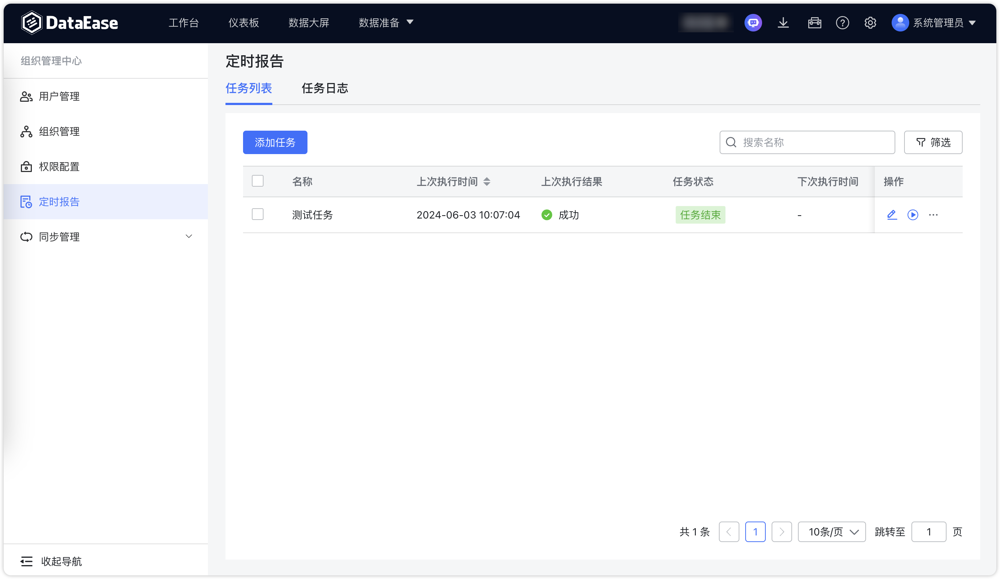
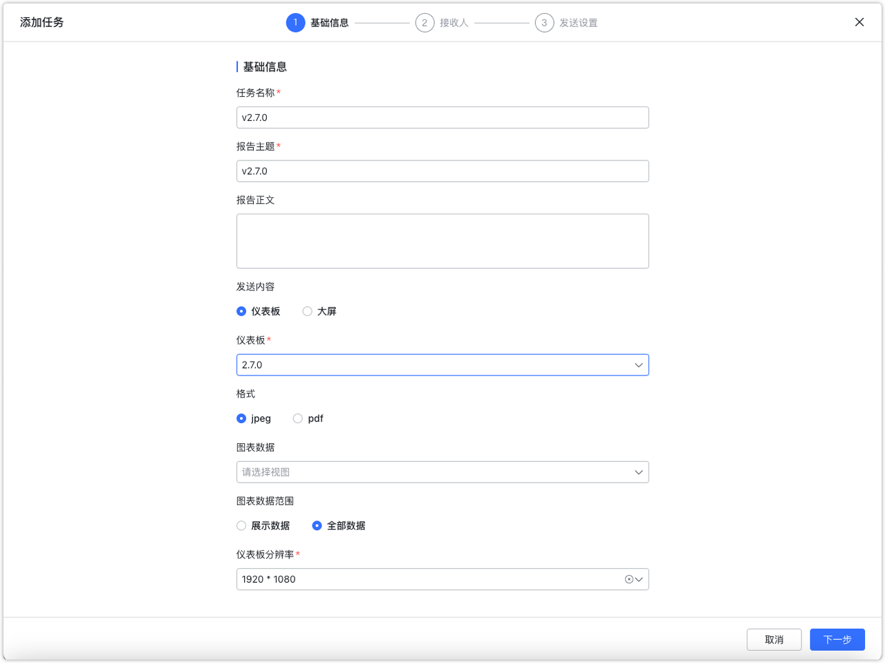
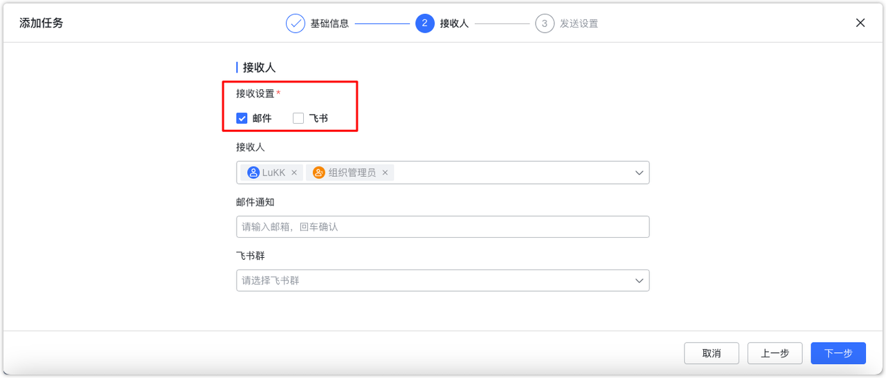
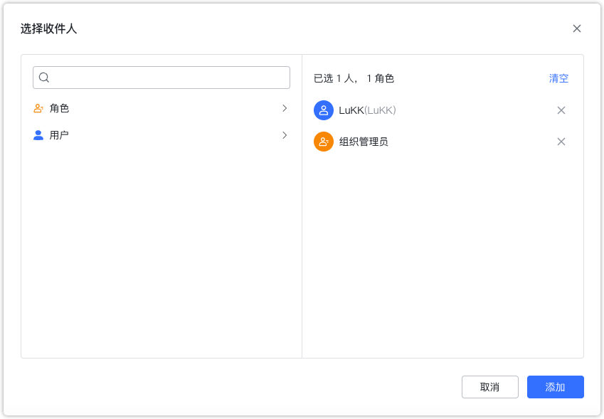
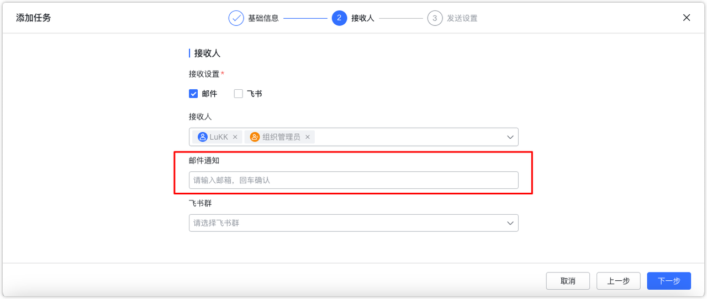
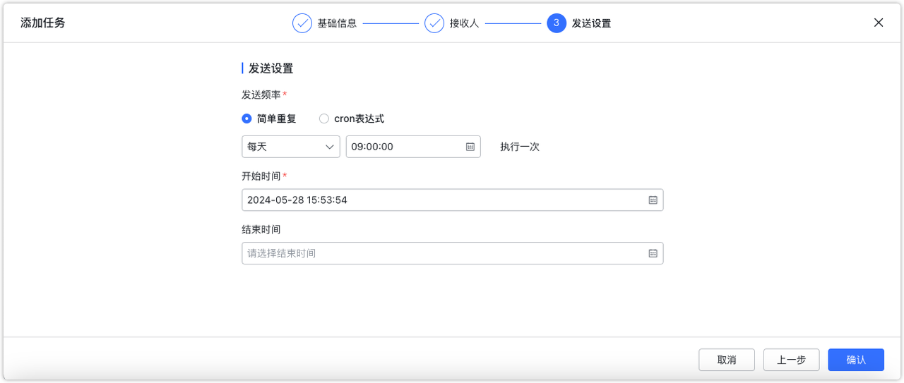
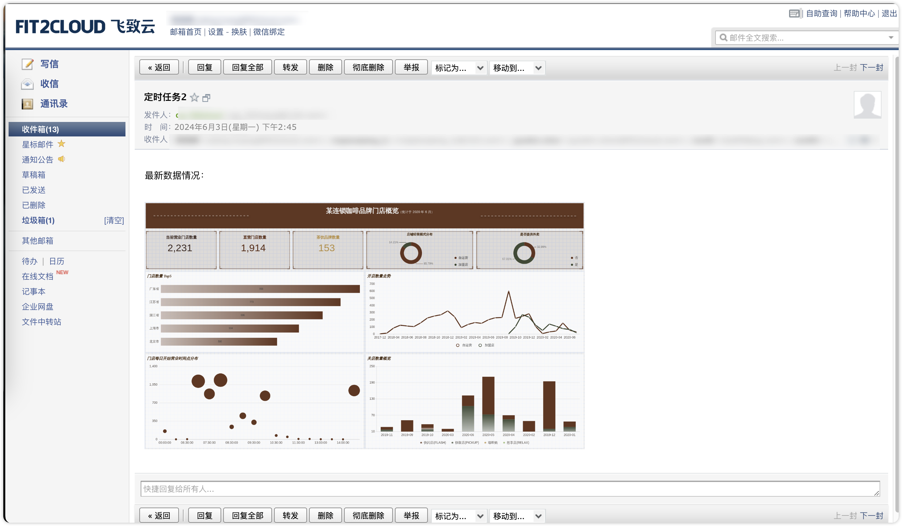
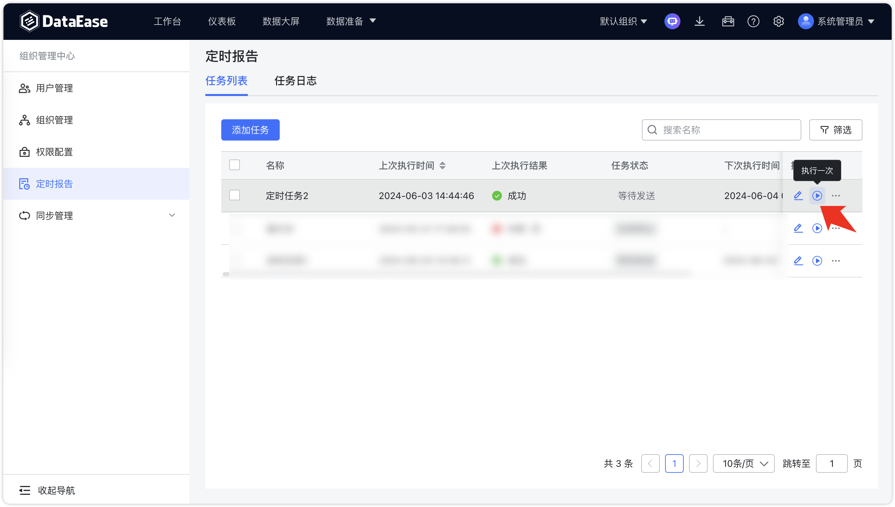
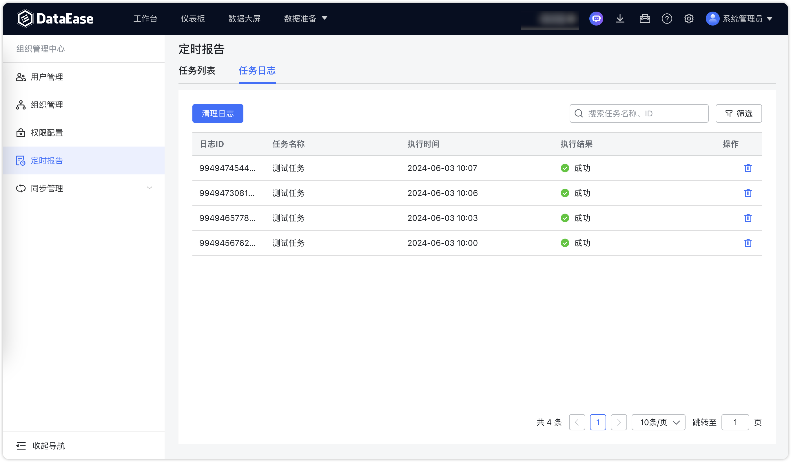

## 1 任务列表

!!! Abstract ""
    系统支持给干系人发送邮件的方式定时推送仪表板的报告，选择"组织管理执行"中的"定时报告"；  
    系统支持批量删除定时报告任务。

{ width="900px" }

## 2 新增任务

!!! Abstract ""
    **第一步：基础信息配置**   
    输入需发送的仪表板或数据大屏；系统支持发送选定视图的数据，支持视图数据范围选项。

    - 【展示数据】：即页面上显示的数据，页面中过滤组件筛选后的数据；
    - 【全部数据】：即未被筛选条件过滤的用户有权限的全部数据。
{ width="900px" }
!!! Abstract ""
    **第二步：接收人配置**  
    目前只支持邮件和飞书接收通知。
{ width="900px" }
!!! Abstract ""
    选择内部收件人可以按照角色或用户维度多选。
{ width="900px" }
!!! Abstract ""
    需要发送给外部邮箱可以通过【邮件通知】输入框输入，输入完邮箱后点击回车即可。
{ width="900px" }
!!! Abstract ""
    **第三步：配置发送设置**  
{ width="900px" }

!!! Abstract ""
    **定时报告邮件接收示例：**  
{ width="900px" }

## 2 执行记录

!!! Abstract ""
    可根据需要，手动即时做一次单次的执行，点击下图的"立即执行"。
{ width="900px" }
!!! Abstract ""
    切换菜单至【任务日志】，查看定时报告的执行记录。
{ width="900px" }
