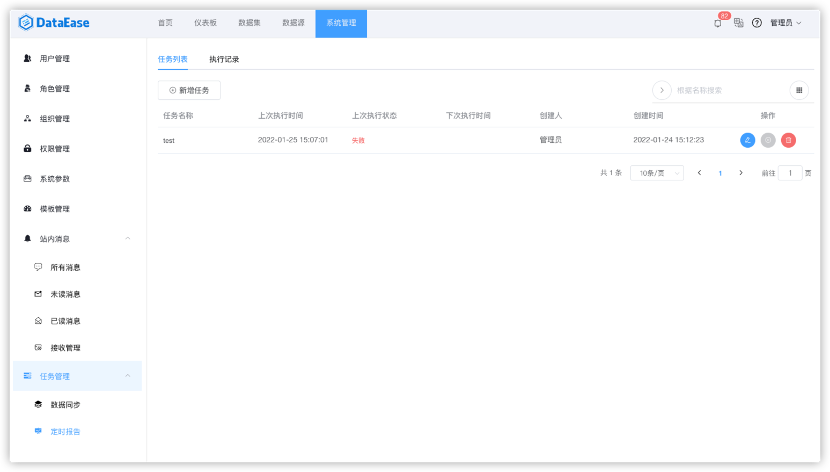
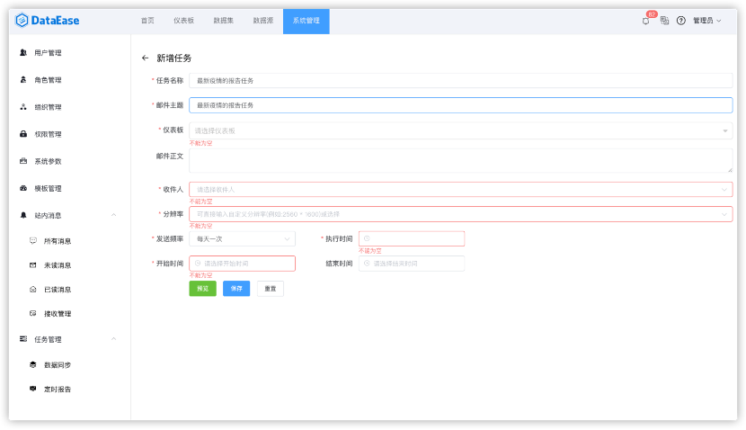
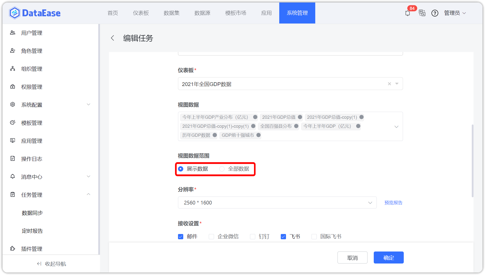
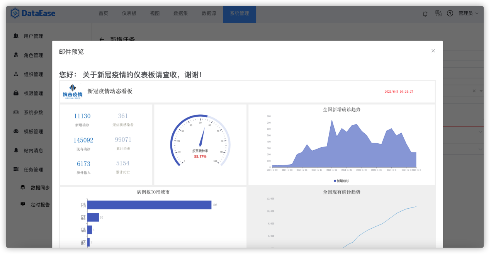
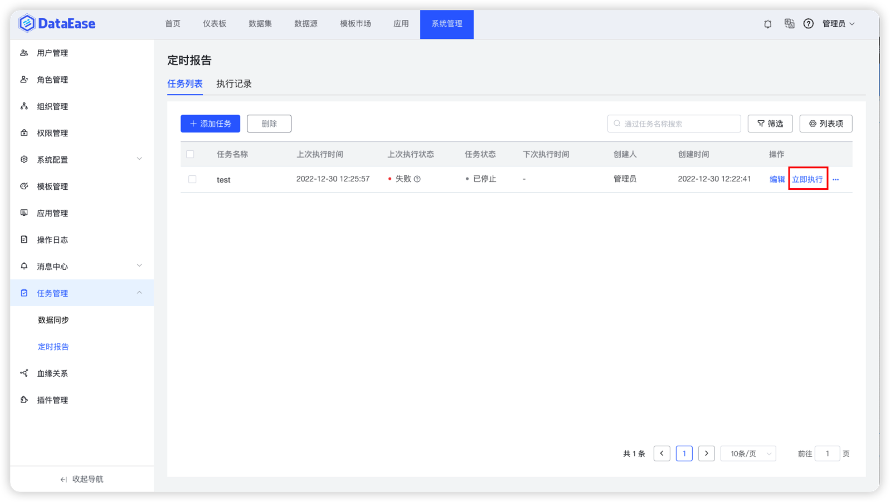
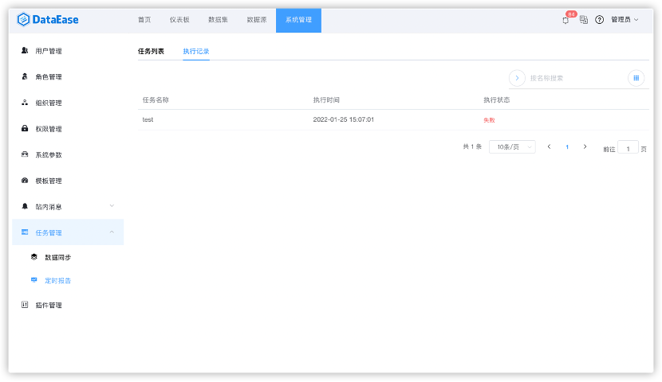

## 1 任务列表

!!! Abstract ""
系统支持给干系人发送邮件的方式定时推送仪表板的报告，选择"系统管理"中"任务管理"的"定时报告"；  
系统支持批量删除定时报告任务。

{ width="900px" }

### 1.1 新增任务

!!! Abstract ""
点击"新增任务"后需要依次输入需发送的邮件信息和仪表板信息；  
支持点击预览进行邮件信息查看；  
支持在富文本编辑器内填写报告内容，支持通过邮件、钉钉、飞书、企业微信、国际飞书等渠道发送富文本内容。  
**注意：** 由于各个第三方平台对富文本支持的不同，不是所有的样式都能支持；  
红色星号标记为必填项，仪表板只能选择一个。

{ width="900px" }

!!! Abstract ""
系统支持发送选定视图的数据，支持视图数据范围选项。

    - 【展示数据】：即页面上显示的数据，页面中过滤组件筛选后的数据；
    - 【全部数据】：即未被筛选条件过滤的用户有权限的全部数据。

{ width="900px" }

{ width="900px" }

!!! Abstract ""
以"飞书"为例，接收到的内容如下图所示。

{ width="900px" }

### 1.2 预览邮件

!!! Abstract ""
点击"预览报告"可以查看邮件效果。

{ width="900px" }

## 2 执行记录

!!! Abstract ""
可根据需要，手动即时做一次单次的执行，点击下图的"立即执行"。

{ width="900px" }

!!! Abstract ""
切换菜单至【执行记录】，查看定时报告的执行记录。

{ width="900px" }
