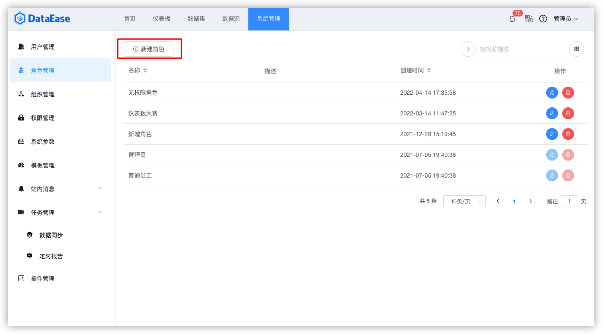
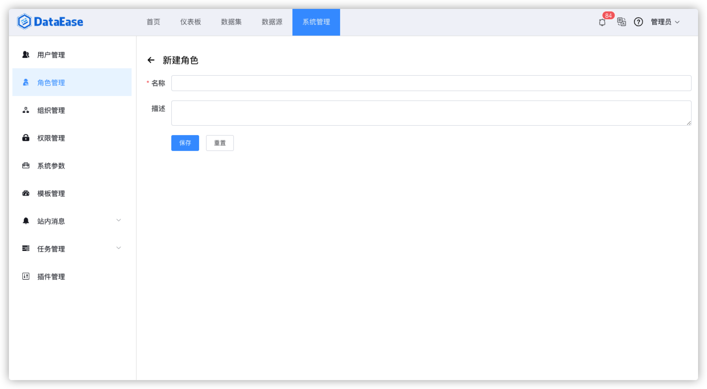
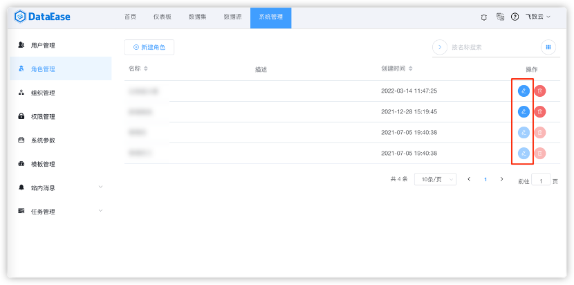
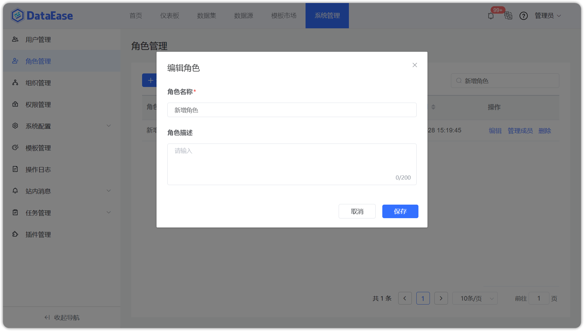
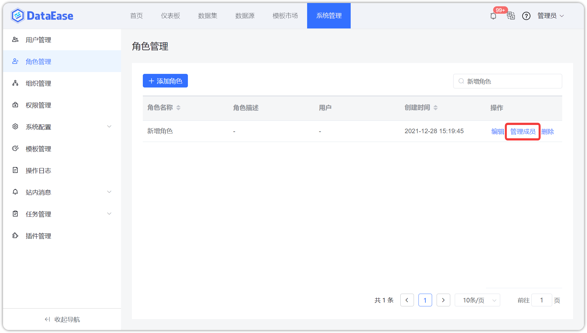

## 1 新建角色

!!! Abstract ""
    系统支持新建自定义角色，为用户赋予角色，达到权限与用户解绑的目的，同一用户可拥有多个角色；  
    系统初始化时已分别内置了一个管理员与普通员工角色。

{ width="900px" }

{ width="900px" }

## 2 编辑角色

!!! Abstract ""
    系统支持对自定义角色进行编辑，内置角色（管理员）不支持编辑，企业版支持对角色的名称和描述进行编辑。

{ width="900px" }

{ width="900px" }

## 3 管理角色成员

!!! Abstract ""
    系统支持对角色成员进行管理，支持对角色所关联的成员进行查看、添加、移除。

{ width="900px" }

!!! Abstract ""
    系统支持对角色成员进行添加。

{ width="900px" }

!!! Abstract ""
    系统支持对角色成员进行移除。

{ width="900px" }

## 4 删除角色

!!! Abstract ""
    系统支持对自定义角色进行删除，内置角色（管理员）不支持删除。

    **提示：** 删除角色后，之前拥有这个角色的用户会自动删除此角色，即之前的用户不再拥有这个角色。

{ width="900px" }