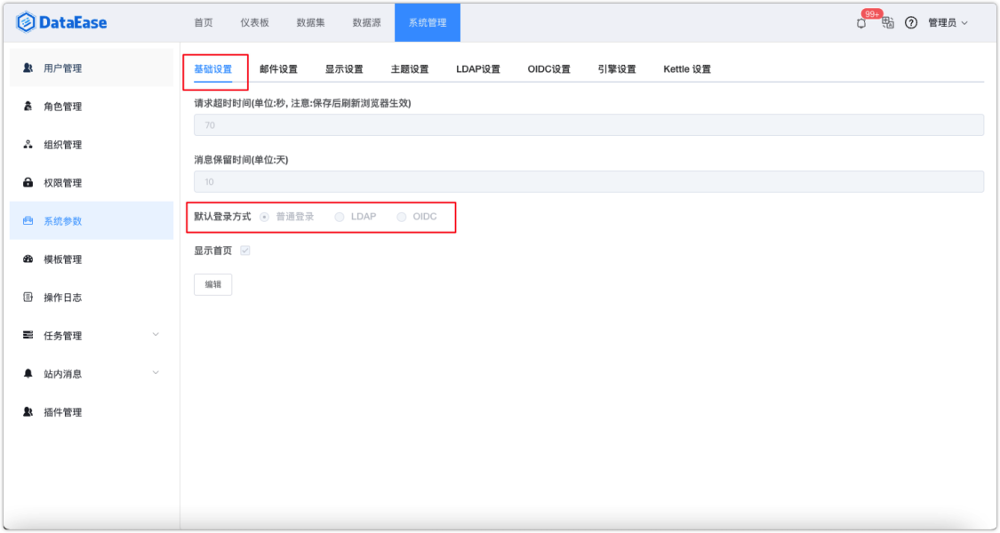
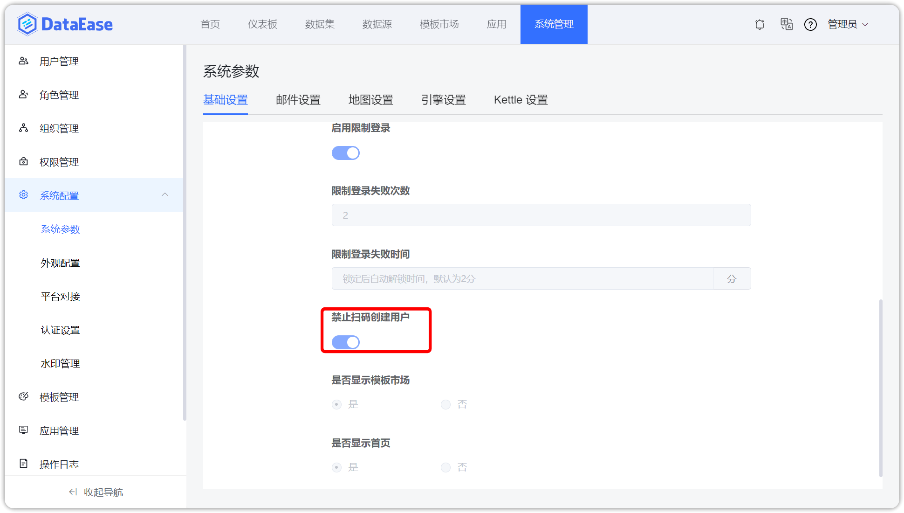

## 1 基础设置

!!! Abstract ""
如下图所示，在启用其他登录方式后，可设置系统默认登录方式，设置后在登陆界面不需再自行选择。

{ width="900" }

!!! Abstract ""
支持设置是否禁用扫码自动创建用户，禁止后，只能通过在已有 DataEase 账号的个人信息中绑定平台账号后扫码登录。

{ width="900" }

{ width="900" }

!!! Abstract ""
模板市场支持权限管理和系统参数叠加权限控制，支持为不同用户开放或关闭“模板市场”菜单，具体可参考【权限管理】的[调整权限](../sys_management_permission/#4)；  
系统参数中的显示控制为总开关，权限管理中的控制优先级低一级，效果如下所述：

    - 当系统参数中关闭显示，则不再判断权限管理中权限；
    - 当系统参数中开启显示，则再依据权限管理中的权限控制模板市场的显示与否。

{ width="900" }
