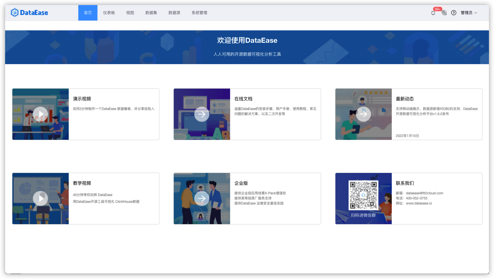

# 工具箱

!!! Abstract ""
    工具箱是 v3.0.0 起新增的一级功能入口，集中收纳了平台日常运维类功能：定时报告、告警管理、血缘分析、模板管理、操作日志。

## 1 入口说明

!!! Abstract ""
    工具箱为隐藏菜单，不显示在顶部导航栏中。可通过以下方式进入：

    - 在工作台首页点击【定时报告】【告警管理】【血缘分析】【模板管理】【操作日志】任一快捷卡片；
    - 或通过浏览器直接访问 `/#/toolbox/report` 等地址。

{ width="900px" }

## 2 功能一览

| 功能 | 说明 |
| --- | --- |
| 定时报告 | 设置任务定时生成报表（仪表板/数据大屏）并推送给指定人员，支持邮件、企业微信、钉钉、飞书等渠道 |
| 告警管理 | 为图表数据设置阈值告警，数据超出预设阈值时触发告警并通知相关人员 |
| 血缘分析 | 查询数据源 → 数据集 → 仪表板/数据大屏的资源血缘关系 |
| 模板管理 | 仪表板/数据大屏模板的分类管理与导入 |
| 操作日志 | 平台内所有用户操作的审计日志，支持筛选与导出 |

## 3 与 v2 的差异

!!! Abstract ""
    - v2 中【定时报告】【告警管理】【血缘分析】位于【系统管理】下；
    - v3 将以上功能统一迁移至【工具箱】，并新增【操作日志】入口；
    - 模板管理在 v2 中位于【系统管理-模板管理】，v3 同样并入【工具箱】。
