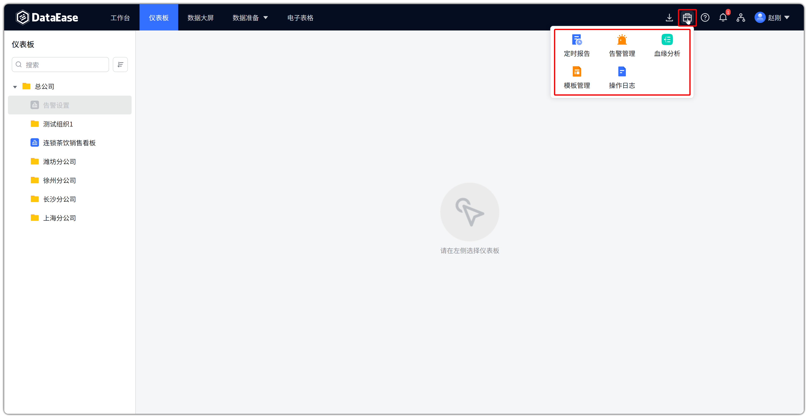
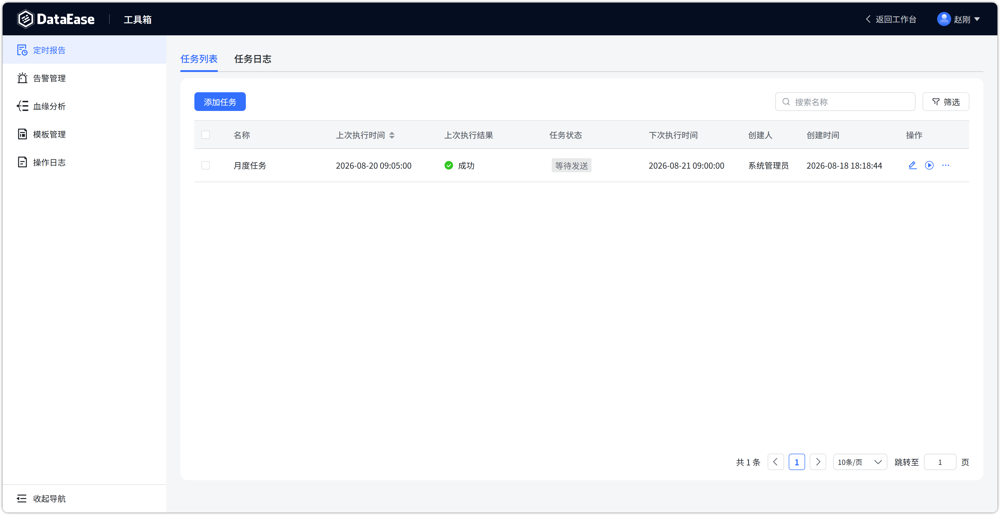
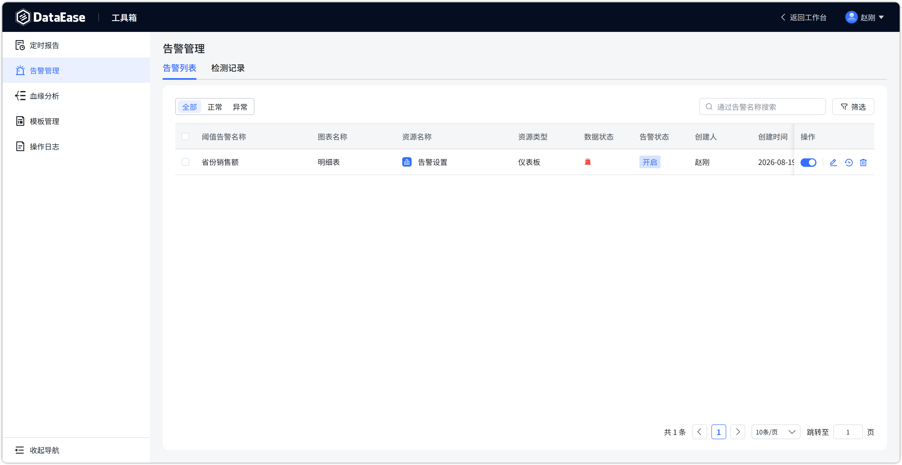
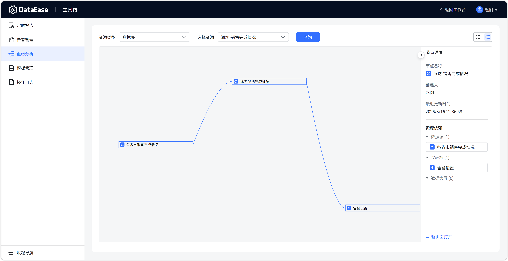
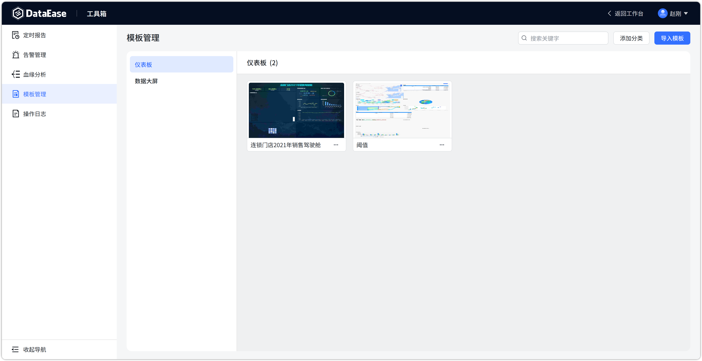

# 工具箱

!!! Abstract ""
    工具箱集中收纳了平台日常运维类功能：定时报告、告警管理、血缘分析、模板管理、操作日志。

## 1 入口说明

!!! Abstract ""
    工具箱入口位于顶部导航右侧工具图标区（公文包样式图标）。点击该图标后展开下拉菜单，包含 5 项功能：

    - 第一行：定时报告、告警管理、血缘分析；
    - 第二行：模板管理、操作日志。

    点击任一菜单项即可进入对应的工具箱功能页面；进入后页面左侧导航可切换其余功能。

{ width="900px" }

## 2 功能一览
!!! Abstract ""
| 功能 | 说明 |
| --- | --- |
| 定时报告 | 设置任务定时生成报表（仪表板/数据大屏）并推送给指定人员，支持邮件、企业微信、钉钉、飞书等渠道 |
| 告警管理 | 为图表数据设置阈值告警，数据超出预设阈值时触发告警并通知相关人员 |
| 血缘分析 | 查询数据源 → 数据集 → 仪表板/数据大屏的资源血缘关系 |
| 模板管理 | 仪表板/数据大屏模板的分类管理与导入 |
| 操作日志 | 平台内所有用户操作的审计日志，支持筛选与导出 |

## 3 定时报告

!!! Abstract ""
    页面包含【任务列表】【任务日志】两个页签，右上角提供【添加任务】按钮，支持按条件筛选任务。

    - **任务列表**：展示定时报告任务，表格列包括名称、上次执行时间、上次执行结果、任务状态、下次执行时间、创建人；
    - **任务日志**：展示各任务的历史执行记录；
    - **添加任务**：新建定时报告任务，可配置报表、执行周期与推送渠道（邮件/企业微信/钉钉/飞书等）。

{ width="900px" }

## 4 告警管理

!!! Abstract ""
    页面包含【告警列表】【检测记录】两个页签，提供状态筛选（全部/正常/异常）与条件筛选。

    - **告警列表**：展示已配置的阈值告警，表格列包括阈值告警名称、图表名称、资源名称；
    - **检测记录**：展示告警检测的历史记录。

{ width="900px" }

## 5 血缘分析

!!! Abstract ""
    页面提供资源血缘关系查询：选择资源类型（数据源）与具体资源后点击【查询】，即可查看血缘链路。

    - **资源类型**：当前提供「数据源」维度；
    - **查询结果**：按数据源名称、数据源集名称、仪表板名称、数据大屏名称展示血缘关系。

{ width="900px" }

## 6 模板管理

!!! Abstract ""
    页面提供模板的分类管理与导入能力。

    - **添加分类**：新建模板分类；
    - **导入模板**：导入仪表板/数据大屏模板文件。

{ width="900px" }

## 7 操作日志

!!! Abstract ""
    记录平台内用户操作行为，支持筛选与导出。详细说明见 [操作日志](operation_log.md)。

## 8 与 v2 的差异

!!! Abstract ""
    - v2 中【定时报告】【告警管理】【血缘分析】位于【系统管理】下；
    - v3 将以上功能统一迁移至【工具箱】；
