## 1 用户

### 1.1 用户列表

!!! Abstract ""
    系统支持多用户体系，系统管理员或组织管理员可以创建及管理用户。

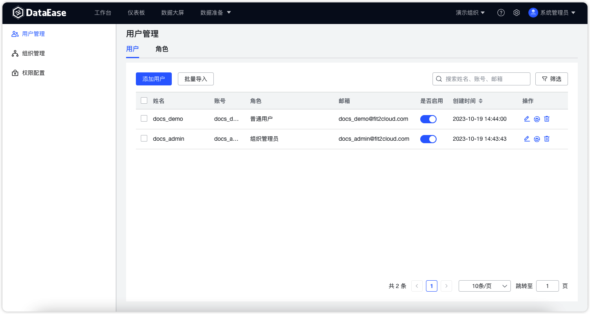{ width="900px" }

### 1.2 添加用户

!!! Abstract ""
    支持系统管理员或组织管理员添加新用户，添加用户前需要先选择对应的组织，并在该组织下创建新的用户。

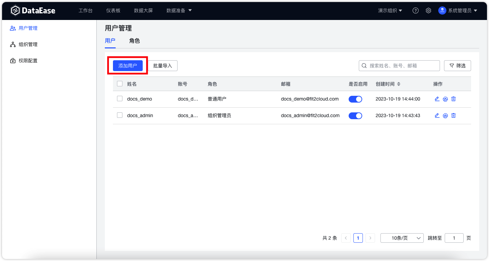{ width="900px" }

!!! Abstract ""

    - 账号：用户账号信息，不支持修改；
    - 姓名：用户姓名；
    - 邮箱：用户邮箱；
    - 手机：用户手机号；
    - 角色：用户在该组织下的角色，可多选；
    - 是否启用：用户的启用状态，如关闭，则用户无法登录 DataEase。
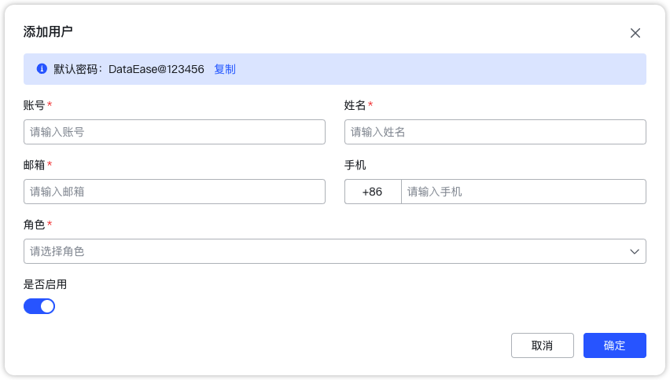{ width="900px" }

### 1.3 批量导入用户

!!! Abstract ""
    系统支持批量导入用户，并提供 Excel 模版，可按照模版格式上传，系统后台会自动进行数据校验。  
    **注意：**

    - 如果上传的 Excel 文件中存在不合规的数据，那么系统只创建合规数据的用户信息，不合规数据，会提供错误信息。用户可下载错误报告查看详细情况。
    - 支持上传的文件大小，10M 以内。
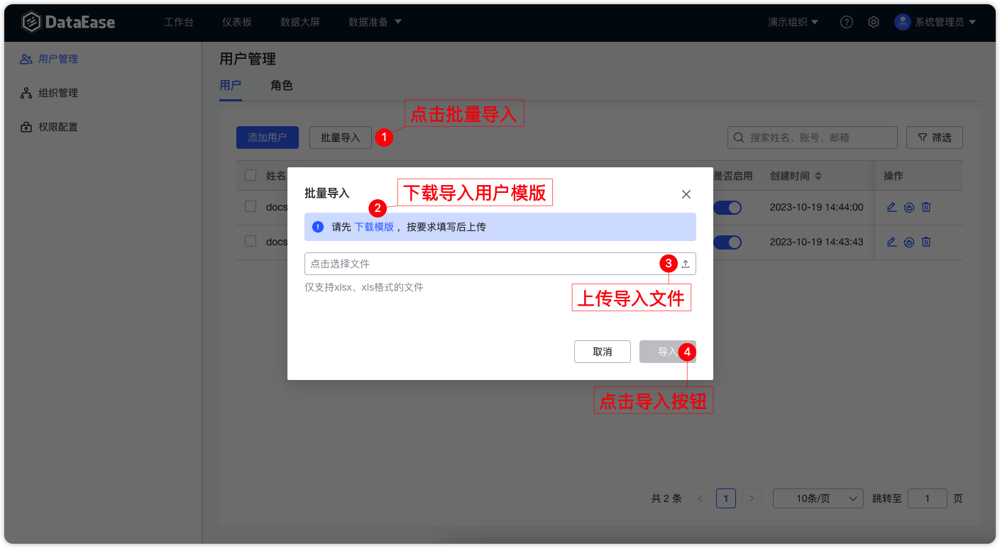{ width="900px" }
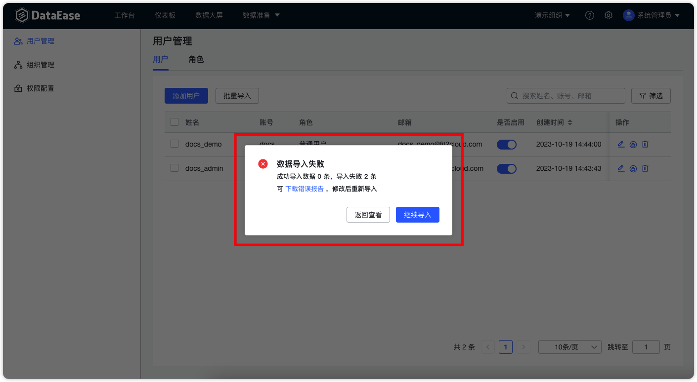{ width="900px" }

### 1.4 编辑用户

!!! Abstract ""
    支持管理员编辑用户信息。 请注意，账号信息不支持修改。

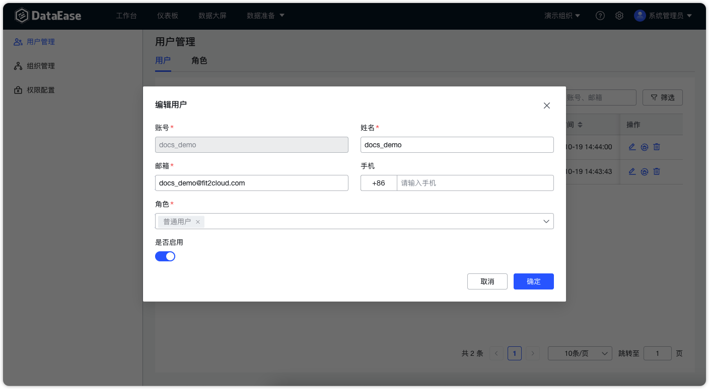{ width="900px" }

### 1.5 重置密码
!!! Abstract ""
    支持管理员将用户信息重置为初始密码。
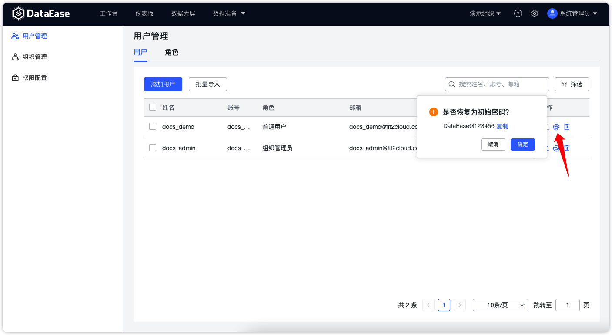{ width="900px" }

### 1.6 删除用户
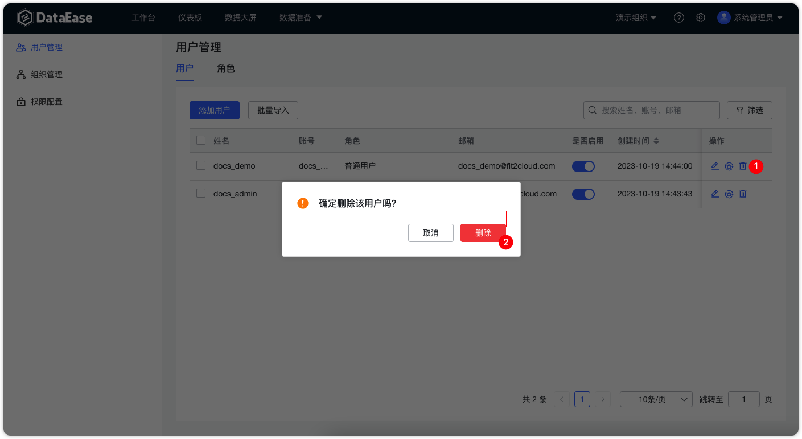{ width="900px" }

### 1.7 查询用户
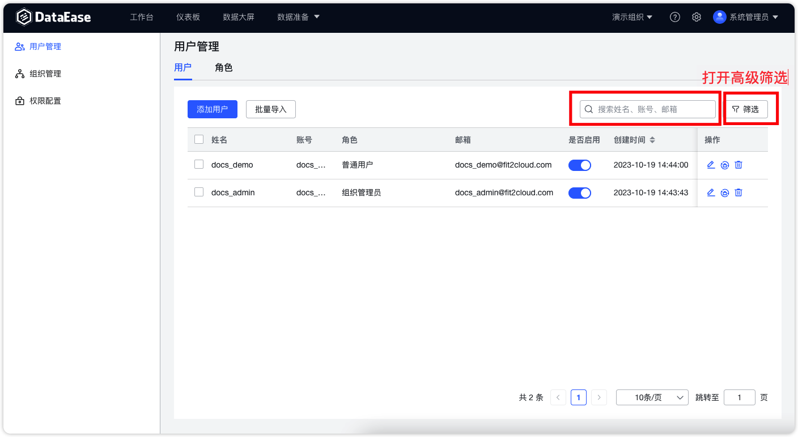{ width="900px" }

## 2 角色
!!! Abstract ""
    角色是⽤户在组织下的⾝份，⽤来批量进⾏权限管理。

    角色级别：

    - 系统级角色：全局角色，目前不可继承不可修改，不可创建该角色的用户，即目前只有内置的 admin 用户为系统管理员；
    - 组织级角色：存在于具体组织下，包括内置角色（组织管理员、普通用户）与自定义角色，系统管理员与该组织的组织管理员可以新建或编辑自定义角色。

    内置角色权限范围：

    - 系统管理员：拥有最高权限，可操作任意功能，可切换到任意组织并管理组织；
    - 组织管理员：指定组织下拥有管理员权限，可以在组织下创建⽤户、资源、当前组织下的自定义角色等；
    - 普通用户：拥有当前组织下所有资源的查看权限；
    - ⾃定义角色：需要在内置组织级角色基础上进⾏继承，权限不⼤于所继承的内置⾓⾊的权限。

### 2.1 角色列表
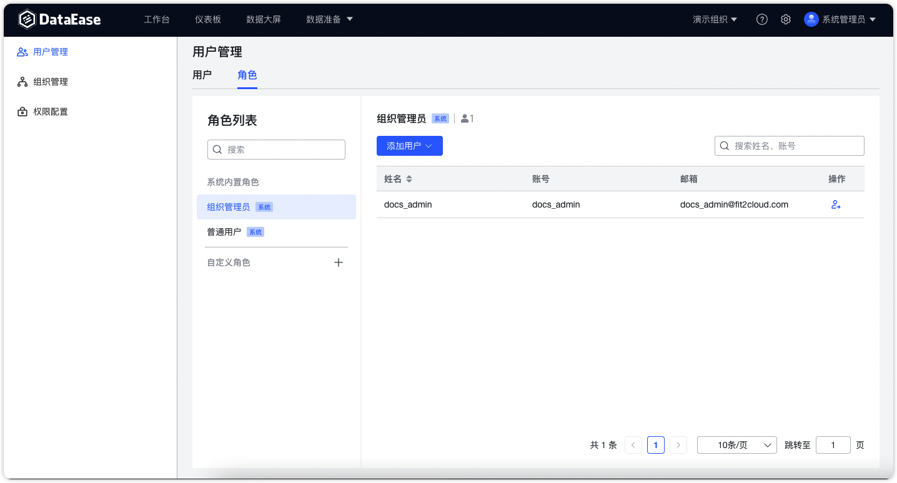{ width="900px" }

### 2.2 添加用户

!!! Abstract ""
    **添加组织用户：** 已经拥有了当前组织下角色的用户，添加组织用户时可以直接勾选。
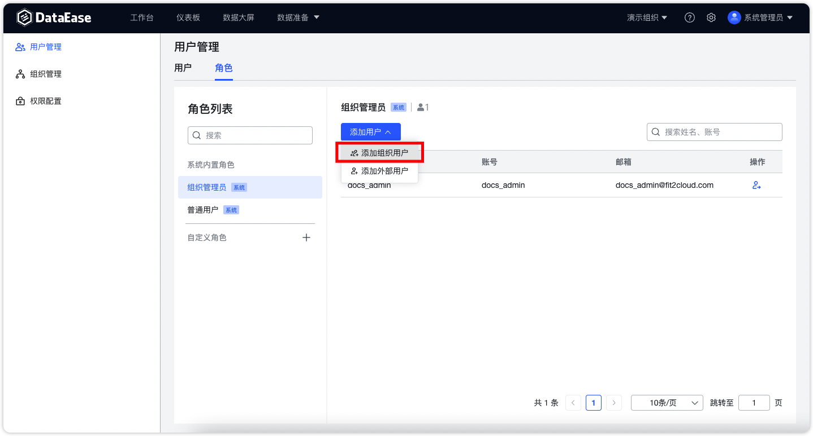{ width="900px" }
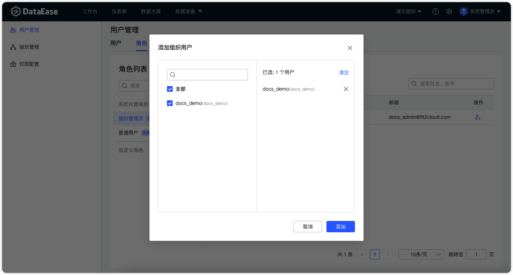{ width="900px" }

!!! Abstract ""
    **添加外部用户：** 未拥有当前组织下角色的用户，添加外部用户时需要精准按照用户的 ID 或账号搜索。
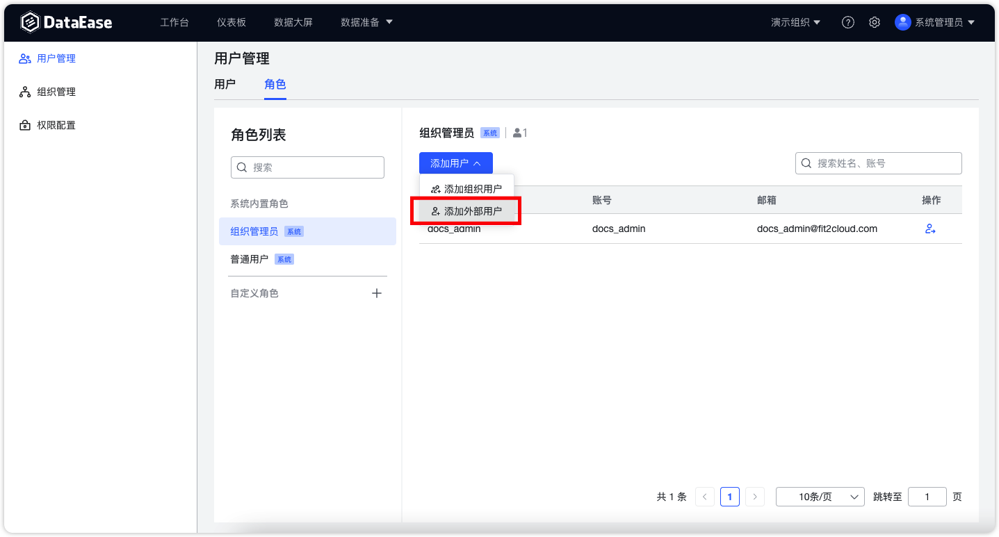{ width="900px" }
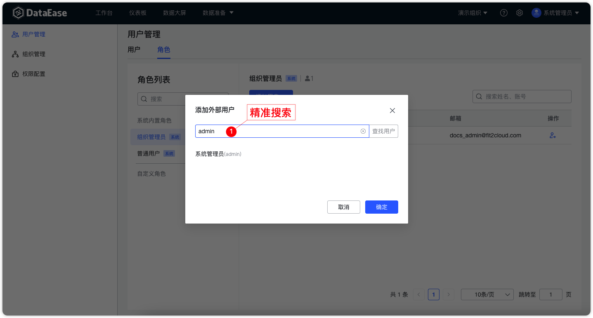{ width="900px" }

### 2.3 移除用户
!!! Abstract ""
    将用户从当前角色中移除，需要注意的是用户在整个系统所有组织中是否只有唯一的一个角色，当唯一角色被删除后用户将同步从系统中删除，仍然有其他角色就不会被删除。
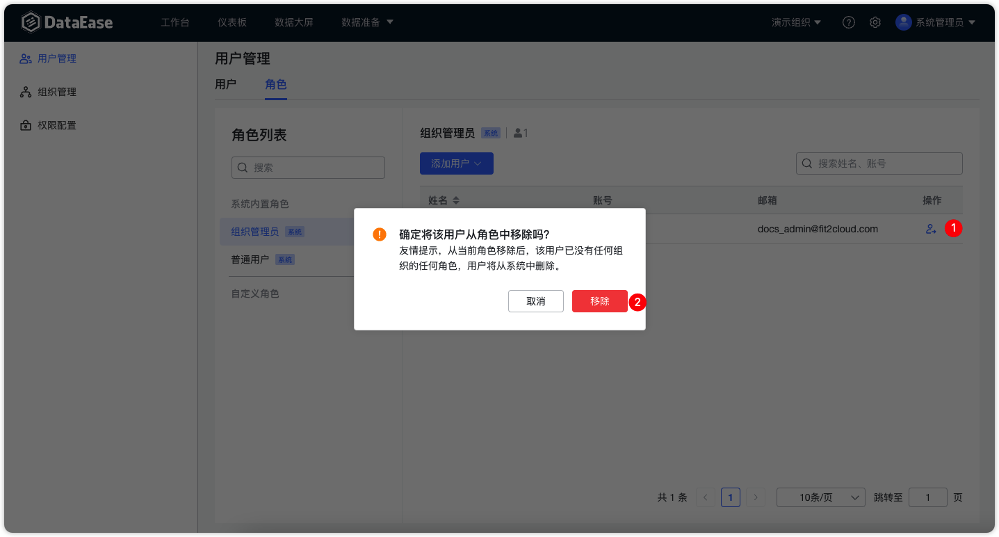{ width="900px" }

### 2.4 创建自定义角色
!!! Abstract ""
    自定义角色需要继承于组织下的内置角色，可以选择继承于普通用户或组织管理员。继承的角色所能够给赋予的权限是小于等于父级角色的。
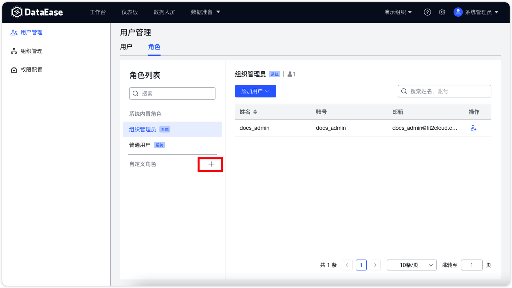{ width="900px" }
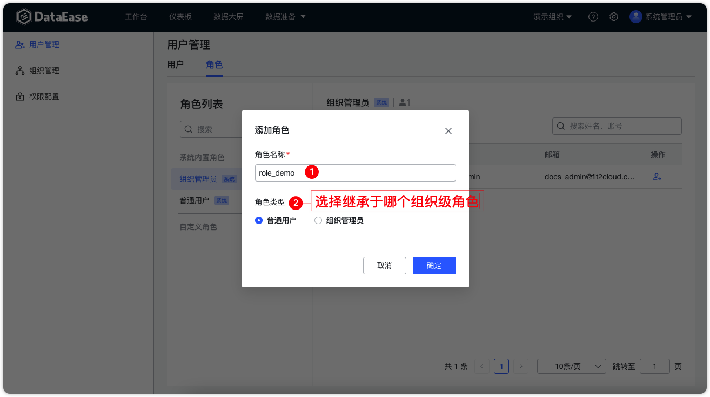{ width="900px" }