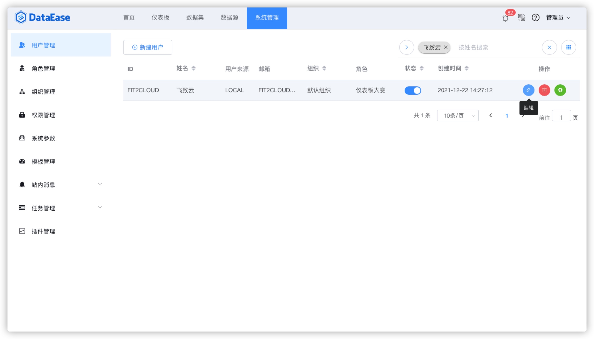
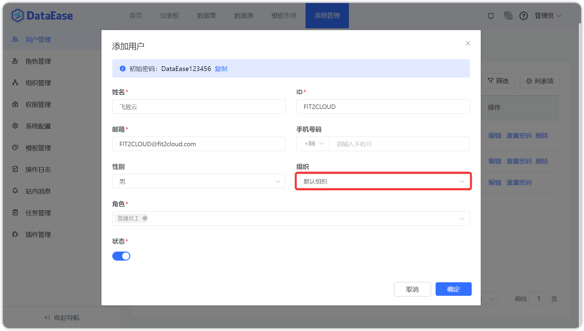

## 1 给用户分配组织

!!! Abstract ""
    系统支持给用户分配一个组织，单个用户可以分配一个组织。

{ width="900px" }

{ width="900px" }

## 2 给用户分配角色

!!! Abstract ""
    系统支持同一用户拥有多个角色，为用户赋予对应角色，可达到权限与用户解绑的目的。

{ width="900px" }

## 3 批量导入用户

!!! Abstract ""
    系统支持批量导入用户，并提供 Excel 模版，可按照模版格式上传，系统后台会自动进行数据校验。  
    **注意：**

    - 如果上传的 Excel 文件中存在不合规的数据，那么系统只创建合规数据的用户信息，不合规数据，可在当前弹框中下载下来，下载的文件在【状态】列右侧会增加【原因】；
    - 支持上传的文件大小，10M 以内。

{ width="900px" }

!!! Abstract ""
    如果上传的 Excel 文件中所有的数据都合规，那么直接上传成功并返回用户列表。

{ width="900px" }