# 用户管理

## 1 功能概述

!!! Abstract ""
    【用户管理】位于【系统设置】下。入口：右上角头像菜单 →【系统设置】→【用户管理】。

    系统管理员在此维护**全平台**用户账号。列表包含全部用户，并显示其所属组织与角色；未加入任何组织的用户，组织列为空、角色显示为 `-`。

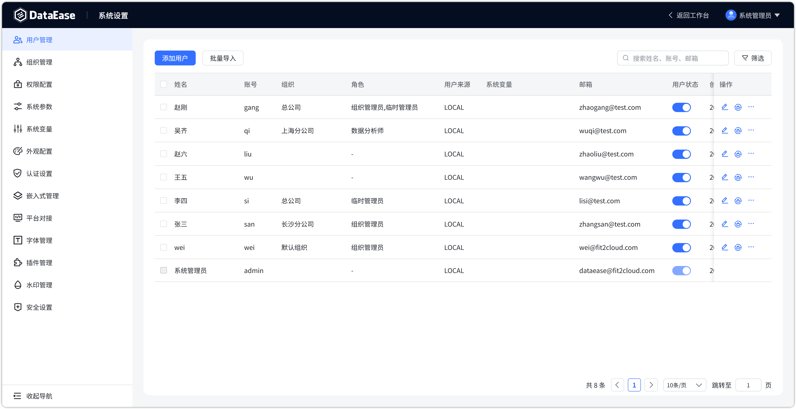{ width="900px" }

!!! Abstract ""

    **本页可以：**

    - 添加用户、批量导入；
    - 编辑用户信息、启用 / 禁用；
    - 重置密码、解锁账号、重置 MFA；
    - 删除用户；
    - 按姓名、账号、邮箱搜索，并按组织、角色等条件筛选。

    **本页不可以：**

    - 创建自定义角色（在【组织管理中心-成员管理】的【角色】页签）；
    - 将已有用户加入 / 移出某个组织（在 [组织管理](sys_management_organization.md) 中操作）。

!!! Abstract ""
    **与【组织管理中心-成员管理】的区别**

    | 对比项 | 系统设置-用户管理 | 组织管理中心-成员管理 |
    | --- | --- | --- |
    | 入口 | 右上角【系统设置】 | 顶部【组织管理中心】 |
    | 管理范围 | 全平台用户 | 当前组织成员 |
    | 添加用户 / 批量导入 / 删除 | 支持 | 不支持 |
    | 加入 / 移出组织 | 在组织管理中操作 | 不支持 |
    | 调整组织内角色 | 添加用户时可指定 | 支持 |
    | 自定义角色 | 不支持 | 支持 |

## 2 用户列表

!!! Abstract ""
    顶部按钮：【添加用户】【批量导入】。右侧可按姓名、账号、邮箱搜索，或打开【筛选】按组织、角色等条件过滤。

    列表列：姓名、账号、组织、角色、用户来源、系统变量、邮箱、用户状态、创建时间、操作。

    操作列常见图标：编辑、重置密码，以及更多菜单中的删除、解锁、重置 MFA。

    组织管理员账号若同时被授予系统设置权限，也可进入本页；未加入组织的用户（组织列为空、角色为 `-`）不会出现在对应组织的【组织管理中心-成员管理】中。
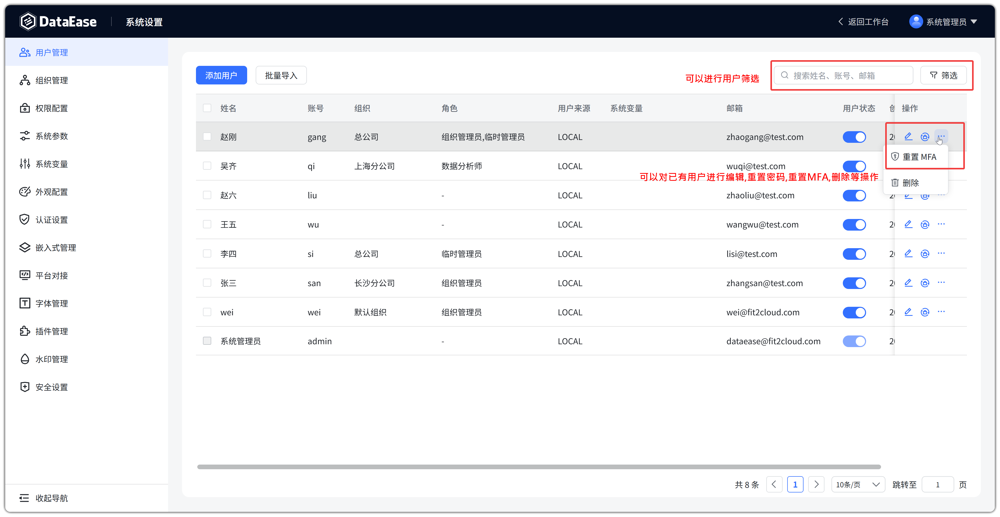{ width="900px" }

## 3 添加用户

!!! Abstract ""
    点击【添加用户】，填写账号、姓名、联系方式等信息，并选择所属组织及在该组织下的角色。弹窗顶部会展示默认密码，创建后用户使用该密码登录。

!!! Abstract ""
    字段说明：

    - **账号**：用户登录账号，创建后不可修改；
    - **姓名**：用户姓名；
    - **邮箱**：用户邮箱；
    - **手机**：用户手机号；
    - **系统变量**：可为该用户添加系统变量参数，见 [系统变量](system_variables.md)；
    - **所在组织**：用户所属组织；未选择时【角色】下拉不可用，提示先选择组织；
    - **角色**：用户在该组织下的角色，可多选，列表随所选组织变化；
    - **用户状态**：关闭后用户无法登录。

    添加用户时可指定其加入某个组织及角色。若用户已存在、只需加入其他组织，请到 [组织管理](sys_management_organization.md) 中操作。
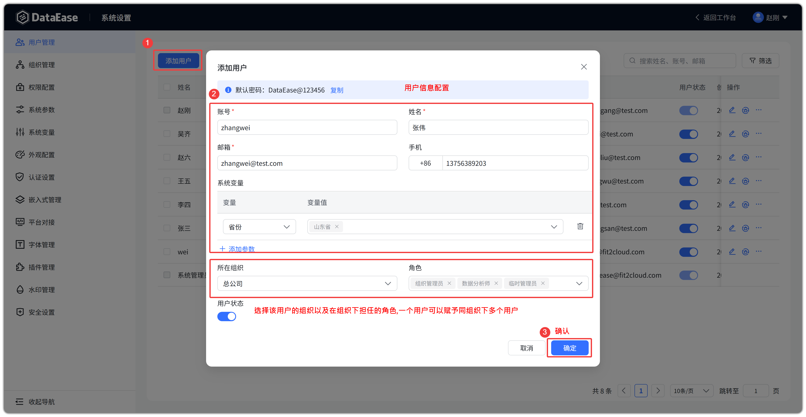{ width="900px" }

## 4 批量导入用户

!!! Abstract ""
    系统支持批量导入用户，并提供 Excel 模板。可按模板格式上传，系统后台会自动进行数据校验。

    操作顺序：点击【批量导入】→ 下载导入用户模板 → 填写后上传 `.xlsx` / `.xls` 文件 → 点击【导入】。
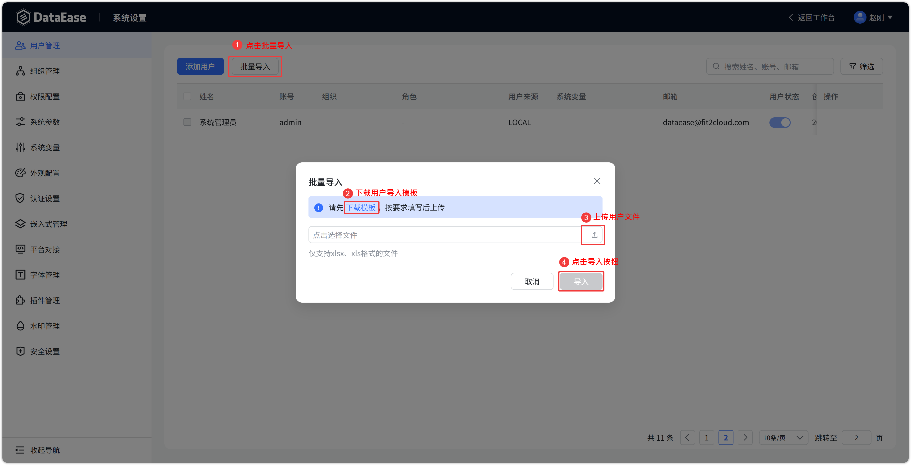{ width="900px" }
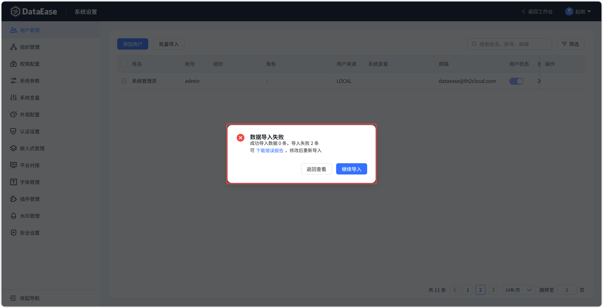{ width="900px" }

!!! Abstract ""
    **注意：**

    - 如果上传的 Excel 文件中存在不合规的数据，系统只创建合规数据的用户信息；不合规数据会提供错误信息，可下载错误报告查看详情；
    - 单次上传文件不超过 10M；
    - 企业微信、钉钉、飞书和国际飞书提前导入用户时，需要将对应平台用户的【账户】填入【唯一标识】后上传。

    用户来源支持的选项同列表中的【用户来源】字段：LOCAL、企业微信、钉钉、飞书、国际飞书、CAS、OIDC、LDAP。
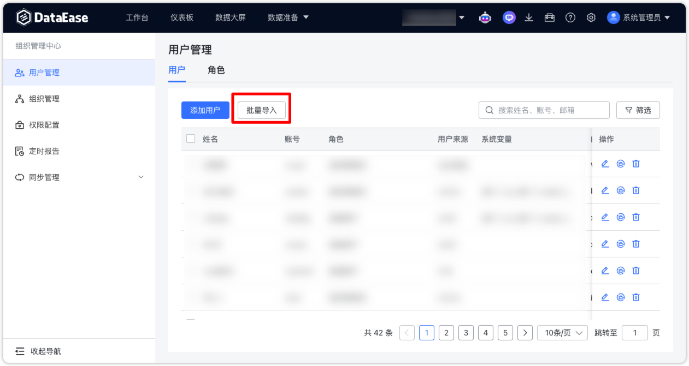{ width="900px" }
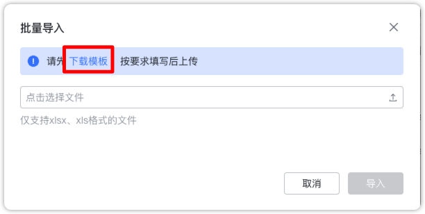{ width="500px" }
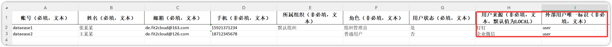{ width="900px" }
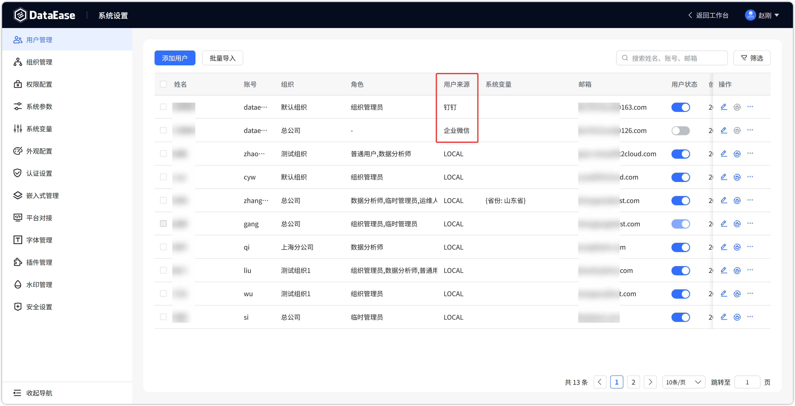{ width="900px" }

## 5 编辑用户

!!! Abstract ""
    支持管理员编辑用户信息。账号信息不支持修改，可改姓名、邮箱、手机、所属组织、角色及启用状态。
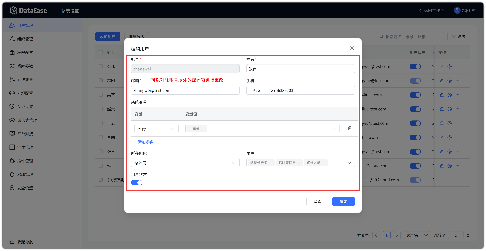{ width="900px" }

## 6 重置密码

!!! Abstract ""
    支持管理员将用户密码重置为系统默认密码。确认弹窗中会显示默认密码，可复制后告知用户。
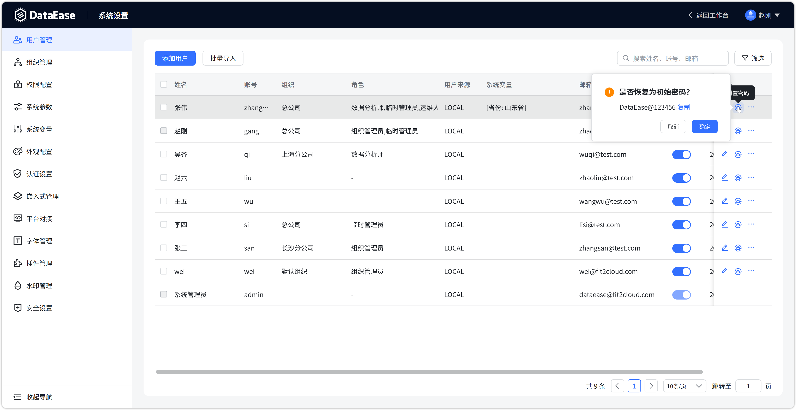{ width="900px" }

## 7 删除用户

!!! Abstract ""
    从平台删除该用户。删除前请确认其在各组织下的角色与资源授权是否需要迁移。
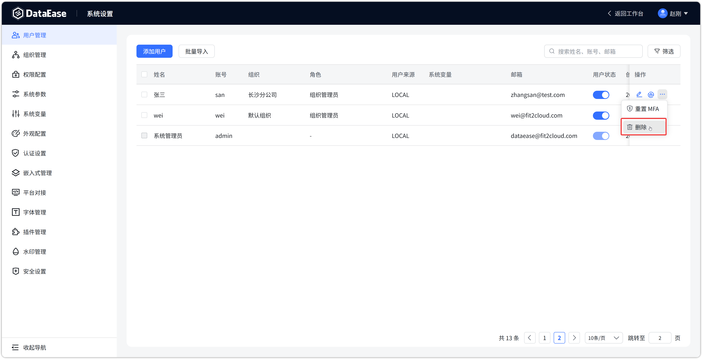{ width="900px" }
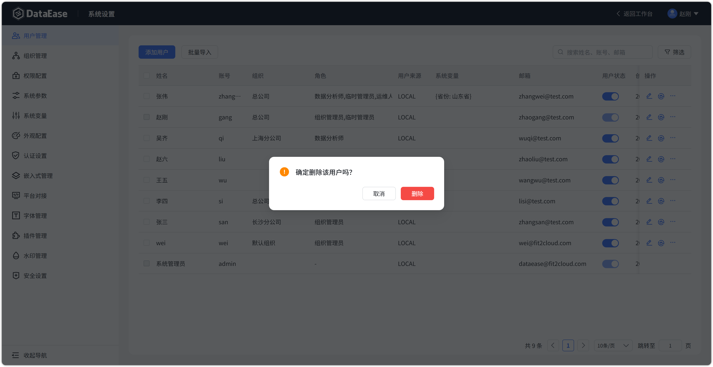{ width="900px" }

## 8 内置角色说明

!!! Abstract ""
    每个组织预置三类系统内置角色（界面标记为「系统」）：

    - **组织管理员**
    - **数据分析师**
    - **普通用户**

    系统管理员可在【系统设置-权限配置】中，通过【用户】维度为个人分配菜单/资源权限，通过【角色】维度配置资源权限。组织内的自定义角色，以及按角色分配菜单，请在【组织管理中心】中处理，见 [成员管理](org_center_member.md)。
