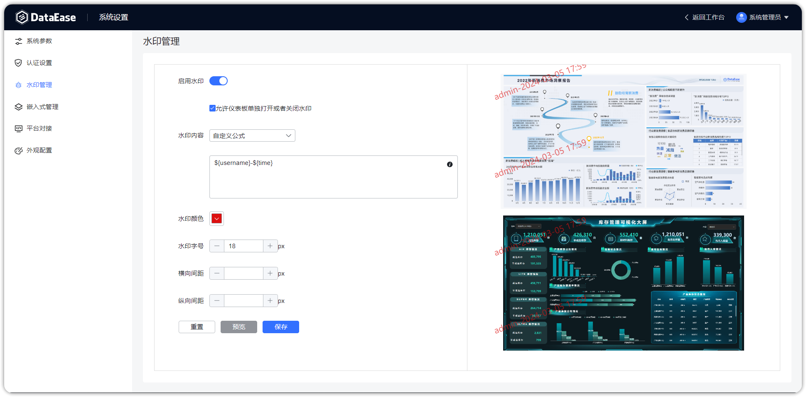

!!! Abstract ""
支持基本的水印设置，支持设置水印颜色、字号、间距，仅影响所有可以看到仪表板的地方；  
内容支持设置：

    - 自定义公式（可选择以下内容自由组合）
    - 账号
    - 昵称
    - IP
    - 当前时间

{ width="900px" }

!!! Abstract ""
自定义公式可参考系统提示的参数。

{ width="900px" }

!!! Abstract ""
完成设置后可点击预览进行确认。

{ width="900px" }

!!! Abstract ""
若开启允许仪表板单独打开或者关闭水印，则在仪表板编辑界面中可选择水印开关。

{ width="900px" }

{ width="900px" }