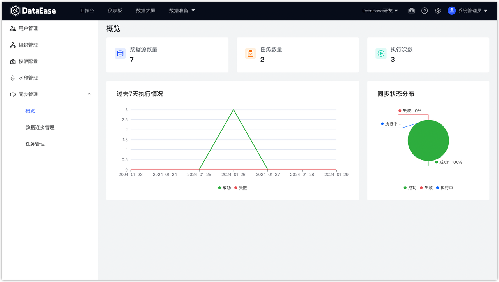
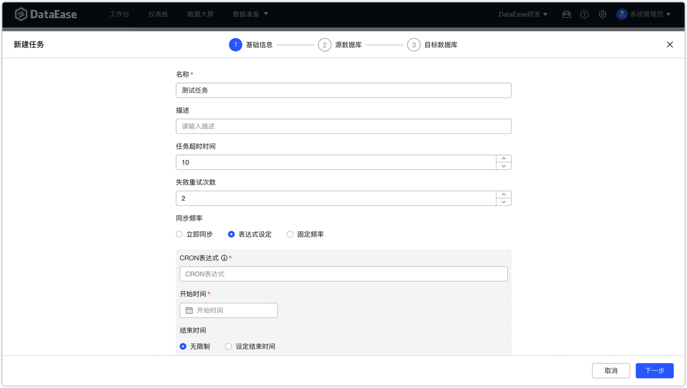
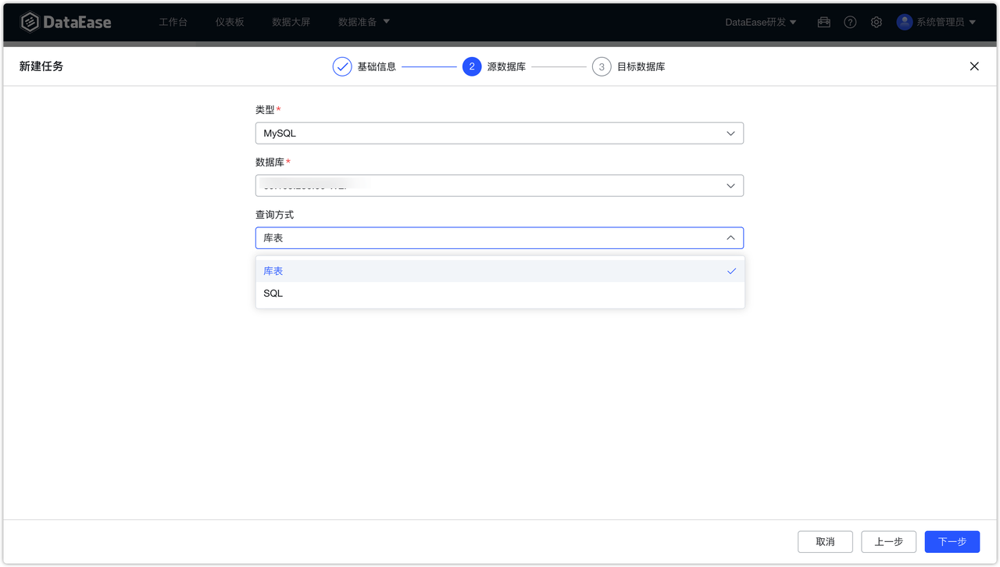
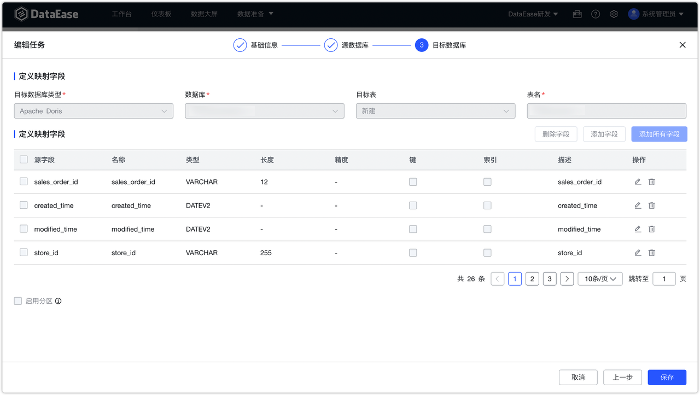

## 1 概述

!!! Abstract ""
    支持将用户自己数据库里的数据同步到如 Apache Doris 等高性能实时的分析型数据库中。

    - 当前支持同步的源数据库：Db2、MySQL、Oracle、SQL Server
    - 当前支持的目标数据库：Apache Doris（v1.2 及以上版本）
{ width="900px" }

## 2 页面介绍
!!! Abstract ""
    数据连接管理页面：源数据源管理与目标数据源管理。 
{ width="900px" }

!!! Abstract ""
    任务管理页面：任务列表管理、任务日志管理 。
{ width="900px" }

## 3 添加任务

!!! Abstract ""
    创建任务流程：填写基本信息-选择源数据库-选择目标数据库。先填写和选择同步管理的相关内容。
{ width="900px" }
!!! Abstract ""
    选择源目标数据库和查询方式。
{ width="900px" }
!!! Abstract ""
    选择目标数据库，进行字段映射。
{ width="900px" }  

!!! Abstract ""
    目标数据源支持自定义配置 Doris 的 FE/BE 端口地址。

{ width="900px" }

